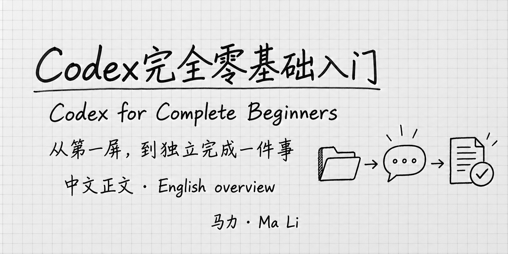

# Codex for Complete Beginners

 <strong>Ma Li · 马力</strong>

Author: Ma Li　|　AI collaboration: Codex

[中文首页](README.md) · English overview

Learn where to put your files, how to start a task, and how to find, check and revise the result. This guide assumes everyday computer skills, with no programming or Codex experience.

**[Start with Chapter 1 (Chinese)](manuscript/intro.md)** · [Read the complete draft (Chinese)](全书.md)

This October 2026 documentation-based update includes an opening guide, 24 Chinese chapters, an appendix, seven concept illustrations and 21 interface drawings. Selected sections now cover GPT-6.1 Sol, Fast usage, steering and desktop archive recovery, checked against official documentation on October 4. Interface details now cover project folders, the first screen, effort, permissions, results and commonly used features. This is not a claim that every workflow has been tested on Windows, Mac or every account. See [verification scope](docs/verification-scope.en.md).

## What the guide covers

| Your next question | Reading entry (Chinese) |
|---|---|
| What can Codex do? How do I install it and choose a project folder? | [Chapters 1–4](manuscript/intro.md) |
| Which model and reasoning effort should I use? What am I approving? | [Chapters 5–8](manuscript/account-usage.md) |
| How do I provide material, review output and resume work? | [Chapters 9–13](manuscript/materials.md) |
| How do I clarify a request and use Plan, Goal and task delegation? | [Chapters 14–18](manuscript/clear-requests.md) |
| What are preferences, skills, plugins, browser access and scheduled tasks? | [Chapters 19–24](manuscript/personalization.md) |

The [GPT-6 Astra opening guide](manuscript/latest-models.md) connects model capabilities to practical tasks; [Chapter 6](manuscript/models-effort.md) explains model and effort choices. Availability conditions remain explicit. The book assumes an existing paid account, follows the desktop app and does not require terminal or Git knowledge. It does not include exercises or a website-building course.

## Materials and updates

The first complete example turns [two original notes into a to-do list](examples/ch04-notes-to-todos/README.md). Later chapters use an original [reference-index example](examples/ch17-reference-index/README.md). Chapters and example text are in Chinese; a full English translation is not yet available.

Star the repository to keep it handy for settings and troubleshooting. Use Watch → Custom → Releases for version updates. [Report a correction](https://github.com/mali9527/codex-full-guide-for-beginners/issues/new/choose) with the chapter, environment and what you observed. Remove personal information from screenshots.

See [sources and acknowledgements (Chinese)](参考来源与致谢.md), [releases](https://github.com/mali9527/codex-full-guide-for-beginners/releases) and the sister [Claude Code guide](https://github.com/mali9527/claude-code-full-guide-for-beginners) (Chinese chapters, English overview).

© 2026 Ma Li. All rights reserved for the book text, original examples and illustrations. Public access does not grant a general license to republish, adapt or use them commercially. See [LICENSE](LICENSE); third-party dependencies retain their respective licenses.
