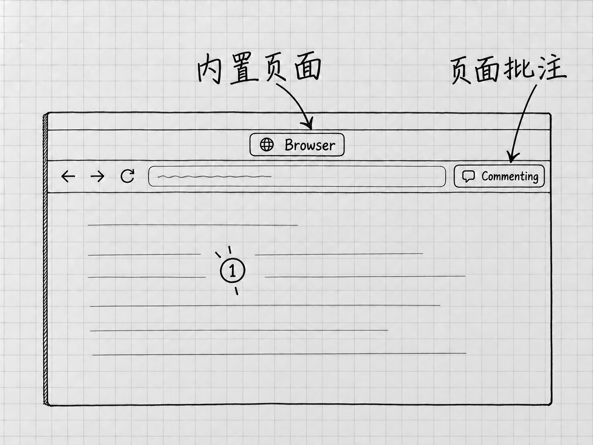

# 第22章 浏览器：把网页交给Codex查看和操作

第11章用过网页搜索，它适合寻找和读取资料。如果问题在于网页实际显示成什么样子，或者要在已登录的网站里查看某个对象，就需要浏览器了。

这时要先决定：让Codex打开一个独立页面，还是使用你平时浏览器里已经打开的标签？两条路线的材料、登录状态和授权都不同。只说一句「用浏览器」，它不知道你眼前是哪一页。

## 先认识内置浏览器

桌面应用的内置 **Browser**，让你与Codex在任务中共同查看网站或本地网页。它随应用提供，可以从工具栏、链接或地址导航进入；也可以在请求中明确使用 **`@Browser`**。[内置浏览器](https://learn.chatgpt.com/docs/browser)

它使用独立的浏览器资料，你常用浏览器里的标签和登录状态，它都看不到。你在Chrome里已经登录的网站，到内置浏览器里仍可能要重新登录，因为这是两个浏览器环境。

当前只想核对公开资料，可以从熟悉的官方页开始：

> 请用@Browser打开 https://learn.chatgpt.com/docs/projects ，先确认页面标题和地址，再找到本地项目主要文件夹的说明。只阅读，给我该段解释与所在小节，不登录、不改设置、不下载文件。

发送前从实际的`@`菜单里选择Browser入口；正文中的写法只用于说明对象。页面打开后，核对地址与标题，再处理网站访问请求。得到结论以后，自己到页面上找到相应说明，确认它读的确实是这一页。

## 网站许可与页面动作分别看

内置浏览器在访问尚未允许的网站前会请求许可；可以在 **Settings → Browser** 管理允许或阻止的网站。允许访问一个网站，管的是能不能打开它。网站里的后续动作要另外判断。

涉及提交信息、购买、修改权限或删除数据的动作，要看具体对象和结果。网页上的按钮和提示也是网页内容的一部分：一个页面让你「继续上传全部资料」，当前的查证任务并不因此需要上传。

下载文件以后，查实际保存位置。内置浏览器默认使用系统的Downloads文件夹，Settings → Browser可以修改位置，或选择每次询问保存地点。上传则不同：当前官方说明明确，内置浏览器不能自动完成文件上传。[访问与文件边界](https://learn.chatgpt.com/docs/browser)

## 已经打开的标签，使用浏览器扩展

需要的是常用浏览器中某个已登录的页面，可以使用对应的浏览器扩展。官方当前列出的支持浏览器包括Chrome、Edge、Brave、Opera和Vivaldi；可用性受版本、开放进度与组织设置影响。[浏览器扩展](https://learn.chatgpt.com/docs/chrome-extension)

先更新桌面应用，并确认目标浏览器已经安装。进入 **Settings → Computer Use**，选择对应浏览器；没有出现在主要列表时，查看 **More browsers**。按提示安装所需插件，再使用浏览器旁的 **Install** 打开官方扩展商店页，安装ChatGPT扩展并阅读浏览器的权限提示。

安装后回到Computer Use，确认该浏览器显示 **Manage**。然后开始新的Codex任务，用`@`菜单选择对应浏览器或实际打开的标签。要用的是安装了扩展的那一个浏览器用户配置；同一个Chrome里的两个账号配置，扩展与登录状态各自独立。

先让它报告当前要操作的页面标题、地址和对象，再发具体要求。给出确切的标签，比说「我刚才那个页面」可靠；涉及账号资料时，还要确认当前登录的就是要使用的账号。

## 只把需要的页面交给它

对于已经打开的文档页面，可以先限定只读标题和某一段。需要修改时，再给出对象、范围与保存要求。第一次使用，从只读开始；发消息、付款和改变共享权限留到熟悉以后。

扩展连接对新网站默认会询问，可按当前请求选择 **Allow once**、允许该网站、允许所有网站或拒绝。只处理眼前一页时，允许一次就够。范围选得越宽，以后询问越少，它能访问的网站也越多，想清楚了再选。

在 **Settings → Computer Use → 对应浏览器的Manage** 中管理允许和阻止的网站。把网站移出允许名单，以后访问它会重新询问；移出阻止名单，以后它可以再次提出访问请求。浏览器旁的开关主要控制它是否出现在`@`菜单中，网站授权要在名单里管理。[网站权限的管理](https://learn.chatgpt.com/docs/chrome-extension)

内置浏览器与扩展浏览器的管理位置不同。改设置之前，先确认要管的是哪一种浏览器。

## 在页面上指出具体位置

支持批注的内置浏览器中，可以开启 **Annotation mode**，点击元素或拖选区域，写下并保存批注，然后回到任务发消息，要求依据这些批注处理。保存批注和发出工作要求，是两个动作。[页面批注](https://learn.chatgpt.com/docs/browser)

<!-- diagram: FIG-024 -->

*图：内置浏览器的页面与批注区域。来源图的Commenting表示正在批注；保存批注后，还要回到任务说明希望怎样处理。*
<!-- /diagram: FIG-024 -->

例如，你可以圈出一段不理解的说明，要求用普通语言解释。在别人的网站上做批注，只是标出了位置，网站内容不会变。要修改的如果是自己项目里的网页，还需要可修改的源文件及相应权限。本章只学习查看与反馈。

没有批注入口时，写清页面地址、小节标题和具体原句，同样能定位。

Chrome、Edge、Brave和Vivaldi还支持浏览器侧聊；可以从浏览器工具栏或扩展菜单打开。Opera支持桌面标签引用与控制，没有同样的侧聊。本书仍以桌面任务为主要的接续位置。

## 连接不上，先核对哪一层

先确认网站没有被阻止，再确认目标浏览器显示Manage、使用的是安装扩展的用户配置、`@`菜单里选择了正确浏览器。只是某个任务失败时，可以在新任务里重试同一个小范围的只读请求。

需要时重启浏览器和桌面应用。仍不连通，再通过设置中的官方安装流程检查扩展。读不到登录后的内容，先核对登录环境；找不到页面，重新指定标签和地址。放开所有网站的权限解决不了这些问题。

文件、文本、截图或网页搜索已经能解决的问题，继续用原来的办法。需要观察真实页面状态时，再使用浏览器。

<!-- studio:nav -->
← [第21章 插件与MCP：接入需要的工具和资料](plugins.md) · [目录](../README.md) · [第23章 电脑操作：让Codex操作其他应用](computer-use.md) →
<!-- /studio:nav -->
