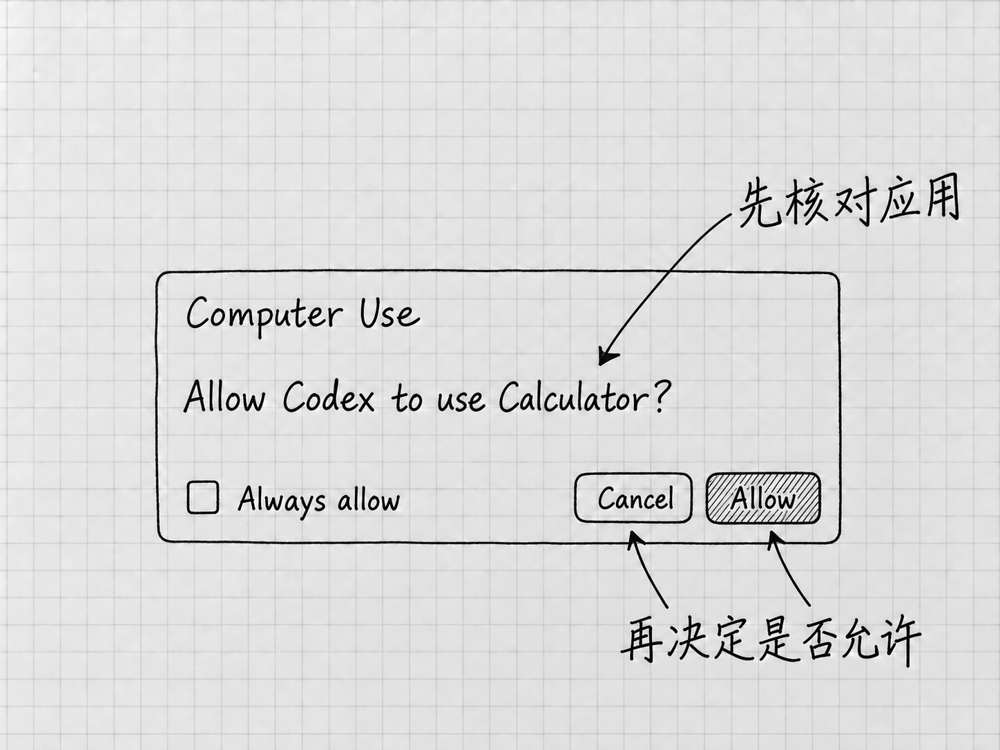

# 第23章 电脑操作：让Codex操作其他应用

有些内容可以直接从文件里读出来，有些看一张截图就够，还有些必须打开应用才能检查。例如，你想知道一份清单在文本软件的窗口里是否显示完整，这个问题光看文件内容回答不了。

**Computer Use，电脑操作**，让Codex查看和操作应用的图形界面。它可能点击、输入或切换窗口，影响到文件夹以外的应用状态。所以使用之前，要把目标应用、动作范围和结束条件说清楚。

## 先判断是否真的需要操作应用

只是合并两份文本，前面的文件路线已经足够。只是希望它解释一张界面，Appshot或截图也可能够用。需要它实际进入某个窗口、查看菜单或验证界面状态时，再考虑Computer Use。

应用有专门的插件或结构化连接时，先考虑那些工具。通过明确的接口读取一份记录，比模拟鼠标逐页寻找更容易重复。问题确实依赖视觉或界面动作时，才轮到操作应用。[电脑操作的用途](https://learn.chatgpt.com/docs/computer-use)

本章从一个只读动作开始：查看你已经打开的自编清单，确认其中一项是否在窗口里完整显示。整个过程不发送消息，不修改账号，清单里的事情也不去办。

## 先安装并启用功能

官方当前在支持地区为Mac和Windows桌面上的Work与Codex提供Computer Use，具体受账号、版本和组织设置影响。在桌面选择Codex，进入 **Plugins → Computer Use**，按提示选择 **Install plugin**；出现 **Enable** 时启用，并确认对应的服务与技能开关打开，再使用 **Try now** 开始。[设置Computer Use](https://learn.chatgpt.com/docs/computer-use)

接着到 **Settings → Computer use** 查看应用访问设置。装好插件只是有了这项能力，访问哪些应用还要逐个批准。

Mac需要按系统提示提供屏幕录制和辅助功能权限：前者让它看到应用，后者让它点击、输入和导航。不能读取或控制时，到 **系统设置 → 隐私与安全性** 检查Codex Computer Use对应的这两项授权。系统安全请求和管理员认证只能由你本人处理。

Windows的条件不同。目标应用必须在活动桌面可见，操作期间它使用的是前台的鼠标与键盘，这段时间你没法在同一桌面上做别的事。锁屏以后它能否继续，也没有保证。[Windows前台与Mac权限](https://learn.chatgpt.com/docs/computer-use)

## 应用批准是另一层选择

<!-- diagram: FIG-025 -->

*图：Computer Use请求框局部。来源以Calculator为例；实际使用时先核对自己请求的应用，再在Allow和Cancel之间选择。Always allow是另一个持续授权选项。*
<!-- /diagram: FIG-025 -->

系统权限开了以后，Codex要使用具体应用时，还会提出相应的应用访问请求。核对应用名称，确认它正是这次要查看的软件，再决定是否允许。对象正确时选择 **Allow**；名称不对、范围拿不准或尚未准备好，就选择 **Cancel**，回到任务说明需要调整什么。先处理这一请求，再开始读取窗口。

**Always allow**表示以后可继续使用该应用而不重复询问，范围比眼前这一次大。刚开始按单次请求处理，熟悉实际范围以后再决定要不要长期允许。已保存的允许应用，可以在Settings → Computer use中查看和移除。

第7章的沙箱与权限模式在这里仍然有作用，系统授权和应用批准则是另外两层。连接出了问题，先查这两层；切换到Full access，屏幕读取的系统授权并不会跟着打开。

## 开始前，把窗口与停止方式确认好

先用平时的文本软件打开自己的「待办清单-v2.txt」，核对文件名，把目标窗口准备好。Windows上要保持它在活动桌面可见。

第一次交出应用控制之前，先查看自己版本里的停止提示。官方允许随时停止任务或接手电脑，但不同平台的呈现可能不同；这里不把某个旧截图的按钮位置当成通用操作。没有找到或拿不准时，先取消应用访问请求，按第9章提供文件或Appshot，同样可以让它检查材料。需要查看实际窗口时，再沿[官方Computer Use说明](https://learn.chatgpt.com/docs/computer-use)确认当前平台的控制方式。

普通补充可以用第8章讲过的Steer送进当前运行，例如要求「停止当前操作，不再点击或输入」。这种消息需要被处理并得到确认，不是立即中断正在进行动作的保证。收到不再操作的确认以后，再接手检查。

## 给出一个小范围要求

在新任务中，使用可用的 **`@Computer`**、具体应用的`@`入口，或者直接说要使用Computer Use。把下面的应用名称替换成你实际打开的文本软件：

> 请用Computer Use查看我已经打开的文本软件中「待办清单-v2.txt」窗口。先确认窗口和文件名，再查看「联系维修店」那一项是否完整显示，只报告看到的文字和是否被遮挡。不要输入、修改文件或打开其他资料；确认完就结束。

这段要求先确认对象，再看指定内容，结束条件也很明确。它报告的如果是另一个窗口，立即要求停止并重新核对。对象错了，后面的指令都会落在错误的地方。

Mac在适用情况下可以进行某些后台应用操作，能否顺利因应用而异。Windows使用的是前台，等任务完成再操作同一桌面，免得你的输入与它的输入混在一起。更复杂的跨应用流程，熟悉这些条件以后再考虑。

## 看真实应用里的结果

本例不要求修改，所以先检查目标窗口仍是正确的文件、内容没有被编辑，再比较它报告的文字。清单内容它从文件里也能读到，所以还要留意任务是否真的使用了应用工具，返回的结果是否对应窗口当前的显示状态。

以后若授权它修改应用中的内容，还要看有没有真正保存。某些修改可能只留在应用内部，暂时没有写到磁盘；项目的改动面板也未必立即显示所有应用变化。需要交付文件时，按第10章重新打开实际文件核对。[应用状态与保存](https://learn.chatgpt.com/docs/computer-use)

Computer Use也有明确的限制。官方说明，它不能自动操作终端应用或ChatGPT自身，也不能用来批准电脑的安全与隐私授权。遇到这些限制，回到任务真正需要的工具。

## 结束任务与撤回授权不同

一次查看结束，只表示这一轮不再操作。以后不想让它自动使用某个应用，到 **Settings → Computer use → Always allow** 移除该应用，下次访问时重新判断。

想暂停使用整项能力，可以在插件管理中关闭相应的服务与技能。Mac还可以在系统隐私设置中撤回屏幕录制或辅助功能授权；这一步影响的范围更大，多个相关操作都会受影响。

撤回授权、关闭插件，都管的是以后。先前已经修改的文件不会因此恢复，要撤销某项结果，得在实际应用或已保存的副本中处理。

应用不受支持、授权未完成或停止方式不清楚时，文件、截图和快照仍然可用。先在自己能判断、能控制的范围里把工作完成。

<!-- studio:nav -->
← [第22章 浏览器：把网页交给Codex查看和操作](browser.md) · [目录](../README.md) · [第24章 定时任务：让跑通的工作按时再做](scheduled-work.md) →
<!-- /studio:nav -->
