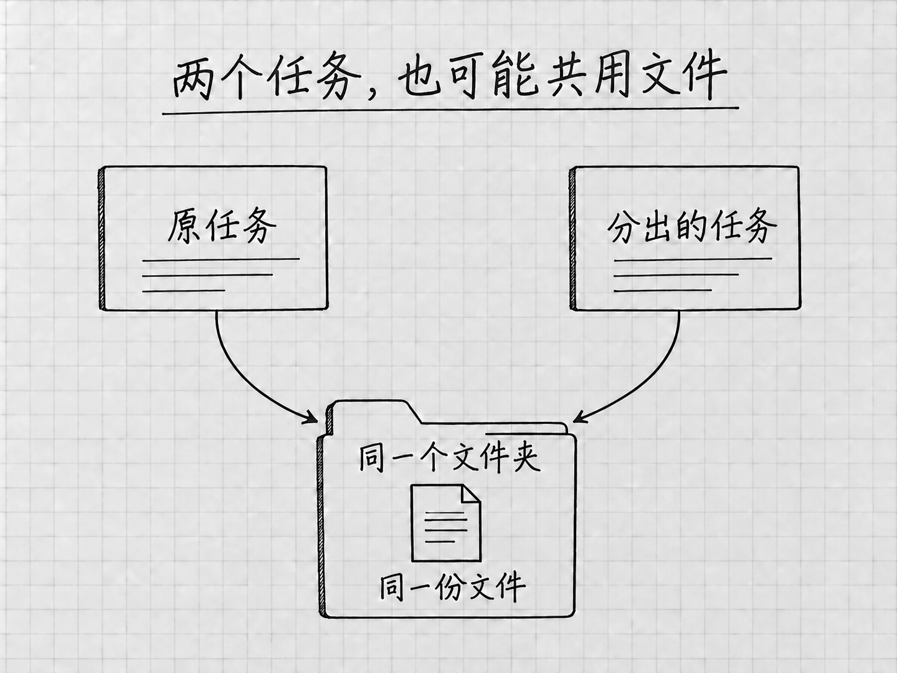

# 第13章 对话变长以后：上下文、压缩和分支

一个任务做久了，里面会有原始要求、补充材料、几次失败、几份方案和已经作废的决定。你向上滚动，这些消息都还看得到。模型每一轮实际处理的信息却是另一回事，它并没有把屏幕上的全部历史原样重看一遍。

知道了这一点，有几件事就好理解了：为什么有时要重新指出当前版本，为什么有压缩命令，为什么另开任务解决不了所有混乱。

## 上下文是这一轮用来工作的材料

模型要根据一些信息来理解你眼前的要求：当前消息、相关历史、读入的文件内容、工具返回的结果，以及适用的说明。这些信息构成它这一轮使用的**上下文**。

模型一次能处理的上下文有容量限制，这个容量通常称为**上下文窗口**。具体能容纳多少token可以不管，要知道的是容量有限。项目里有很多文件，当前上下文里装着的只是其中读入的部分。

本地文件夹、任务历史和上下文各有作用。文件夹保存实际材料；任务记录帮助你回看交流；上下文服务于当下这一轮处理。想让它用上某份文件，请它重新读取一遍，比提醒一句「我前面已经给过你」管用。

## `/status`看的是哪一种占用

在当前任务输入`/`，选择 **`/status`**，可以查看上下文使用和任务、限额等状态。读的时候分清标签：上下文占用是一项，账号用量是另一项。[状态与上下文命令](https://learn.chatgpt.com/docs/reference/slash-commands)

上下文占得多，说明当前交流里积累的信息多。账号额度管的是你还能使用多少资源。压缩上下文以后，已经用掉的账号额度仍是用掉的。

占用比例低，回答也可能出错。材料冲突、版本含混、要求没说清，对结果的影响常常比信息总量大。发现回答开始混淆时，先问它「现在用的是哪份文件、依据哪条决定」，这比盯着百分比有用。

## 压缩保留的是摘要

Codex支持在历史变长时自动压缩；按官方配置说明，触发的阈值随模型而定，没有一个对所有模型通用的固定比例。[自动压缩与上下文窗口](https://learn.chatgpt.com/docs/config-file/config-reference)

你也可以在当前任务使用 **`/compact`**，主动压缩上下文，让任务带着更精简的信息继续。压缩以后还在同一个任务里，但保留下来的是摘要，细枝末节可能被省略。

所以，在一个已经很长、又准备继续的重要任务里，压缩之前先要求：

> 请先整理当前接续说明：正在使用的文件路径、已经确认的事实、已否决的方案、不能修改的范围，以及下一步。涉及不确定内容就保留不确定，不要重新替我决定。

检查这份说明，必要时保存为项目内的「接续说明.txt」，然后再使用`/compact`。压缩结束后，用一个简短问题核对关键约束，例如「接下来以哪份文件为准，哪些内容不能改？」有遗漏就明确补回。

## 什么时候继续，什么时候换任务

仍在修改同一个成果，当前决定也清楚，就继续原任务。消息多而内容不乱的任务，可以一直用下去，占用比例高一些也没关系。

目标已经变了，或者旧要求与新要求混在一起时，整理好接续说明，再新开任务。新任务开始时，提供实际文件、当前标准和本轮目标。把整个旧聊天原样复制过去，只是换了个地方继续堆材料。

可以这样开始：

> 这是一次新的排版比较。以「结果/待办清单-v2.txt」为内容依据，再读「接续说明.txt」。请先确认四项内容和当前状态，不改原文件。随后提出按事项顺序和按状态分组两种呈现方式，先在消息中给方案。

这里交接的是继续工作所需的事实与决定。旧任务的来龙去脉，新任务不需要知道。

## `/fork`让另一种思路有自己的任务

<!-- diagram: FIG-017 -->

*图：分开任务以后，仍需核对文件位置，并为新方案另存文件。*
<!-- /diagram: FIG-017 -->

想从当前讨论出发尝试另一种方案，可以用 **`/fork`** 创建任务分支。后续讨论进入另一条任务线，两种思路分别推进。对于本地任务，菜单可能提供新的本地任务或工作树等选择，以当前可用入口为准。[分支命令](https://learn.chatgpt.com/docs/reference/slash-commands)

「分支」分开的是任务，磁盘上的文件并没有跟着复制一份。新任务如果仍在同一文件夹工作，两边改的就是同一个文件。所以尝试新排版之前，先保留已认可的文件，并给新方案指定不同的输出名，例如「待办清单-按状态.txt」。

操作时先等当前轮结束，确认文件已保存。再用`/fork`选择适用的本地任务路径，进入分支后核对项目和当前目录，写明本次只做哪一个方案、另存成什么名字。回看原任务时，靠名字与文件路径辨认版本。

菜单中若出现 **Worktree**，它是一种依赖Git的隔离工作目录，用来把项目文件工作区分开。本书的普通文件案例用不到它。[运行位置的区别](https://learn.chatgpt.com/docs/environments/modes)

## 把重要决定留在可检查的地方

管理上下文，要做的是几件具体的事：原材料保留，当前版本明确，重要决定写下来，继续之前重新核对。这些做法对人和模型都有帮助。

某个任务里讨论过的一条限制，以后的其他任务并不知道。适合长期保留的项目说明和记忆，第19章讲。在那之前，一份短小、准确的接续说明已经能解决很多实际问题。

<!-- studio:nav -->
← [第12章 管好任务与项目，过几天还能接着做](projects-tasks.md) · [目录](../README.md) · [第14章 把想法说清楚：让Codex知道你要什么](clear-requests.md) →
<!-- /studio:nav -->
