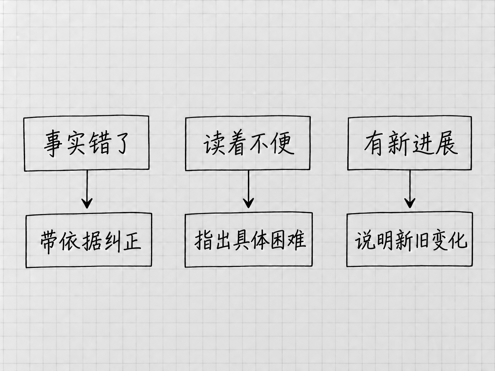

# 第16章 第一版不满意：怎样反馈、核对和改进

第一版出来后，说一句「不太好，再改改」很容易。要让Codex改到点上，得先让它知道你不满意的是哪一类：事实，表达，范围，还是后来才补充的新要求。

问题的类型清楚了，反馈自然具体，已经做对的部分也保得住，用不着每次把整份成果推倒重来。

## 先确认正在评价哪一版

打开实际文件，核对路径和文件名。第15章已经另存了「待办清单-按状态.txt」，而旧窗口可能还显示着v2。两份混在一起，反馈写得再详细也可能指错对象。

在原任务中继续，并写出当前版本。需要定位时，引用条目名称和有问题的原句，或使用第10章介绍的预览批注。没有定位入口，就用文字描述位置，说到「第几页、第几项、哪一句」就够了。

提出修改之前，把相关段落读完整。分组或换行之后，原有信息可能只是换了位置。

## 事实错了，给它可以回查的依据

假设照片数量漏了，可以说：

> 「待办清单-按状态.txt」中发照片这一项漏了数量。「材料/补充说明.txt」写的是选10张。请补回这项要求，其他事实和状态保持不变，保存后再对照两份备忘检查。

文件、错误、依据和范围都在里面。这是遇到该错误时的示例，你的成果没有漏数量，就跳过这一步。

如果它把「尚未预约」改成了「已预约」，要指出这是事实错误，让它回到原文修正。只说「语气不够准确」，它可能换一个含糊的近义说法了事。

发现一处问题后，可以要求检查同类问题：一个数量漏了，就核对其他数字是否完整。范围到此为止，一次补数量用不着带出整篇的风格重写。

## 表达不合适，说明使用时遇到什么困难

有时内容没有错，只是读起来不方便。说「更简洁」，它可能删掉重要说明；说「更详细」，它可能加上大量背景。把实际的困扰讲出来，更容易得到合适的改动：

> 我每天扫读时不容易一眼找到截止时间。请把每项已有的截止时间单独放一行；日期未定的项也直接写明。内容不删，不新添日期，先改这一处排版。

这条反馈解决的是一个具体的阅读问题。修改后，检查自己是不是能更快找到时间，也检查事实有没有被误改。两者都满足，这次改动才值得保留。

只说得出感受时，可以先请它提出两种小范围的改法，解释各自解决什么问题，你再选。必要时回到Plan讨论。

## 新进展出现，要说明它是新信息

「笔记本已经买好了」是你后来提供的进展，原材料里本来就没有。反馈时说明这是新的事实，并指出它替代了哪一项旧状态：

> 补充一个新进展：笔记本已经买好。请只更新这一项状态，另存下一版，其他未完成事项保持原状。

如果把新信息说成「你前面怎么没写」，模型可能回头去找并不存在的依据，甚至给出错误的解释。纠错和更新分开说，版本变化的原因才清楚。

需求也会变。原来只给自己看，现在要交给别人，就需要补背景或改语气。这属于用途变化，上一版并没有写错。把新用途说出来，才能判断哪些旧选择需要调整。

## 把正确的部分也指出来

一份成果常常大部分可用，只有局部需要改。反馈里可以写明「保留目前的四项顺序和简短句式，只处理日期说明」，让Codex知道哪些内容已经得到认可。

修改以后引入了新问题，就指出具体变化，回到已认可的版本比较。连续说「再短一点」「再丰富一点」，中间没有一个当前标准，结果会越来越难评价。

一次修改达到了本轮要求，先把它保留下来。下一轮要试另一个方向，再另存副本。

## 让它检查，但你要看证据

<!-- diagram: FIG-032 -->

*图：先辨清事实错误、表达不便和新进展，再给相应依据或要求。*
<!-- /diagram: FIG-032 -->

可以要求Codex审阅自己的成果，也可以让另一个模型或另一个任务提意见。这些意见有助于发现问题。几个AI说法一致，依据却仍是同一份材料，算不上多个独立来源。

事实问题，最终回到原材料或可靠原页；排版问题，看实际显示；保存问题，打开实际文件。

一条有用的审阅意见，会说明哪里有问题、依据是什么、可能造成什么影响。只得到「整体不错，但还可优化」时，追问一个具体例子。

## `/review`和`/feedback`各有专门用途

桌面斜线菜单的 **`/review`** 用于代码改动审查，例如检查尚未提交的改动，或与另一条代码基础版本比较。审阅本书这些文本文件用不到它，直接说明对象和标准就可以。

**`/feedback`** 则打开向产品提交意见的反馈对话框，可选择附带日志。它是向OpenAI报告应用问题或提产品建议用的；让当前任务改清单，仍然直接发消息。提交之前检查包含的信息，尤其是可选日志的范围。[两条命令的官方用途](https://learn.chatgpt.com/docs/reference/slash-commands)

第一版不满意时，先确定问题来自哪里，再采取对应动作。材料缺了就补材料，要求含混就补要求，局部出错就针对那一处修改。换模型、调高Effort或重开任务，是这些办法都不对症时才考虑的事。

<!-- studio:nav -->
← [第15章 先商量怎么做：Plan与方案比较](planning.md) · [目录](../README.md) · [第17章 用Goal持续推进有明确终点的任务](goals.md) →
<!-- /studio:nav -->
