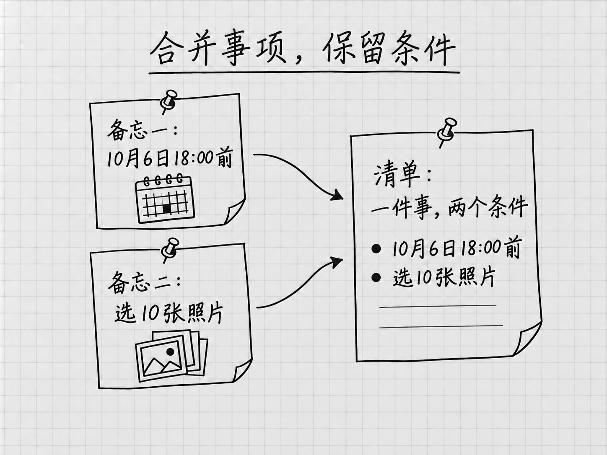
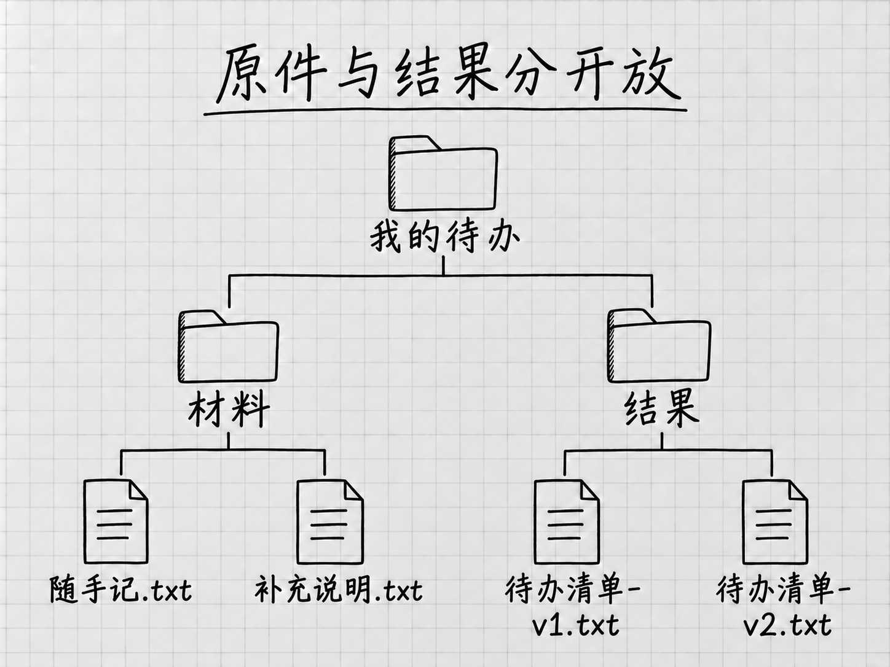

# 第4章 第一次完整使用：把零散备忘整理成待办清单

上一章，我们让Codex在回复里整理了几行提醒。这一次，材料已经存在电脑文件里，我们要让它找到材料、整理内容、保存清单，再根据新的进展修改一版。

案例仍然很小：两份备忘，四件待办。最后我们会留下两版清单：第一版把原始信息整理好，第二版只更新一件事的完成状态。事情少，每一处遗漏和变化都容易看清。这里学会的提供材料、核对事实和限定修改范围，以后换成更长的文档也用得上。

## 回到已经打开的「我的待办」

第3章已经取得随书材料，并在Codex中打开外层「我的待办」文件夹。现在从侧栏回到这个项目，在其中用New chat开始整理清单的任务，确认运行位置仍为Local。另开任务，是为了把文件整理与上一章的水杯短消息分开；接下来读取、生成和修改清单，都留在这个新任务里做。

如果你是直接从本章开始阅读，先到[第3章的「打开项目文件夹」](workspace-files.md#打开项目文件夹告诉codex在哪里工作)完成准备。所用文件仍在[配套材料页](../examples/ch04-notes-to-todos/README.md)。

| 位置 | 内容 |
|---|---|
| 我的待办 | 本次工作的外层文件夹，已经连接到Codex项目 |
| 我的待办 → 材料 | 「随手记.txt」和「补充说明.txt」两份原件 |
| 我的待办 → 结果 | 稍后新建，存放整理后的清单 |

先到电脑的文件夹里，进入「我的待办」中的「材料」，用平时查看文字文件的软件打开「随手记.txt」和「补充说明.txt」。这一步是你自己先读原件。「随手记」写了发照片、整理书桌、买笔记本和联系维修店，其中发照片重复记了两次。「补充说明」补上照片选10张、笔记本要横线款等要求，也交代哪些时间还没确定。只读一份，就可能漏掉另一份里的条件。

原件和结果分开放，检查时才能回到原文。起始压缩包也先保留，需要时可以重新取得一份原材料。若当前项目名称或路径与你准备的材料不符，先按上一章的方法核对连接位置。看完原件后，回到刚才新建的Codex任务。

## 先选好本次工作使用的设置

新任务的模型和权限可能与上一个任务不同，先看一眼输入框下方。模型可以保持当前可用的Power预设，这个案例用不着换型号。

如果想明确使用GPT-6 Astra，打开模型控件，进入可用的 **Advanced**，选择GPT-6 Astra，再把 **Effort** 设为 **Light**，核对当前型号和档位。Light是官方给出的Astra常见起点，四件待办用它就够。没有这个型号时，继续用当前可用选择；本例主要检查材料读全、事实不变和文件保存。

再打开输入框下方的权限控件，选择 **Ask for approval（请求批准）**，确认当前任务显示这一项后，再发送要求。按官方说明，它允许在当前工作区范围内读写文件及执行常规本地操作，需要额外访问时再请求批准；具体范围受设置和组织要求影响。遇到请求时，看清操作对象与目的；看不明白就先放着，请它解释为什么需要这一步。

我们还会在要求中写「原材料不动」。这是对本次工作的约束，不会自动把权限切成只能读取。权限设置决定允许做什么，任务要求说明这次应该做什么，两者都需要留意。

使用自己的材料前，先确认这些内容可以交给AI服务。Local说明文件操作围绕本地项目开展，文件内容仍会发给模型处理；本例使用随书自编材料，没有这层顾虑。

## 让它读一遍，确认找对了

在输入框里发送：

> 看一下「材料」里有哪些文件，各自记了什么。先不要改文件。

这条提示词只做一件事：确认它能够找到并读到正确材料。把读取和整理分开，问题就容易定位。材料没读对，此时纠正，比等一份完整清单生成以后再猜哪里出错更直接。

回复只有「找到了两个文件」还不够。看它能否说出照片选10张、笔记本要横线款等细节，再与原件对照。文件名和内容都对应，才有理由继续；讲出的内容不符，就指出具体差异，请它重新读取。

这一步还没要求生成清单，「结果」文件夹此时没有出现是正常的。若Windows此时提示首次设置沙箱，先按[第2章](desktop-setup.md)处理，再回来继续。若无法读取文件，先检查项目与路径；文件没读到之前，它说出的内容只能是根据文件名猜的。

## 先想清楚，什么样的结果算完成

<!-- diagram: FIG-001 -->

*图：合并同一件事时，截止时间与数量都保留。*
<!-- /diagram: FIG-001 -->

拿发照片这件事来说。「随手记」写着：

> 2026年10月6日18:00前，把上次出游的照片发给同行的朋友。

「补充说明」又补了一句：

> 给朋友发照片，选10张就好，不用发整个相册。

整理之后，我们希望只留一项，同时保留截止时间和数量。本书配套的第一版清单是这样写的：

> 1. 待办｜给同行的朋友发上次出游的照片。
>    截止时间：2026年10月6日18:00前。选10张，不用发送整个相册。

合并之后，信息集中在一起，要求也没有丢。这就给了我们一个**完成标准**：重复事项合并，重要信息保留，未确定的内容不猜，最后保存成文件。先想清楚怎样才算做好，再把要求交给AI，后面就有依据判断结果。

## 请它整理，并保存到文件夹

留在刚才读取备忘的任务里，接着发送：

> 请把「材料」里的两份备忘整理成一份待办清单。同一件事只列一次，把补充要求放到对应事项下面。
>
> 保留写明的日期、时间和数量；没有确定的时间就照实说明，不要替我安排。每项先标为「待办」。只整理清单，不代办其中的事情。
>
> 在当前「我的待办」项目下新建「结果」文件夹，保存为「待办清单-v1.txt」，原材料保留不动。
>
> 保存后，对照两份备忘检查有没有漏项、重复，日期和数量有没有改变；能按原文纠正的问题先纠正。完成后告诉我文件的实际位置、检查了什么，以及还有哪些信息未确定。如果没有成功保存，请说明原因。

这段要求把工作推进到了交付：先整理，再保存，再对照材料检查。只说「帮我整理一下」，结果可能停留在消息里；写明文件名、位置和完成后的检查，才把想要的成果说完整。

其中「原材料不动」保护了后面核对的依据，「只整理、不代办」划清了行动范围：清单里记着「联系维修店」，联系这件事仍由你来做。这段话可以直接复制，用不着记句式；以后换材料时，想清楚用哪些资料、要得到什么、哪些内容不能擅自改变。

发送后，看消息区域里的处理进展。它可能先读取两份材料，建立结果文件夹，再写入清单；实际安排可以不同。我们检查的是要求有没有做到。

如果它问「整理书桌安排在哪一天」，可以回答「仍未确定，请保留日期未定」。如果它请求联网查询附近维修店，可以说明这次只整理已有备忘，请按现有材料记录。

若它等待批准，就核对具体操作；若报告无法读取或保存，先处理那个原因。看到「准备创建文件」时，文件还没有创建。等它报告已保存及检查结果，再去打开实际成果。它的自行检查能发现一部分问题，下一步的核对仍要我们自己做。

## 到文件夹里，把成果打开

上一章认识了成果预览，它便于边看边改，自动打开与支持格式仍有条件。本例走容易确认保存位置的路线：回到电脑里的「我的待办」，打开「结果」，找到「待办清单-v1.txt」，用刚才查看备忘的文本软件打开。聊天里贴出的清单只是文字，这一步看的是电脑里实际留下的文件。

如果「结果」里没有文件，把聊天中的文字复制过去并不能算完成。回到任务里问：

> 我在当前「我的待办」的「结果」里没有找到清单。请检查文件是否已写入，报告它的完整路径；如果还没保存，请保存到我指定的位置。

把回复里的地址与当前项目位置对照。存到了另一处同名文件夹，和根本没有写入文件，需要分别处理。如果它只是报告了计划或贴出了内容，继续要求完成保存；如果保存失败，先解决它报告的具体原因。

到这里，你看过三样东西：消息中的完成说明、可能出现的成果预览、指定文件夹里的实际文件。前两者帮助你了解和查看工作，第三个才说明文件留在了预期位置。这次要交付的是文件，检查就要做到第三步。

## 检查意思有没有变

配套的[完整清单](../examples/ch04-notes-to-todos/演示结果/待办清单-v1.txt)有四件事。你的措辞、顺序和排版可能不同，核对时主要看事实与含义。

例如，「选10张照片发给同行的朋友」与原意相同。但把「10月6日18:00前发照片」改成「10月6日18:00开始选照片」，数字都在，截止时间却变成了开始时间。读起来通顺的句子也可能把事情讲错，对照原文才能看出这种差别。

自行车这一项也要留意。原文让我们问维修店什么时候可以预约，补充说明写着尚未预约。因此，清单要保留「联系维修店、确认时间」这一步。写成「去维修店做保养」，就跳过了还没完成的预约。

整理时，把已经知道的事和还没确定的事分开。「尚未预约」「日期未定」都在提醒你下一步需要决定什么，比补上一个猜测有用。

对照两份备忘，把这几个关键点看一遍：

| 事项 | 要保留的信息 |
|---|---|
| 发照片 | 只列一次；发给同行的朋友；2026年10月6日18:00前；选10张 |
| 整理书桌 | 日期尚未确定 |
| 买笔记本 | 一本，纸质，横线款 |
| 联系维修店 | 询问可以预约的时间；目前尚未预约 |

这样既能查有没有漏事，也能看出要求是否保留。四项齐全之后，再看各项是否都标为「待办」，然后回到「材料」里查看原件，确认内容没有被改动。若Codex报告了自行检查结果，也用这几项去核对它的报告。

## 发现问题，指出具体差异

假如照片数量漏了，回到刚才的任务继续反馈，不用另开一个任务。下面是遇到该问题时的示例；你的清单没有这个错误，就跳过这一节：

> 「结果/待办清单-v1.txt」的发照片事项漏了数量。「材料/补充说明.txt」里写的是选10张。请把数量补到清单对应事项里并保存，其他内容保留，原材料不动。

这段反馈指出要改哪份文件、依据在哪里、只补哪一处。「结果/待办清单-v1.txt」是从当前项目文件夹开始写的简短位置：进入「结果」，找到这一版清单。用具体差异提修改意见，比笼统地说「再做好一点」更容易对准问题；补上「保存」，也把要求落回实际文件。

等它改完，关掉之前查看清单的窗口，再从「结果」里重新打开这一份。既看数量有没有补上，也看其他内容是否保持原样。

## 做完一件，就让清单跟着更新

确认v1已经保存、四项信息也核对过，再做一次状态更新。假设笔记本现在已经买好了，这是演示中的新消息，原备忘里没有。留在刚才的任务里发送：

> 笔记本已经买好了。请以「结果/待办清单-v1.txt」为基础，把买笔记本这一项标为「已完成」，其他内容保持不变。
>
> 另存成「待办清单-v2.txt」，仍放在「结果」文件夹，保留v1和两份原材料。

等这一轮报告v2已保存，再到电脑的「结果」文件夹打开两份清单，确认第一版没有被覆盖：v1中笔记本仍是「待办」，v2中变成「已完成」，其他事项和要求保持原样。[配套第二版](../examples/ch04-notes-to-todos/演示结果/待办清单-v2.txt)放在本书材料的「演示结果」目录，供你对照；你自己的文件仍在「结果」里。

初学时，可以像这样小步修改：先说清这一轮改什么，改完再比较。变化少，就容易发现哪里改对了、哪里被意外带动。以后修改更长的文档，也可以先完成一个明确的改动，确认有效后再继续。

下次继续更新，可以从侧栏回到这个任务，明确以「待办清单-v2.txt」为当前版本，再告诉它新的进展。现在已经有两版，只说「改一下那个清单」，它可能改错对象；指出文件名就清楚了。

如果换了一个新任务，要重新提供文件位置与本轮要求，因为新任务并不知道此前的决定。怎样让较长的工作继续下去，后面的任务管理与上下文章节会讲。到这里，你已经用过侧栏、输入框、模型与权限选择、本地项目和实际成果，这些界面元素也都有了对应的用途。

<!-- diagram: FIG-002 -->

*图：原始依据留在「材料」，不同版本的成果保存在「结果」。*
<!-- /diagram: FIG-002 -->

## 没得到预期结果时

| 停在了哪里 | 可以先做什么 |
|---|---|
| Codex找不到备忘，或项目还没准备好 | 核对是否选中了外层「我的待办」、是否使用Local；请它报告当前路径及文件名，与电脑中的位置对照 |
| 打开文件夹快捷键没有反应 | 在Settings的快捷键设置中搜索Open folder，核对当前绑定；默认快捷键可以自定义 |
| 备忘打开后是乱码 | 先不覆盖保存；到配套材料页查看原文，再重新取得材料核对。乱码状态下让AI整理，得到的只会是猜测 |
| 聊天里有清单，文件夹里没有 | 请它保存为「结果」里的「待办清单-v1.txt」并说明位置；若不能保存，先看具体原因 |
| 出现权限请求 | 核对具体操作和作用对象；如果要替你发照片或联系维修店，已经超出本次整理范围，拒绝即可 |
| 清单漏事或改错了时间 | 指出原文件和对应文字，请它修改，再打开文件核对 |
| 修改后只找到一份清单 | 先请它列出两版的实际路径，核对是否存到别处；若确认第一版被覆盖，先停止继续修改并保留现有文件。手里有副本就据副本恢复；按原材料重做得到的是一份新生成的清单，与原来那一版未必相同 |

打开文件夹的操作可查[默认快捷键](https://learn.chatgpt.com/docs/reference/commands)与[设置](https://learn.chatgpt.com/docs/reference/settings)。本例的[成果与边界要求](https://learn.chatgpt.com/docs/prompting)、[模型起点](https://learn.chatgpt.com/docs/models)、[持续反馈](https://learn.chatgpt.com/docs/use-chatgpt)和[成果预览](https://learn.chatgpt.com/docs/artifacts-viewer)可查对应官方说明。生成与保存依据是[本地运行位置](https://learn.chatgpt.com/docs/environments/modes)、[本地项目的文件访问](https://learn.chatgpt.com/docs/projects)和[权限规则](https://learn.chatgpt.com/docs/permission-modes)。清单的正确与否，仍要对照上面的原始材料和完成标准判断。

本章的案例选择参考了已有教程对入门任务的安排，具体作用见[参考来源与致谢](../参考来源与致谢.md)。备忘、提示词、清单和讲解均由本书独立编写。

<!-- studio:nav -->
← [第3章 看懂第一屏，并发出第一条消息](workspace-files.md) · [目录](../README.md) · [第5章 账号与额度：看懂自己正在用什么](account-usage.md) →
<!-- /studio:nav -->
