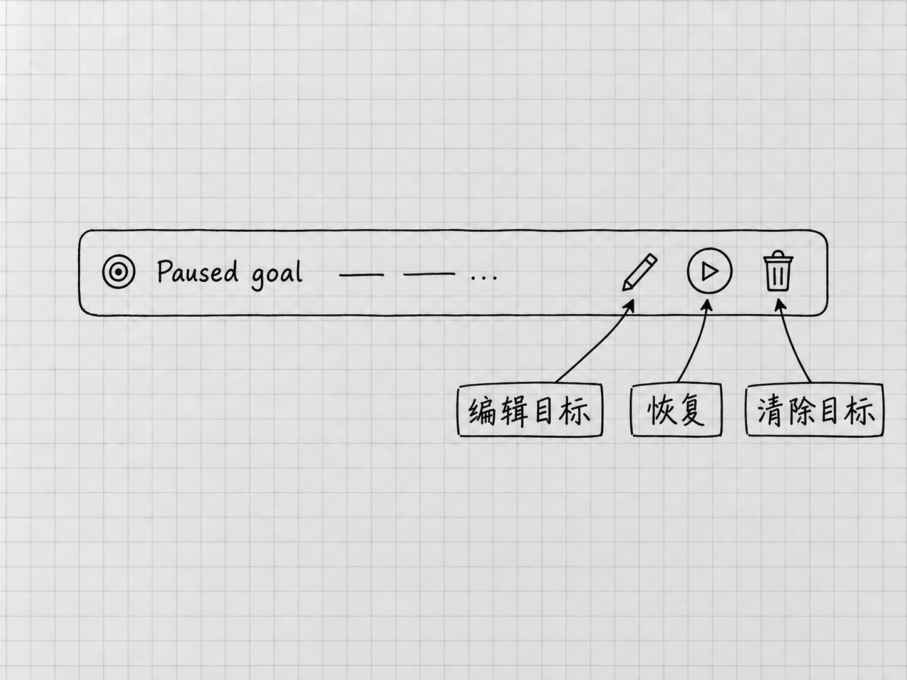

# 第17章 用Goal持续推进有明确终点的任务

前面的大多数要求，一轮或几轮就能完成。有些工作要读一组材料、形成几个成果、交叉核对，再处理发现的问题。每完成一个小步骤都回来说一句「继续」，很费事。

**Goal，持续目标**，适合这种已经知道终点、需要接着推进的工作。它让Codex围绕同一目标继续选择下一步，直到完成、暂停或需要更多输入。目标写得清楚，才看得出它是在推进，还是在不断给自己加活。

## 先看这次要完成什么

本章使用另一组[原创配套材料](../examples/ch17-reference-index/README.md)：一个虚构的「资料目录」，里面有12条登记信息，以及整理规则、旧索引和补充决定。我们要整理的是这些记录，12份真实文件并不存在，也就谈不上移动或删除。

这组材料里有几处需要核对：旧索引少了两条；一个叫「备份」的条目是否重复还未确认；一份路线草稿需要标明过时；有些日期或分类没有依据。最后要得到分类索引、待确认事项和接续说明，三份文件要彼此一致。

这件事用普通任务也能完成。本章用Goal来做，是为了看清持续目标怎样定义、怎样中途调整、怎样知道该停。

## 材料和工作位置先准备好

从配套页取得「资料目录-起始材料.zip」，解压得到「资料目录」文件夹，按第3章的方法在Codex中打开这个文件夹。Windows默认用Ctrl+O，Mac默认用⌘O；若绑定不同，到快捷键设置查Open folder。

在该项目里用New chat开始一个Local任务，核对当前文件夹。先要求只读列出「材料」中的文件，并各用一句话说明用途。应能看到「文件目录.txt」「整理规则.txt」「旧索引.txt」「补充决定.txt」四份输入。

接着确认模型和权限，沿用已经能完成普通文件任务的设置。使用Goal，用不着换到最高的Effort或Full access。材料能读取、输出位置清楚之后，再设置目标。

## 把终点写进目标

在输入区键入`/`，选择 **`/goal`**，按入口填写目标。目标文字既是最初的要求，也是判断完成的依据，只写「帮我一直整理」就没有终点。可以使用本例的完整要求：

> 整理当前「资料目录」项目的四份输入。在「结果」中新建「分类索引.txt」「待确认事项.txt」和「接续说明.txt」，原材料不动。
>
> 分类索引按「整理规则」与「补充决定」处理。01至12每个编号各出现一次，名称、已有日期和分类不擅自改动；没有依据的内容保留未定，可能重复的条目不合并。指出旧索引的遗漏或过时信息，所有待确认事项说明对应编号和来源。
>
> 完成三份文件以后，交叉检查编号覆盖、事实、未确定事项和文件间一致性。能依据原文纠正的问题继续纠正；确需我决定的事说明依据再问。只整理记录，不寻找、移动、删除真实资料，也不联网补写。三份文件保存并完成上述核对，就是本次终点；报告实际位置、检查结果与剩余未知。

这段目标让它自己安排小步骤，同时给出了明确的终点。未知的分类留在那里，整理照样算完成；没有依据却硬填一个分类，才是违反目标。[Goal的目标与完成标准](https://learn.chatgpt.com/docs/long-running-work)

## 进度行用来管理持续目标

<!-- diagram: FIG-019 -->

*图：暂停状态的Goal进度行局部。三处圈注分别指向编辑、恢复与清除目标；已经保存的文件要到文件夹中另行检查。*
<!-- /diagram: FIG-019 -->

目标启动后，输入区上方会显示目标进度行。官方提供的控制包括**暂停、恢复、编辑目标和清除目标**，它们管的都是这个持续目标。[Goal控制入口](https://learn.chatgpt.com/docs/reference/slash-commands)

想补一条材料或限制，继续在同一任务发消息。想先看清现状再改目标，就在进度行暂停，等状态显示已暂停，检查已生成的文件，再编辑目标。核对修改后的目标文字，准备好以后恢复。

例如，运行中你决定不再需要单独的接续说明，就写明去掉哪个交付项，并检查前面是否已经生成过该文件。已经生成的文件，编辑目标和暂停都不会去动它。

目标不再需要继续时，使用进度行清除。清除的是持续推进的目标，任务历史和磁盘上的文件都保持原样。留下了什么，回到实际文件夹检查。

## 停下来，不一定是没完成好

Goal仍遵守原来的权限与批准规则，需要你决定时会等待。新的文件、应用或账号访问，照样要经过请求和批准。

本例遇到「10的分类未定」，按要求保留即可；你后来要求必须归入某一类，就需要自己决定归到哪里。遇到文件保存失败、材料无法读取或账号限制，先解决具体原因。缺少的条件不补上，让它「继续直到成功」也成功不了。

想了解进展而暂不改变主任务，可以用学过的`/side`问当前状态。要改变目标或范围，回到主任务或目标控制里明确处理。

## 完成后看三份实际文件

Goal显示完成，检查才开始。打开「结果」中的三份文件，先看索引里01至12有没有各出现一次，再核对关键条件：05没有因为名字像备份而被合并，07保留了使用前重新核对的说明，10仍未定分类，01与09没有编出日期。

待确认事项应与索引一致，接续说明应指出实际输出和仍未知的问题。旧索引缺少05与11，也应在差异说明中交代。配套材料提供了[演示结果](../examples/ch17-reference-index/README.md)供比较内容。它是文件级示例，你得到的措辞和执行过程可以不同。

报告说检查通过，文件却仍有遗漏，就指出具体编号，要求按原目标修正。反过来，目标已经完成时，它提出的优化建议可以留到以后，这次到此为止。

## 离开电脑之前，先看工作在哪里运行

本地任务依赖这台电脑、应用和文件可用。预计要断网时，先暂停Goal，等条件恢复、核对文件以后再继续。Mac可按需要启用Settings里的Prevent sleep while running，它防的是电脑睡眠，网络和账号条件仍要另外留意。

若账号提供 **Codex Remote**，可以在手机上查看、引导和批准连接电脑上的任务。可选设置路径是电脑端 **Settings → Connections → Control this Mac or PC → Set up或Add**，按提示完成验证；手机扫码，用同一ChatGPT账号和工作区批准连接，再在手机的Remote中选择那台电脑。

工作仍由连接的Mac或Windows电脑执行，所以电脑要保持唤醒和联网。可用性受开放进度与组织设置影响。[Remote官方设置](https://learn.chatgpt.com/docs/remote)

不使用Remote，本章的目标整理照样能做。

<!-- studio:nav -->
← [第16章 第一版不满意：怎样反馈、核对和改进](feedback.md) · [目录](../README.md) · [第18章 几件事怎样分开做：多个任务与子代理](delegation.md) →
<!-- /studio:nav -->
