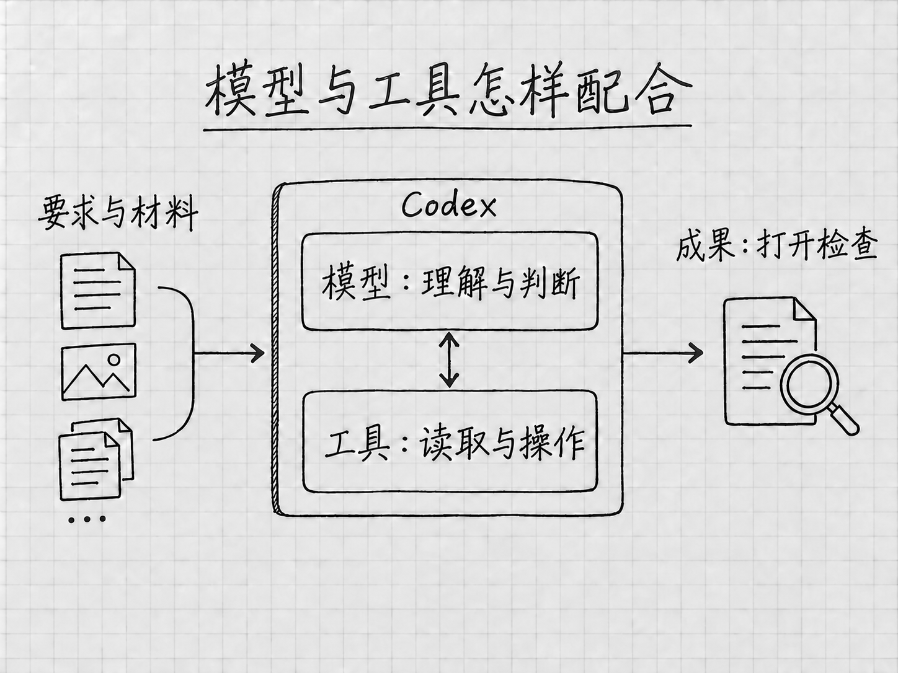

# 开篇：GPT-6 Astra与现在的Codex

你手里有几份资料，想把它们整理成一份能用的说明。费时间的常常是打字以外的事：要看懂几份材料说的是不是同一件事，找到互相矛盾的地方，决定怎样组织，再根据反馈继续修改。

GPT-6 Astra适合参与这类工作。OpenAI把它定位为面向高难度完整任务的模型，强调跨资料、跨工具、跨步骤的判断能力。对没有编程经验的人来说，这意味着可以从自己熟悉的材料出发，请它把阅读、比较、制作和检查连起来，逐步做出一份成果。[官方模型说明](https://learn.chatgpt.com/docs/models)

本书的2026年9月内容重点介绍Astra，也会讲清Sol、Luna和常用设置。先看明白这些能力与你有什么关系，再去安装应用、认识界面。本篇的例子都是为说明用法设计的情景，没有拿来当模型测试的成绩。

## 从回答问题，到做完一件事

如果你问「待办清单怎样写」，得到的是写法和建议。如果你提供两份备忘，要求合并重复事项、保留时间和数量、保存成文件，需要完成的事情就多了。

例如，一份备忘写着「10月6日18:00前，把出游照片发给同行的朋友」，另一份补充「选10张，不用发整个相册」。整理时要认出两条说的是同一件事，把截止时间与数量放在一起，两个要求都留着。文件生成后，还要对照原文检查。

Astra的重点之一，就是让这种需要连续判断的工作保持连贯。它要根据前面读到的内容决定下一步，使用可用工具处理材料，再把你的新意见接到原任务上。第4章会用本书自编的两份短备忘，带你完整走一遍。

官方常说的**推理**，放到这个例子里，就是联系已有信息、比较不同解释，再判断怎样处理。判断两条提醒是否重复、一个时间是截止时间还是开始时间，都在推理，它的范围比解数学题宽得多。

材料少时，这些判断看起来很简单。换成几份版本不同的说明、散落的补充意见，或者必须同时满足多项要求的成果，就更值得考虑Astra。一件工作复杂与否，既看材料多少，也看其中有多少关系、冲突和取舍需要处理。

## Astra能在哪些地方帮上忙

### 把几份材料放在一起理解

假设你在比较两台设备，手里有各自的说明，还有自己写的需求：希望少占空间，日常维护省事。可以请Astra根据这几份材料整理两者的差别，说明哪些信息支持判断，哪些条件还没有查到。

这样的工作光抄一张参数表是做不好的。某项功能听起来更先进，却可能与你的需求无关；一份说明没有提到维护周期，只能写成「材料没有说明」。有用的整理，是把资料与你的用途联系起来。

这是根据官方所述研究与分析能力设计的使用方向。你可以在要求中补上一句：「请区分材料写明的事实、你的判断，以及还需要确认的信息。」这样，拿到结果后更容易知道哪些内容可以回原文核对，哪些仍需要你作决定。

### 根据要求做出成果，再继续修改

资料比较完以后，还可以继续请它写成说明、整理成表格，或者改成适合别人阅读的版本。Astra的官方用途包括研究、文档制作和软件工作；Codex也支持研究、文档等知识工作，并不要求所有任务都从写代码开始。[Astra型号说明](https://developers.openai.com/api/docs/models/gpt-6-astra)、[Codex的工作范围](https://learn.chatgpt.com/docs/use-chatgpt)

仍用设备资料的例子。给自己看的版本，可以保留详细比较；给家人看的版本，可能只需说明用途差别、尚未确定的条件和下一步要查什么。你不必重新开始，可以继续说：

> 请把这份说明改成给没有看过原资料的人看的版本。先说明两者分别适合什么情况，再解释理由；不展开与我的需求无关的参数，保留还需要确认的问题。

这里改变的是阅读对象和详略，原材料里的事实仍要保留。拿到新版后重点看一处：为了让推荐显得明确，原来那些还不确定的条件有没有被省掉。

### 看懂图片提供的线索

有些问题用文字不好描述。例如，一张表的标题和内容挤在一起，或者页面上的按钮让人找不到。Astra本身支持图像输入，可以结合你提供的图片理解问题；提供截图时，再说明希望它关注哪一块，会更有帮助。[模型输入能力](https://developers.openai.com/api/docs/models/gpt-6-astra)、[如何提供相关材料](https://learn.chatgpt.com/docs/prompting)

「看看截图，解释哪里难读」和「打开那个文件，替我改好」是两种任务。前者只需要图像内容，后者还要能访问文件，并有相应的操作工具与权限。绘图也是另一项功能，要看当前环境有没有提供。

想让它调整版面，可以同时提供原文件和截图：原文件是要修改的对象，截图用来指出问题。改完以后，打开修改后的成果看一遍。

### 在工作中接住你的补充

做事时才发现新要求很常见。刚开始只说「整理一份说明」，看到初稿后才意识到需要缩短、改变侧重点，或者补上一份新材料，都可以继续说。

官方特别提到Astra吸收新要求、调整方向和围绕原目标持续工作的能力，也指出它会在重要信息缺失时提出有针对性的问题。[Astra使用指南](https://developers.openai.com/api/docs/guides/latest-model?model=gpt-6-astra)

例如，比较设备时，你还没说主要用来做什么，它可能先问用途。这个答案会影响比较标准，先问清楚有价值。如果只是说明中的小标题怎样排列，通常可以由它先整理一版，让你看过再改。

你可以据此说明自己的偏好：「影响结论的问题先问我；一般的排版和措辞先给出一版。」这是一种工作约定，不会替代应用里的权限设置。任务运行中如何补充消息、什么时候会排队，第8章结合界面介绍。

## 模型、Codex和工具，各自负责什么

<!-- diagram: FIG-005 -->

*图：模型负责理解与判断，工具负责具体操作；成果仍要打开检查。*
<!-- /diagram: FIG-005 -->

**Astra是处理要求的模型，Codex是你与它交流并让它使用工具工作的入口。** 你把目标和材料交进来，模型负责理解、判断和组织内容；读取文件、搜索网页、执行计算或操作应用，还需要相应工具。

例如，比较已有的两份说明，先要能读到它们；如果还要查今天的官方信息，就需要实际检索；如果要求保存报告，就要有文件写入能力。换了模型，不会自动补齐缺少的材料，也不会自动获得某个账号、网站或文件夹的访问权。

Astra可以参与浏览器、应用和代码相关工作，但你在桌面上具体能用哪些功能，仍取决于平台、账号、工具和授权。某个入口没有出现时，先核对这几项条件。

后面的材料、插件、浏览器和电脑操作各章，会把这些连接过程讲清。现在先记住，模型能力、可用工具和本次允许做的事要放在一起看。请它整理「发照片」这项待办，它得到的授权只到整理清单为止，照片仍由你自己发。

## 怎样提出要求，才能用好Astra

要求写得长，并不会自动变好。按官方的提示建议，更有用的是交代想得到什么、哪些材料有关、重要限制是什么；只有过程本身影响结果时，才规定具体步骤。[官方提示说明](https://learn.chatgpt.com/docs/prompting)

假设要把旧说明和几条新要求整理成新版，可以这样说：

> 请根据旧说明和新补充的要求，整理一份新版说明，给第一次接触这件事的人看。
>
> 先核对哪些内容需要更新，再完成正文。材料有冲突、而且会影响结论的地方，请向我确认；只是措辞或段落顺序的问题，你可以先处理。
>
> 保留原文件，另存新版。完成后对照材料检查有没有漏掉要求，并告诉我仍未确认的事项。

这段话没有固定句式。它交代了读者、依据、需要询问的情况和完成标准，一般的处理过程留给模型自己安排。换成你的工作，只留下会影响结果的要求即可。

Astra有时会在完成第一版后回来等你判断，而你心里想的「完成」还包括核对、修正和保存。官方的Astra使用文章专门提醒，要提前说明做到哪里才算结束。上面要求「完成后对照材料检查」，就是把检查也纳入了任务。[关于Astra的提示与完成边界](https://developers.openai.com/blog/rethinking-skills-and-prompts-for-gpt-6-astra)

反过来，如果确实想先看方案，就明确写「先给方案，等我确认后再修改文件」。想让它继续还是停下，都说具体，并且只留一种：同一段要求里既写「每一步先问我」又写「自行全部完成」，它就难以判断该听哪一句。

Astra的官方指南还提到，它可能偏向详细、格式较多的回复。如果你要的是平实的说明，可以直接要求「先讲结论和理由，用完整段落，不需要每段都列成清单」。要整理大量并列项目时，表格反而更合适。成果的文风和结构由你决定。

## 什么时候选Astra，Effort先用哪一档

需要联系多份材料、处理含混要求、权衡不同条件，或把几个环节连续做完时，可以优先考虑Astra。只是提取几项信息、按明确规则分类，较轻的模型也值得尝试。官方对三类模型的用途划分，可以作为开始选择的依据：

| 模型 | 适合先考虑的工作 |
|---|---|
| GPT-6 Astra | 需要深入分析、持续判断和完整成果的工作 |
| GPT-6 Sol | 日常写作、研究，以及需要判断和较完整处理的任务 |
| GPT-6 Luna | 范围明确、标准清楚的提取、分类和重复整理 |

三者的用途有重叠，同一件事常常不止一个型号能做。比较时可以使用相同材料和要求，看结果是否漏信息、是否满足限制，以及需要等多久。选择能满足自己要求的设置，比凭型号名字判断更有用。[官方模型选择建议](https://learn.chatgpt.com/docs/model-selection)

**Effort指模型在处理任务时的思考投入。** 同样使用Astra，也可以选择不同投入。官方建议从 **Light** 开始，再根据工作中需要的分析和检查程度提高。Light管的是思考投入，回答的详略另由你的要求决定，选了Light仍然可以要一份详细说明。

比如，把两条重复提醒合并，用Light起步就够；需要比较几份相互冲突的材料、解释取舍，再考虑提高。投入增加，可能改善复杂判断，也会增加等待和使用消耗。材料里本来缺的信息，仍然要靠补充或查证，调高投入补不出来。[官方Effort建议](https://learn.chatgpt.com/docs/models)

第一次使用还不用把Max、Ultra等所有选项都调一遍。先用熟悉的小材料得到可检查的结果，再决定哪里需要更多投入。第6章会完整解释模型、Effort、Power和相关设置；这里先建立一个判断：**任务需要怎样的思考，才是调整设置的理由。**

## 已经装好应用，怎样找到Astra

在桌面Codex输入框下方，打开模型与推理设置控件。界面可能先显示 **Power** 预设，它把模型与思考投入组合在一起。需要明确指定型号时，从可用的 **Advanced** 选项中选择GPT-6 Astra，再核对当前型号和投入档位。

实际可选项和默认值会受账号、客户端、工作区与开放进度影响。没有看到Astra时，先核对登录账号、应用更新和组织允许的模型。本书的入门过程用当前可用的模型也能完成，可以先往下学。[模型选择入口与可用条件](https://learn.chatgpt.com/docs/models)

还没安装的话，继续读第1章了解Codex的整体用途，再到第2章取得Windows或Mac的官方安装入口。第3章认识第一屏，第4章完成第一次文件任务。做过这些再回来看模型的差别，就能把它们与自己做过的事联系起来。

## 相关官方资料

本篇依据当前[模型说明](https://learn.chatgpt.com/docs/models)、[模型选择](https://learn.chatgpt.com/docs/model-selection)、[Astra使用指南](https://developers.openai.com/api/docs/guides/latest-model?model=gpt-6-astra)、[Astra型号页](https://developers.openai.com/api/docs/models/gpt-6-astra)、[提示建议](https://learn.chatgpt.com/docs/prompting)及[Astra的提示与技能使用文章](https://developers.openai.com/blog/rethinking-skills-and-prompts-for-gpt-6-astra)编写。具体任务与请求示例由本书自行设计。型号页中的开发接口参数和计费规格不直接当作桌面账号的使用条件。

<!-- studio:nav -->
[目录](../README.md) · [第1章 Codex能帮你做什么](intro.md) →
<!-- /studio:nav -->
