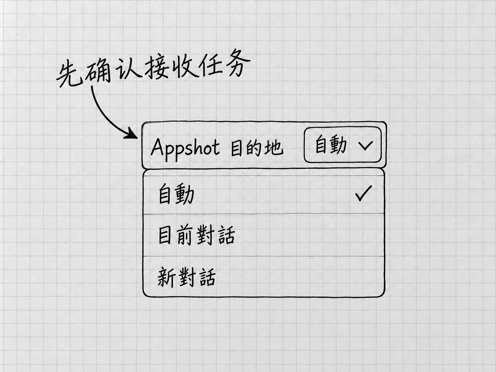

# 第9章 把材料交对：文件、图片、链接与应用快照

第4章能整理出正确的清单，一个重要原因是两份备忘都放在明确的文件夹里，我们也先确认了Codex读到了什么。以后换成邮件摘录、长文档、截图或网页，这个顺序照样有用。

交材料，要让它拿到完成眼前工作所需要的内容，并且知道每份内容起什么作用。材料多并不等于充分：一份已经过期却没有标明的文件，会把结果带偏。

## 先决定交哪一种材料

只有几行文字，直接贴在输入框里最直观。在文字前后说明「下面是原始记录」和「我要你怎样处理」，材料与要求就各有位置。材料里如果有「立即发送」这样的句子，那是别人的原话；你只要整理，就写明这些文字只当材料阅读。

文件已经在「我的待办」里，就用不着再把全文复制一遍。回到这个本地项目中的任务，确认工作位置，再告诉它文件位置。输入区的 **`@`** 可以用来选择文件：输入文件名的关键部分，检查候选项所在的位置，选中真正要用的那份，再补上要求。选中文件只是指明了对象，它读了多少，后面还要确认。[本地任务与文件引用](https://learn.chatgpt.com/docs/environments/modes)

可以这样决定：

| 材料现在在哪里 | 比较直接的做法 |
|---|---|
| 只有几行文字 | 粘贴内容，说明它是原文还是新要求 |
| 当前项目里的文件 | 用`@`选择，或写清相对于项目的位置 |
| 一张需要判断的截图 | 加入图片，并指出要看什么 |
| 一个公开网页 | 提供原页链接，说明要查的问题和时点 |
| 另一个应用当前显示的内容 | 需要时使用Appshot，随后核对捕获范围 |

选好入口之后，还要说明用途。同一份文件可以是待改的原稿，也可以只是格式参考。只说一句「参考这个文件」，Codex不知道你想沿用的是内容、结构还是版式。

## 位置要从共同的起点说起

「材料/补充说明.txt」这种写法，表示从当前项目文件夹进入「材料」，再找里面的文件。它依赖一个共同起点，这就是**相对路径**。当前项目换成另一个文件夹，同样的文字就可能指向另一份文件，或者什么也找不到。

从电脑的磁盘位置一路写到文件名，则是**完整路径**。Windows常见开头是盘符，Mac常见开头是`/Users/`。实际地址以你的电脑为准。

拿不准起点时，先问：

> 先不要改文件。请报告当前工作文件夹的完整路径，并列出其中「材料」文件夹里的文件名。

把回复与自己在电脑中打开的位置对照，再继续。文件在项目之外时，可以把本次需要的副本放进项目，并写明原件不动；确实需要访问另一位置，再说明实际路径并处理相应权限。交两份材料，范围限在这两份就好。

## 先确认内容，别只确认文件名

读一份长文档时，可以让Codex先说明读到了哪些部分、有没有表格或图片无法读取，再开始整理。这样问：

> 请先读取这两份材料，分别用一句话说明内容，并列出你没能读取或没有把握识别的部分。暂时不要补写，也不要修改原文件。

随后用自己知道的关键细节核对。第4章可以查「10张」「横线款」「尚未预约」；更长的材料可以查末尾的一项要求、表格中的一行或图片旁的说明。它能报出标题，说明找到了文件；正文读全没有，要靠这些细节来验。

读不全时，先缩小问题。告诉它具体页码、表格名称或段落，把必要部分单独提供。复杂排版、扫描文字和受保护文件可能需要不同工具。让它报告缺了哪些范围，比要求它凭上下文「补完整」可靠。

## 图片需要一个观察目标

在桌面输入区，可以按住 **Shift** 拖入图片。发送前，先看输入区是否出现了预期的图片，有没有带入不相关的内容。也可以让它查看当前项目内指定的图片文件。[图片输入](https://learn.chatgpt.com/docs/image-inputs)

图片旁边的说明越明确，检查越有针对性。例如：

> 这张截图是我刚打开的清单。请只检查右下角那项内容是否被窗口遮住；不要根据截图补写我没提供的待办事项。

提供了两张图，就分别说哪张是原版、哪张是修改版，以及比较什么。这里说的都是请它看图。生成或修改图片是另一种请求，操作图片里显示的那个应用又是另一种，第23章才讲。

截图适合呈现可见状态。需要准确处理一整篇文字时，还应提供原文件或相关文本，一张截不全的图片承载不了全文。

## 把另一个应用的当前内容带进来

有时材料就在另一个应用里，你不想先另存文件。这时可以使用 **Appshot，应用快照**。它把最前方应用窗口的截图和能够取得的文字带入任务，作为材料。它只带回内容，那个应用仍由你自己操作。

<!-- diagram: FIG-014 -->

*图：Windows繁体界面中的Appshot目的地：自動、目前對話和新對話决定快照进入哪里。图中勾选仅为来源状态；用于同一件事时，先确认接收任务。*
<!-- /diagram: FIG-014 -->

先决定快照要进哪个任务。官方提供的目的地设置有 **Current chat**、**New chat** 和 **Automatic**，分别对应当前任务、新任务和自动选择。先打开Settings，找到Appshot destination，按本次需要选择；随后回到准备接收材料的任务。想给现有任务补材料，目的地就要先选对，免得快照落到另一个新任务里。

然后切到要提供材料的应用，把正确窗口放到最前方。默认热键是Mac同时按两侧的 **Command**，Windows同时按两侧的 **Alt**；如果改过热键，以自己的设置为准。第一次使用按系统和应用提示授权；Mac可能需要屏幕录制与辅助功能权限，组织也可能限制功能。[Appshots的入口与权限](https://learn.chatgpt.com/docs/appshots)

捕获后回到Codex，确认快照进了哪个任务、附件是否对应正确窗口，再说要处理什么。Automatic通常会新建任务；最近60秒内交互过的任务可能被继续使用。规则记不住也没关系，看到实际附件再发送要求。

快照取得的文字，有时比截图可见范围多，有时只有截图，各应用能提供的内容不同。整份文档、其他标签页和屏幕外的信息是否读到了，可以先问一句「这份快照里你实际能读到哪些内容」，再对照你要处理的部分。

没有快照入口或授权失败时，回到前面的文件、图片、文本或链接路线。只需要一段文字的任务，复制粘贴就解决了。

## 链接是线索，还需要实际读取

贴出网页链接时，附上要找的问题。「请核对这个页面说明的Windows首次设置要求」，比「看看这个」明确。需要登录的网页，普通网页读取可能取不到内容；网页也可能已经移动，或者只返回页面标题。

收到答复后，看它读取的是原页，还是只看到了搜索摘要。联网查证在第11章专门讲。这里先记住：给了材料的地址，材料本身还要它实际去读。

把材料交出去以前，删去与本次无关的个人信息，并确认自己有权提供。截图和应用快照尤其容易把旁边的姓名、消息或其他窗口内容一起带进来。前面说过，Local指的是本地工作位置，交出的内容仍会发给模型处理。

材料出了问题，按这个次序定位：先看是不是正确的任务和项目，再看文件或附件是否正确，接着看实际读取范围，最后才判断理解有没有错。这样反馈给Codex的是一个具体缺口，它也更容易补上真正缺的东西。

<!-- studio:nav -->
← [第8章 看懂运行过程：补充、排队、停止和继续](running-control.md) · [目录](../README.md) · [第10章 找到、检查、批注和保留成果](results.md) →
<!-- /studio:nav -->
