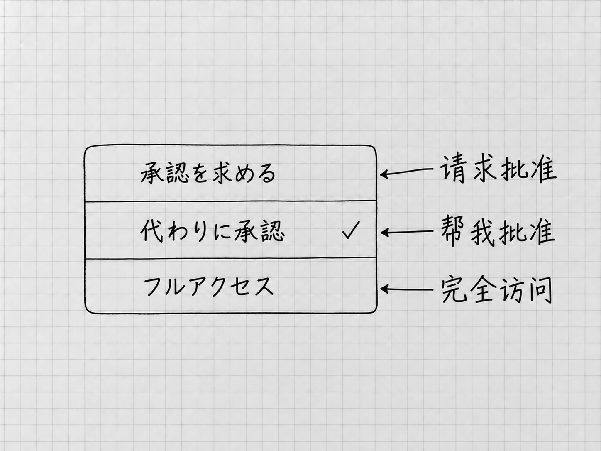

# 第7章 权限与批准：哪些事需要你决定

第4章里，你要求Codex把清单存到「结果」，它读原件、写文件，中间并没有每一步都来问。当时选的明明是「请求批准」，为什么不问？因为权限要管两件事：让范围内的工作顺利进行，让范围外的操作停下来等你判断。看懂这层关系，就知道什么时候等着，什么时候该回应。

## 能做什么，和这次应该做什么

当前任务的权限控件位于输入框下方。第3、4章选择的 **Ask for approval（请求批准）**，允许Codex在当前工作区内进行常规读写和本地操作；需要额外访问时，再提出批准请求。

你在消息里写「只读取，不改文件」，是在已有能力范围内缩小这次任务的要求：权限仍然允许写入，这次约定不写。反过来，消息里的话也扩大不了权限。写一句「帮我把文件保存到另一个位置」，原来受限的位置照样受限，它得先提出请求。

技术上限制文件和网络访问的范围，通常叫**沙箱**。把它理解为运行时的访问边界就够了，内部规则用不着你配置。项目帮你组织工作、指定本地位置，实际允许访问哪里，由沙箱和权限设置决定。

## 三种常见模式怎样选

<!-- diagram: FIG-012 -->

*图：日文界面的三种模式与本书称呼对照。图中的勾选只是来源状态，初次使用按正文先选请求批准；别把帮我批准理解为取消所有确认。*
<!-- /diagram: FIG-012 -->

| 模式 | 请求交给谁判断 | 使用时要理解的区别 |
|---|---|---|
| Ask for approval | 需要额外访问时由你决定 | 适合先看清请求和操作范围 |
| Approve for me | 符合条件的请求交给自动审核 | 仍有访问边界，也可能被拒绝 |
| Full access | 不再按同样方式逐次询问本地文件和联网操作 | 访问范围更广，错误操作的影响也更大 |

本书的文件案例，用Ask for approval就够了。Full access没有必要作为「某一步失败了」之后的通用处理；先找出失败原因，再决定是否需要增加具体的访问范围。

**Approve for me是「帮我批准」**。它把一部分请求交给另一个审核代理评估。它改变的是谁来审核，原来的访问边界照旧，Codex能做的事也没有因此变多。自动审核同样可能判断错。

如果准备使用后两种模式，而任务菜单里还没有，先打开 **Settings → General**，在Permissions部分查看相应模式是否允许启用。设置里的Auto-review对应任务里的Approve for me。启用后，回到准备工作的任务，在输入框下方实际选择并核对。**设置中启用，只是让模式可选，不会自动替当前任务选中。**组织禁止的选项可能显示为不可用，这属于组织的决定，需要时找管理员。[权限模式](https://learn.chatgpt.com/docs/permission-modes)

## 请求出现时，先看对象和动作

设想你要求把检查后的清单复制到另一个文件夹，而那处位置不在当前允许范围内，Codex就可能提出额外访问请求。这是为说明判断方法假设的情境，请求是否出现、怎样显示，取决于当前权限。

先看它要访问哪里，再看准备做什么。复制一份文件、覆盖已有的同名文件、删除整个目录，影响差得很远。然后问自己：这一步是不是在完成我刚才的要求？本来只想在「我的待办」里整理清单，它却要读取一大片无关文件，就先让它缩小范围。

看不懂请求里的命令时，可以先让它解释：

> 先不要执行。请用日常语言说明这一步会读取、修改或发送什么，为什么当前任务需要它，有没有只在「我的待办」中完成的办法。

核对解释和具体请求后，再使用当前请求提供的批准或拒绝选项。官方默认快捷键是：批准请求打开时用Enter批准，Esc拒绝。这两个键只在请求打开时起这个作用。初次使用，先把请求读完整，再选对应的动作。

批准只是允许它尝试。文件仍可能因为位置错误、程序失败等原因没有生成，所以批准以后要看执行结果。拒绝以后，回到原任务说明允许的替代范围，例如「不访问那个目录，只使用当前项目里的两份备忘」。

## 有些授权不在这一个菜单里

使用Codex时，还可能遇到电脑系统和外部服务的授权。可以按它们控制的对象来区分：

| 授权发生在哪里 | 通常控制什么 |
|---|---|
| Codex任务的批准请求 | 这次工具或文件操作是否可以执行 |
| 电脑系统设置 | 麦克风、屏幕或应用控制等系统能力 |
| 外部服务的登录与连接页面 | 哪个服务账号、哪些资料或动作可被访问 |

三处各管各的。同意了麦克风访问，操作邮件应用仍要另外授权；插件装好了，服务账号还要另外连接。后面的插件和电脑操作章节会分别走这些路径。

联网也分两种。Codex使用的托管网页搜索，与它在你电脑上执行一条需要联网的命令，受不同控制。它能搜到网页时，本地命令的联网仍要另行获准。看请求时，看具体工具和目的。

## 自动审核拒绝以后

自动审核拒绝某项操作时，先读它说明的原因。可以让Codex缩小范围、改用已有材料，或把要写出的内容先保存为本地草稿。如果原任务只是整理待办，它却提出替你联系维修店，让它撤回这项多余行动就行了。

桌面菜单中的 **`/approve`**用途很窄：自动审核启用、且存在适用的最近拒绝时，为那次被拒动作批准一次重试。它放行的只有这一次，组织不允许的动作也不会因此成功。使用前先弄清具体对象和影响。

拿不准是否应该重试时，可以把请求留在那里，先完成用不到它的部分。把受限的部分与已经能做的部分分开说清，很多任务在现有权限里就能出成果。

相关官方资料：[权限与模式](https://learn.chatgpt.com/docs/permission-modes)、[自动审核](https://learn.chatgpt.com/docs/sandboxing/auto-review)、[批准命令](https://learn.chatgpt.com/docs/reference/slash-commands)、[桌面按键](https://learn.chatgpt.com/docs/reference/commands)、[搜索与联网边界](https://learn.chatgpt.com/docs/web-search)。

<!-- studio:nav -->
← [第6章 模型、Effort和快速模式，应该怎么选](models-effort.md) · [目录](../README.md) · [第8章 看懂运行过程：补充、排队、停止和继续](running-control.md) →
<!-- /studio:nav -->
