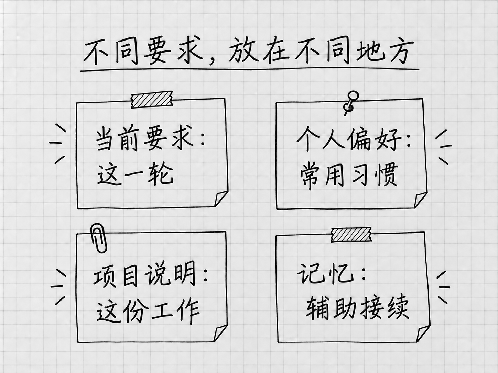

# 第19章 不想每次重说：偏好、项目说明与记忆

每次整理清单，都要重新交代「原材料不动」「没有日期就保留未定」，说多了就会想：能不能把这些做法保存下来？可以，前提是先分清它们应该在哪个范围生效。

有些话只针对这一次，比如笔记本已经买好；有些只针对这个项目，比如结果放进「结果」文件夹；还有些是你希望所有任务都遵守的交流习惯。放对了位置，既省得重复，也免得一条旧要求去干扰不相干的工作。

## 个人偏好，放在个性化设置

打开 **Settings → Personalization**，查看当前提供的个人设置。在自定义说明里，可以写跨任务的稳定偏好，例如：

> 解释陌生概念时，先说它在当前任务中有什么用，再给出名称。回答尽量直接；不确定的信息请明确指出。

这样的要求没有绑定某一份文件，适合长期使用。「这次把清单另存为v3」只属于当前任务，就留在当前任务里说。

Codex中的个人自定义说明保存在全局的`AGENTS.md`中，项目还可以有自己的说明。个人说明从设置入口写就行，用不着去找那个全局文件。[个人说明的作用范围](https://learn.chatgpt.com/docs/personalize)

同一页还可能提供 **Friendly、Pragmatic、None** 等Personality选择，用来调整交流方式。支持该功能的模型也可通过 **`/personality`** 选择。它改变的是回答的风格；这次到底要做什么，仍要在要求里写明。

## 项目说明，是放在文件夹里的工作约定

只对「我的待办」成立的规则，可以放进这个项目的说明文件。Codex会按全局和项目目录范围读取这种约定，文件通常叫 **`AGENTS.md`**。可以把它理解为放在这份资料夹里的工作说明，内容直接用自然语言写。[项目说明如何读取](https://learn.chatgpt.com/docs/agent-configuration/agents-md)

`.md`表示Markdown文本，一种用少量标记表示标题、列表的文字格式。读它和写它，用的都是普通句子。

先回到正确的本地项目，看看有没有现成的说明：

> 先检查当前项目是否已有AGENTS.md或其他实际生效的项目说明，报告路径和主要内容。不要覆盖或修改现有文件。

已有说明时，先阅读，再决定补哪几条。它可能来自之前的工作或团队，重新生成一份会把这些内容盖掉。

## 没有说明时，再起草最少的几条

确认没有需要保留的同类说明后，可以在输入区选择 **`/init`**，为当前项目生成起稿，再检查内容。官方将它定义为生成项目`AGENTS.md`的起点，生成稿是否适合你的资料夹，要读过才知道。[`/init`入口](https://learn.chatgpt.com/docs/reference/slash-commands)

你也可以直接说明本项目只处理文本材料，请它根据已经跑通的做法起草。对于「我的待办」，有几条规则就够用：

> 「材料」中保留原件，整理结果放在「结果」中。没有依据的日期、数量或状态不补写。改变已认可结果时另存新版本，并报告实际文件位置。只整理记录，不代办其中的事情。

检查生成的文件里有没有混入与项目无关的开发要求、假定存在的工具或过细的步骤，删掉以后再保存。项目说明会随任务一起读入，只留确实用得上的几条。

## 保存以后，用新任务确认

在同一项目里新建任务，先请Codex报告实际加载了哪些说明文件，并简述与当前工作有关的要求。核对路径，再用一个小范围的只读问题，观察它有没有按规则工作。

它能复述规则，说明规则已经读到了；成果是否遵守，以后每次仍要检查。项目说明是对行为的要求，技术上原材料仍然可以被修改，权限要靠第7章的设置来管。

规则没有生效时，先检查任务实际的工作目录，文件名是否正确、内容是否为空，以及是否有更靠近当前目录的说明把它覆盖了。第12章提过，次要文件夹里的说明不会被自动发现。可以让Codex报告它依据的说明来源，再针对原因修改。同一条要求抄到许多地方，以后更难维护。

规则过时了，就在原来生效的位置更新。「笔记本已买」这样的短期信息，留在材料或当前任务里，不写进长期规则。

## 记忆提供帮助，但不能代替明确约定

<!-- diagram: FIG-021 -->

*图：本轮要求、个人习惯、项目约定与记忆各有用途。*
<!-- /diagram: FIG-021 -->

**Memories，记忆**，用于把过去工作中有用的信息带到未来任务。本地Codex记忆与ChatGPT网页记忆分别存储和控制，网页那边记住的事，本地Codex未必知道。[本地记忆](https://learn.chatgpt.com/docs/customization/memories)

本地记忆默认关闭。需要时，到 **Settings → Personalization → Enable memories** 开启，再回到当前任务用 **`/memories`** 查看这次任务的两类选择：能否使用已有记忆，能否作为生成未来记忆的材料。这两项只管当前任务，全局开关仍在设置里。

启用以后，Codex会在后台处理符合条件的历史任务，更新的时间没有保证。还在运行、过短或不符合其他条件的任务，可能暂时不参与生成；额度条件也会影响后台过程。所以必要的信息仍要在任务里明确给出，一句「你应该记得」靠不住。

想管理使用范围，用全局设置和`/memories`的当前任务控制。关闭以后，已经生成的记忆文件还在。官方把记忆文件视为生成状态，排查问题或分享之前可以查看，主要的控制手段仍是上面两处设置。密钥和需要保密的信息，一开始就别让它进入记忆。

## 认识一个可选功能：Computer History

Mac上还有 **Computer History**，用于把允许的应用和网站活动整理成时间线与记忆。它默认关闭，需要相应账号、Memories和组织授权条件；Windows上没有这项功能。

它与Appshot的区别在于：Appshot是你此刻主动提供的一张快照，Computer History是开启后按允许的范围持续收集活动并生成摘要。官方说明它不把截图放进历史，也不录音，但会使用交互事件及可取得的文字；生成摘要时要经过服务端处理。[Computer History范围](https://learn.chatgpt.com/docs/customization/computer-history)

想了解时，到Mac的 **Settings → Computer history** 查看说明与控制。暂停或关闭，停止的是后续采集；要去掉已有记录，在History中单独删除或清除，清除不可撤销。只为少说几句重复的话，明确的项目约定已经够用，这项功能可以先不开。

个人偏好、项目说明和记忆，解决的是三个不同范围的问题。值得保存的是反复有用、含义清楚的要求；这一次的事实、文件版本和完成标准，留在眼前的任务里。

<!-- studio:nav -->
← [第18章 几件事怎样分开做：多个任务与子代理](delegation.md) · [目录](../README.md) · [第20章 Skill：把已经跑通的做法保存下来](skills.md) →
<!-- /studio:nav -->
