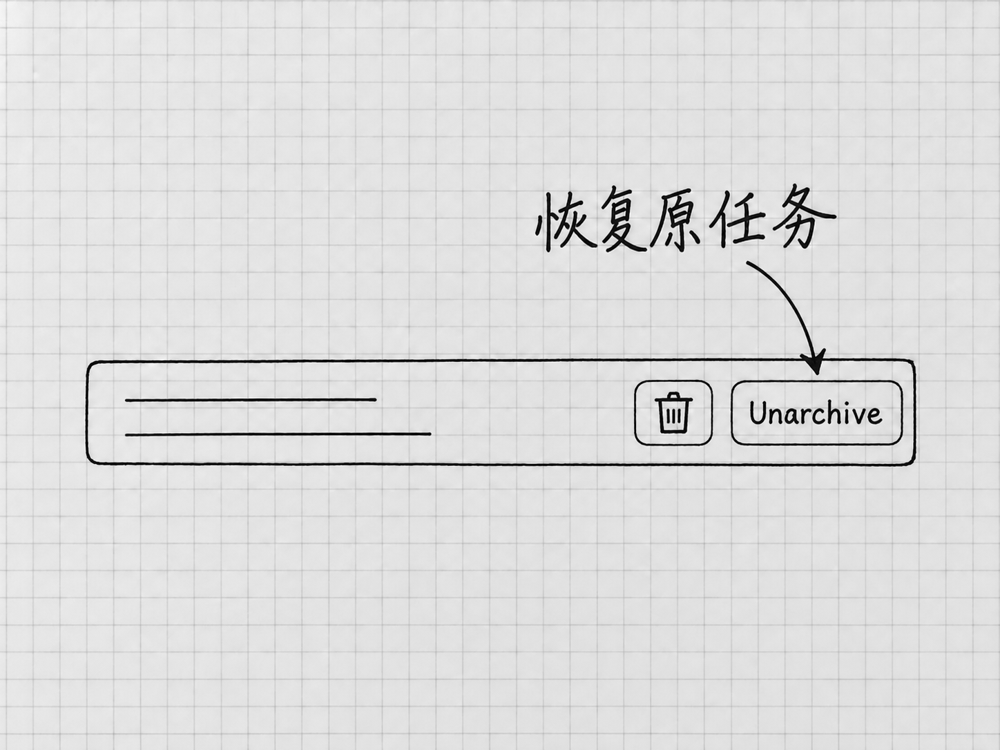

# 第12章 管好任务与项目，过几天还能接着做

刚开始只有一个任务，靠记忆就能找到。用了一段时间以后，手里可能同时有清单整理、资料查证和一篇文章的修改。这时候难住人的，往往是找不到该回到哪一处继续。

项目帮你组织相关的工作和文件，任务保留某一次工作的交流过程。把两者分清，再起几个容易辨认的名字，大部分混乱就避免了。

## 一件成果，通常留在同一个任务里改

第4章从读备忘到生成v1、更新v2，都在同一个任务里完成。后面的反馈紧接着前面的结果，留在原任务里，「这次只改哪一处」最容易说清。

要得到一个独立成果，例如查证Windows当前的设置要求，可以在同一项目里另开任务。资料查证和清单更新各有自己的消息与结果，回来时也容易找。

两个任务放在同一个项目里，仍然各有自己的交流记录，一个任务里讨论过的决定，另一个任务并不知道。文件却是共用的：同一项目的任务读写的是同一批本地文件。两个任务同时改「待办清单-v2.txt」，就会互相影响。[项目与任务的组织方式](https://learn.chatgpt.com/docs/projects)

## 新任务先检查工作位置

准备新建时，先在侧栏选中需要的本地项目，再使用 **New chat**。发送文件操作要求之前，确认项目名称和本地位置；必要时像第9章那样，让它先报告当前工作文件夹与待处理文件。

输入区的斜线菜单也有几个相关入口：

| 命令 | 用在什么地方 |
|---|---|
| `/project` | 为新任务选择项目 |
| `/task` | 开始一个不依附项目的任务 |
| `/local` | 选择在本地项目中工作 |

它们各自解决一个入口问题，文件不会因此移动或同步。选完以后，检查任务实际显示的项目与位置。[桌面命令](https://learn.chatgpt.com/docs/reference/slash-commands)

临时问一个独立问题，可以不使用项目。会反复使用同一批文件、产生多个版本的工作，放进明确的本地项目更合适。

## 文件夹多了，主要位置是什么

第3章只连接了一个「我的待办」文件夹。后来确实需要让一个项目使用多个文件夹时，可以在项目菜单进入 **Edit project**，用 **Add folder** 添加，再按需要用 **Make primary** 指定主要文件夹。[本地项目的文件夹设置](https://learn.chatgpt.com/docs/projects)

主要文件夹是新任务开始工作的起点。原来已经存在的任务仍在它原来的位置，继续之前查看实际目录。次要文件夹里的文件可以搜索、读取和编辑，放在那里的项目说明、技能和配置却不会被自动发现。后面讲项目说明与Skill时，会用到这个区别。

基础使用阶段，保留一个清楚的主文件夹就够了。文件夹少，才容易判断材料来自哪里、成果写到了哪里。

## 给任务起能找回来的名字

「继续处理」「帮我看看」这样的名字，几天后的自己看了想不起内容。可以把任务改名为「待办清单｜更新购买状态」，或「桌面安装｜核对Windows设置」，写出对象和目的。

在当前任务中，官方默认的重命名快捷键是Mac的 **⌘⌥R**、Windows的 **Ctrl+Alt+R**；置顶是Mac的 **⌘⌥P**、Windows的 **Ctrl+Alt+P**。快捷键可以自定义，找不到对应动作时，到Settings的快捷键设置中搜索Rename chat或Pin chat，按当前绑定操作。这里的chat就是本书一直说的任务。[桌面命令与快捷键](https://learn.chatgpt.com/docs/reference/commands)

置顶只改变任务在侧栏里的位置，方便你找到它。适合置顶的是经常回来继续的几件事；什么都置顶，就又分不出先后了。

找旧任务时，使用侧栏的 **Search chats**，搜索标题或你记得的关键词。它搜索的是任务记录，电脑里的文件要到文件夹里找。找到任务以后，核对它讨论的是哪一版成果。

## 归档以后，怎样回来

<!-- diagram: FIG-016 -->

*图：归档列表中的Unarchive用于恢复原任务，旁边的垃圾桶是删除入口。先核对任务，再选择恢复。*
<!-- /diagram: FIG-016 -->

已经告一段落的任务可以归档，让侧栏更清楚。在当前任务中，默认归档快捷键是Mac的 **⌘⇧A**、Windows的 **Ctrl+Shift+A**，也可以在自己的快捷键设置中查对应动作。

要继续已归档的任务，在桌面应用打开 **Settings → Archived chats**，找到对应任务，用 **Unarchive** 恢复。恢复以后先查看最后的成果与未完成事项，再发新要求。网上有些说明会多一层Data Controls，那是网页入口的路径；本书这里讲的是桌面应用。入口与你的版本不同时，先核对[当前桌面设置说明](https://learn.chatgpt.com/docs/reference/settings)，不要为了找回任务重新创建同名项目。

归档整理的是任务列表。任务从侧栏消失了，电脑里的成果文件仍在原处；文件的备份要另外做。

## 离开前留一句真正有用的接续说明

工作暂时停下时，可以让Codex在任务里总结，也可以保存到项目中的一个文本文件。内容用不着长，要包含能帮助下一次继续的信息：

> 当前以「结果/待办清单-v2.txt」为准，已对照两份备忘核对四项事项。笔记本已完成，其他三项仍待办。下次只更新新进展；原备忘与v1保留，不替我办理其中的事情。

这段说明保存了当前版本、已确认状态和行动边界。「今天做得很好，下次继续」就帮不上这个忙。

过几天回来，先打开实际文件，看看中间有没有自己或其他任务修改过。聊天记录说的是当时发生了什么，文件反映的是现在保存的状态。两者有差异时，先确认该用哪个版本。

原任务已经太长，或者想换一种方案时，可以把这份接续说明带到新任务。上下文、压缩和任务分支，下一章继续讲。

<!-- studio:nav -->
← [第11章 让Codex上网找资料，并检查来源](web-search.md) · [目录](../README.md) · [第13章 对话变长以后：上下文、压缩和分支](context.md) →
<!-- /studio:nav -->
