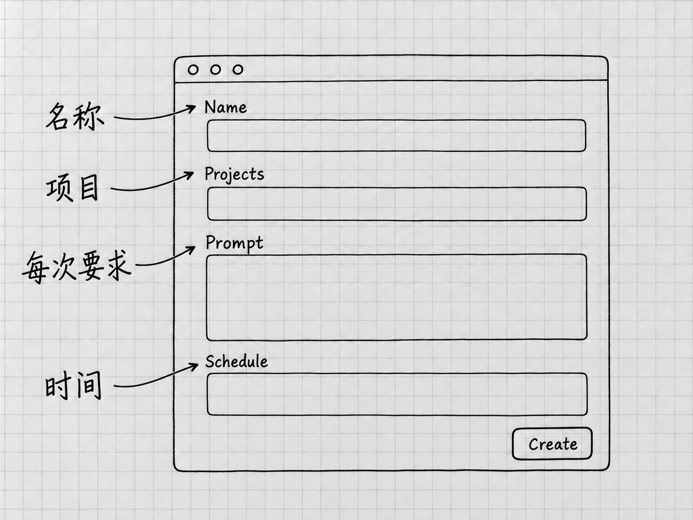

# 第24章 定时任务：让跑通的工作按时再做

Goal解决的是「现在围绕一个目标持续做」。定时任务解决的是「到了指定时间，再做一次已经说清楚的工作」。还有一种更简单的情况，只是到时间提醒你一下，既不读材料也不生成文件。

把这三种需要分开，再决定怎样安排。一个还没跑通的流程，定时以后只会把同样的问题按时再出一遍。所以先把单次工作做对，再让它按时重复。

## 先手动完成同样的一次

假设你每周想看一眼当前清单是否漏了原备忘中的要求。先回到「我的待办」项目，用普通任务提出一次只读检查：

> 读取「材料」中的两份备忘，以及我指定的当前清单「结果/待办清单-v2.txt」。检查事项、日期、数量和补充要求是否遗漏或改变，分别列出差异与无法确认的地方。只读，不自动更新状态或改文件。报告检查了哪些文件。

打开原材料和当前清单，核对它的报告。路径错误、把已完成状态当成错误、漏看一份材料，都在这一次处理好。例如笔记本的「已完成」来自后来的新进展，就要在要求里说明，免得它拿最初的备忘去否定最新状态。

单次流程清楚了，结果也容易检查，再考虑定时。每次还需要你临场解释很多条件的话，先把流程说明白。[官方关于先测试后定时的建议](https://learn.chatgpt.com/docs/automations)

## 每次回来，应该做同一件什么事

定时任务在以后运行，到时候没有「刚才」可言，所以要求里要写全：检查哪份材料，什么算值得报告，结果放哪里，哪些情况需要停下来。

当前清单以后可能从v2更新到v3。计划如果一直固定检查v2，每次都按时成功，查的却是一份过期文件。可以保留一份写明当前版本的说明，让它每次先读；也可以在版本变化时直接更新定时任务。靠文件名排序去猜最新版，是最容易出错的办法。

内容没有变化时，你是希望仍收到一条简短记录，还是只在发现问题时才提醒，也写清楚。否则周期工作会攒下一堆看不出用处的消息。

## 选择回到原任务，还是每次独立运行

桌面定时支持在原任务中接着做，也支持每次启动独立任务。前者适合持续跟进同一件事，保留相关上下文；后者适合每轮都依据固定要求重新检查，结果分别留在Scheduled中。[定时任务的目的地](https://learn.chatgpt.com/docs/automations)

本例每周核对一次清单，选独立运行，各周的讨论就不会混在一起。想让它持续跟进同一个问题、直到某个明确状态出现，则可以要求回到原任务，并写出停止条件。

普通的文件夹项目可以直接运行定时任务。Git和Worktree是原本就使用Git、需要隔离改动的项目才涉及的选择，这里的只读核对用不到。

## 用对话建立安排，再核对保存结果

<!-- diagram: FIG-026 -->

*图：创建表单依次核对名称（Name）、项目（Projects）、每次要求（Prompt）和时间（Schedule）。看到这张表单还不等于保存成功，完成创建后仍要到Scheduled核对实际安排。*
<!-- /diagram: FIG-026 -->

在已经跑通的任务里，可以直接要求Codex创建定时安排。下面写东京时间，是为了把时区说清楚，实际使用时换成你所在地区的时区：

> 将刚才确认的只读清单核对设为每周一上午9点，时区Asia/Tokyo。每次在「我的待办」项目启动独立任务，使用本轮已经确认的材料与当前清单路径。只报告差异和未知，不改文件、不代办事项。
>
> 若文件缺失或无法读取，请报告失败位置，不猜内容。创建后列出保存的要求、运行项目、时区、下次运行时间和结果入口，便于我核对。

官方支持从对话创建或更新计划，并说明每轮回到原任务还是新建任务。任务内如果生成了设置卡片或需要选择，核对后完成界面要求的保存操作。聊天里出现计划文字，计划还不算建好。

接着打开侧栏的 **Scheduled**，找到这项安排，核对名称、状态、频率和下次时间。显示的时区或时间与你的要求不符，先改正再启用。电脑换了地区、遇到夏令时或本地显示方式变化时，也要重新看一眼实际的下次运行时间。

## 本地文件任务仍依赖电脑

需要本地项目的任务，运行时电脑要开启、应用在运行、文件夹仍可访问。睡眠、断网、退出账号、移动材料或失去权限，都可能使结果不完整。[本地运行条件](https://learn.chatgpt.com/docs/automations)

后台任务使用相应的默认沙箱与组织规则。你不在屏幕前，没有人来点批准，某些越界操作可能直接失败；组织设置也会影响行为。所以手动测试成功以后，还要看后台运行时的条件是否相同。

遇到失败，先看任务是否需要访问项目之外的文件，能否把必要的副本放在明确位置，工具是否已经授权。只读本地清单的需求，按这个范围安排就行，用不着为此改成Full access。

功能未对当前账号开放，或者组织不允许时，继续手动完成已经跑通的流程。网页端也有同名的定时功能，但它进不了你电脑里的文件夹。

## 第一轮运行后，还要看什么

到了约定时间，在Scheduled查看这项任务的运行记录和需要注意的结果；安排在原任务内的，回到对应任务核对。打开结果，检查实际读取的文件、核对范围和报告内容。状态显示「完成」，只说明它跑完了。

最初几轮尤其值得检查：有没有因为当前文件换名而读错，是否对没有变化的内容反复报警，失败时有没有说清原因。根据真实结果调整要求或频率，比一开始就设一个很复杂的周期容易维护。

没有按时出现结果时，先核对计划是否启用、时间与时区、电脑和应用状态、文件位置、账号与权限，再决定是否重跑。本书不假定错过的运行会自动补上；补跑之前先看已有记录，免得重复处理。

## 更新、暂停、恢复和删除

计划需要变化时，先在Scheduled找到正确的项目与名称，或者在原任务中明确指出要改哪一个已有安排。可以说「把这项每周核对改到周二，保留其他要求」。重新创建一个会留下两个名字相似的安排，以后分不清。

暂时不用，就要求暂停该计划，随后到Scheduled确认状态；准备继续时再恢复，并核对下次运行时间。彻底不需要了，删除这一项安排，并确认它不再计划执行。修改或暂停未来安排，管的是以后的运行；此刻正在运行的那一次，要按第8章的办法另行处理。

删除安排以后，过去生成的文件和已经做过的外部操作都还在。历史成果需要清理的话，针对具体文件另作决定。

第20章的Skill可以复用稳定流程，定时任务的要求里也可以点名调用某个技能。没有技能也没关系，一段经过实际检查的清楚要求，就能作为周期工作的基础。以后材料、模型或工具变了，先回到单次运行验证，可靠了再继续安排。

到这里，你已经从安装和第一条消息，走到了设置、材料、检查、接续、扩展与定时。日常使用用不着每次动用全部功能。先看当前任务缺的是材料、判断、工具还是安排，再用相应的入口去补。

<!-- studio:nav -->
← [第23章 电脑操作：让Codex操作其他应用](computer-use.md) · [目录](../README.md) · [附录：命令、设置、排障与术语](quick-reference.md) →
<!-- /studio:nav -->
