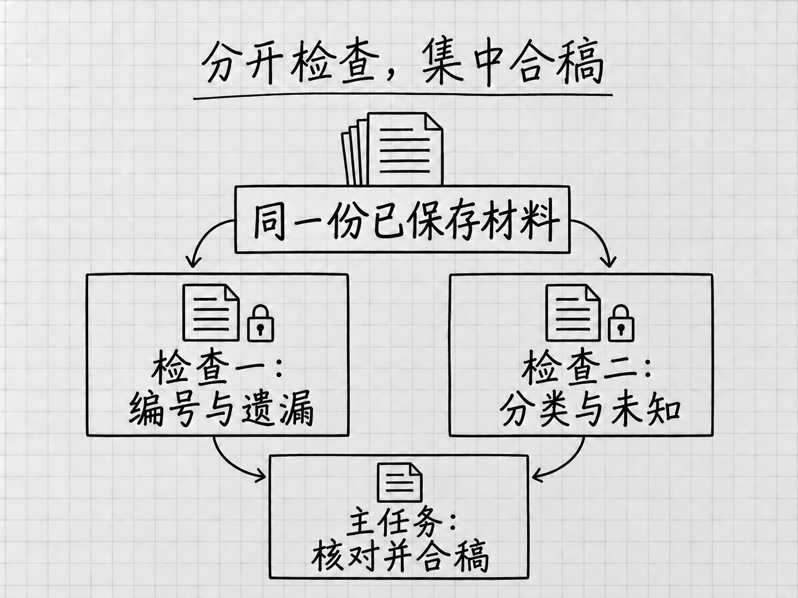

<!-- Generated by studio; edit the units in book.yaml. -->

# Codex完全零基础入门

 <strong>马力</strong>

## 目录

- [开篇：GPT-6 Astra与现在的Codex](#latest-models)
- [第1章 Codex能帮你做什么](#intro)
- [第2章 安装应用，进入Codex](#desktop-setup)
- [第3章 看懂第一屏，并发出第一条消息](#workspace-files)
- [第4章 第一次完整使用：把零散备忘整理成待办清单](#first-task)
- [第5章 账号与额度：看懂自己正在用什么](#account-usage)
- [第6章 模型、Effort和快速模式，应该怎么选](#models-effort)
- [第7章 权限与批准：哪些事需要你决定](#permissions)
- [第8章 看懂运行过程：补充、排队、停止和继续](#running-control)
- [第9章 把材料交对：文件、图片、链接与应用快照](#materials)
- [第10章 找到、检查、批注和保留成果](#results)
- [第11章 让Codex上网找资料，并检查来源](#web-search)
- [第12章 管好任务与项目，过几天还能接着做](#projects-tasks)
- [第13章 对话变长以后：上下文、压缩和分支](#context)
- [第14章 把想法说清楚：让Codex知道你要什么](#clear-requests)
- [第15章 先商量怎么做：Plan与方案比较](#planning)
- [第16章 第一版不满意：怎样反馈、核对和改进](#feedback)
- [第17章 用Goal持续推进有明确终点的任务](#goals)
- [第18章 几件事怎样分开做：多个任务与子代理](#delegation)
- [第19章 不想每次重说：偏好、项目说明与记忆](#personalization)
- [第20章 Skill：把已经跑通的做法保存下来](#skills)
- [第21章 插件与MCP：接入需要的工具和资料](#plugins)
- [第22章 浏览器：把网页交给Codex查看和操作](#browser)
- [第23章 电脑操作：让Codex操作其他应用](#computer-use)
- [第24章 定时任务：让跑通的工作按时再做](#scheduled-work)
- [附录：命令、设置、排障与术语](#quick-reference)

# 开篇：GPT-6 Astra与现在的Codex

你手里有几份资料，想把它们整理成一份能用的说明。费时间的常常是打字以外的事：要看懂几份材料说的是不是同一件事，找到互相矛盾的地方，决定怎样组织，再根据反馈继续修改。

GPT-6 Astra适合参与这类工作。OpenAI把它定位为面向高难度完整任务的模型，强调跨资料、跨工具、跨步骤的判断能力。对没有编程经验的人来说，这意味着可以从自己熟悉的材料出发，请它把阅读、比较、制作和检查连起来，逐步做出一份成果。[官方模型说明](https://learn.chatgpt.com/docs/models)

本书的2026年9月内容重点介绍Astra，也会讲清Sol、Luna和常用设置。先看明白这些能力与你有什么关系，再去安装应用、认识界面。本篇的例子都是为说明用法设计的情景，没有拿来当模型测试的成绩。

## 从回答问题，到做完一件事

如果你问「待办清单怎样写」，得到的是写法和建议。如果你提供两份备忘，要求合并重复事项、保留时间和数量、保存成文件，需要完成的事情就多了。

例如，一份备忘写着「10月6日18:00前，把出游照片发给同行的朋友」，另一份补充「选10张，不用发整个相册」。整理时要认出两条说的是同一件事，把截止时间与数量放在一起，两个要求都留着。文件生成后，还要对照原文检查。

Astra的重点之一，就是让这种需要连续判断的工作保持连贯。它要根据前面读到的内容决定下一步，使用可用工具处理材料，再把你的新意见接到原任务上。第4章会用本书自编的两份短备忘，带你完整走一遍。

官方常说的**推理**，放到这个例子里，就是联系已有信息、比较不同解释，再判断怎样处理。判断两条提醒是否重复、一个时间是截止时间还是开始时间，都在推理，它的范围比解数学题宽得多。

材料少时，这些判断看起来很简单。换成几份版本不同的说明、散落的补充意见，或者必须同时满足多项要求的成果，就更值得考虑Astra。一件工作复杂与否，既看材料多少，也看其中有多少关系、冲突和取舍需要处理。

## Astra能在哪些地方帮上忙

### 把几份材料放在一起理解

假设你在比较两台设备，手里有各自的说明，还有自己写的需求：希望少占空间，日常维护省事。可以请Astra根据这几份材料整理两者的差别，说明哪些信息支持判断，哪些条件还没有查到。

这样的工作光抄一张参数表是做不好的。某项功能听起来更先进，却可能与你的需求无关；一份说明没有提到维护周期，只能写成「材料没有说明」。有用的整理，是把资料与你的用途联系起来。

这是根据官方所述研究与分析能力设计的使用方向。你可以在要求中补上一句：「请区分材料写明的事实、你的判断，以及还需要确认的信息。」这样，拿到结果后更容易知道哪些内容可以回原文核对，哪些仍需要你作决定。

### 根据要求做出成果，再继续修改

资料比较完以后，还可以继续请它写成说明、整理成表格，或者改成适合别人阅读的版本。Astra的官方用途包括研究、文档制作和软件工作；Codex也支持研究、文档等知识工作，并不要求所有任务都从写代码开始。[Astra型号说明](https://developers.openai.com/api/docs/models/gpt-6-astra)、[Codex的工作范围](https://learn.chatgpt.com/docs/use-chatgpt)

仍用设备资料的例子。给自己看的版本，可以保留详细比较；给家人看的版本，可能只需说明用途差别、尚未确定的条件和下一步要查什么。你不必重新开始，可以继续说：

> 请把这份说明改成给没有看过原资料的人看的版本。先说明两者分别适合什么情况，再解释理由；不展开与我的需求无关的参数，保留还需要确认的问题。

这里改变的是阅读对象和详略，原材料里的事实仍要保留。拿到新版后重点看一处：为了让推荐显得明确，原来那些还不确定的条件有没有被省掉。

### 看懂图片提供的线索

有些问题用文字不好描述。例如，一张表的标题和内容挤在一起，或者页面上的按钮让人找不到。Astra本身支持图像输入，可以结合你提供的图片理解问题；提供截图时，再说明希望它关注哪一块，会更有帮助。[模型输入能力](https://developers.openai.com/api/docs/models/gpt-6-astra)、[如何提供相关材料](https://learn.chatgpt.com/docs/prompting)

「看看截图，解释哪里难读」和「打开那个文件，替我改好」是两种任务。前者只需要图像内容，后者还要能访问文件，并有相应的操作工具与权限。绘图也是另一项功能，要看当前环境有没有提供。

想让它调整版面，可以同时提供原文件和截图：原文件是要修改的对象，截图用来指出问题。改完以后，打开修改后的成果看一遍。

### 在工作中接住你的补充

做事时才发现新要求很常见。刚开始只说「整理一份说明」，看到初稿后才意识到需要缩短、改变侧重点，或者补上一份新材料，都可以继续说。

官方特别提到Astra吸收新要求、调整方向和围绕原目标持续工作的能力，也指出它会在重要信息缺失时提出有针对性的问题。[Astra使用指南](https://developers.openai.com/api/docs/guides/latest-model?model=gpt-6-astra)

例如，比较设备时，你还没说主要用来做什么，它可能先问用途。这个答案会影响比较标准，先问清楚有价值。如果只是说明中的小标题怎样排列，通常可以由它先整理一版，让你看过再改。

你可以据此说明自己的偏好：「影响结论的问题先问我；一般的排版和措辞先给出一版。」这是一种工作约定，不会替代应用里的权限设置。任务运行中如何补充消息、什么时候会排队，第8章结合界面介绍。

## 模型、Codex和工具，各自负责什么

<!-- diagram: FIG-005 -->

*图：模型负责理解与判断，工具负责具体操作；成果仍要打开检查。*
<!-- /diagram: FIG-005 -->

**Astra是处理要求的模型，Codex是你与它交流并让它使用工具工作的入口。** 你把目标和材料交进来，模型负责理解、判断和组织内容；读取文件、搜索网页、执行计算或操作应用，还需要相应工具。

例如，比较已有的两份说明，先要能读到它们；如果还要查今天的官方信息，就需要实际检索；如果要求保存报告，就要有文件写入能力。换了模型，不会自动补齐缺少的材料，也不会自动获得某个账号、网站或文件夹的访问权。

Astra可以参与浏览器、应用和代码相关工作，但你在桌面上具体能用哪些功能，仍取决于平台、账号、工具和授权。某个入口没有出现时，先核对这几项条件。

后面的材料、插件、浏览器和电脑操作各章，会把这些连接过程讲清。现在先记住，模型能力、可用工具和本次允许做的事要放在一起看。请它整理「发照片」这项待办，它得到的授权只到整理清单为止，照片仍由你自己发。

## 怎样提出要求，才能用好Astra

要求写得长，并不会自动变好。按官方的提示建议，更有用的是交代想得到什么、哪些材料有关、重要限制是什么；只有过程本身影响结果时，才规定具体步骤。[官方提示说明](https://learn.chatgpt.com/docs/prompting)

假设要把旧说明和几条新要求整理成新版，可以这样说：

> 请根据旧说明和新补充的要求，整理一份新版说明，给第一次接触这件事的人看。
>
> 先核对哪些内容需要更新，再完成正文。材料有冲突、而且会影响结论的地方，请向我确认；只是措辞或段落顺序的问题，你可以先处理。
>
> 保留原文件，另存新版。完成后对照材料检查有没有漏掉要求，并告诉我仍未确认的事项。

这段话没有固定句式。它交代了读者、依据、需要询问的情况和完成标准，一般的处理过程留给模型自己安排。换成你的工作，只留下会影响结果的要求即可。

Astra有时会在完成第一版后回来等你判断，而你心里想的「完成」还包括核对、修正和保存。官方的Astra使用文章专门提醒，要提前说明做到哪里才算结束。上面要求「完成后对照材料检查」，就是把检查也纳入了任务。[关于Astra的提示与完成边界](https://developers.openai.com/blog/rethinking-skills-and-prompts-for-gpt-6-astra)

反过来，如果确实想先看方案，就明确写「先给方案，等我确认后再修改文件」。想让它继续还是停下，都说具体，并且只留一种：同一段要求里既写「每一步先问我」又写「自行全部完成」，它就难以判断该听哪一句。

Astra的官方指南还提到，它可能偏向详细、格式较多的回复。如果你要的是平实的说明，可以直接要求「先讲结论和理由，用完整段落，不需要每段都列成清单」。要整理大量并列项目时，表格反而更合适。成果的文风和结构由你决定。

## 什么时候选Astra，Effort先用哪一档

需要联系多份材料、处理含混要求、权衡不同条件，或把几个环节连续做完时，可以优先考虑Astra。只是提取几项信息、按明确规则分类，较轻的模型也值得尝试。官方对三类模型的用途划分，可以作为开始选择的依据：

| 模型 | 适合先考虑的工作 |
|---|---|
| GPT-6 Astra | 需要深入分析、持续判断和完整成果的工作 |
| GPT-6 Sol | 日常写作、研究，以及需要判断和较完整处理的任务 |
| GPT-6 Luna | 范围明确、标准清楚的提取、分类和重复整理 |

三者的用途有重叠，同一件事常常不止一个型号能做。比较时可以使用相同材料和要求，看结果是否漏信息、是否满足限制，以及需要等多久。选择能满足自己要求的设置，比凭型号名字判断更有用。[官方模型选择建议](https://learn.chatgpt.com/docs/model-selection)

**Effort指模型在处理任务时的思考投入。** 同样使用Astra，也可以选择不同投入。官方建议从 **Light** 开始，再根据工作中需要的分析和检查程度提高。Light管的是思考投入，回答的详略另由你的要求决定，选了Light仍然可以要一份详细说明。

比如，把两条重复提醒合并，用Light起步就够；需要比较几份相互冲突的材料、解释取舍，再考虑提高。投入增加，可能改善复杂判断，也会增加等待和使用消耗。材料里本来缺的信息，仍然要靠补充或查证，调高投入补不出来。[官方Effort建议](https://learn.chatgpt.com/docs/models)

第一次使用还不用把Max、Ultra等所有选项都调一遍。先用熟悉的小材料得到可检查的结果，再决定哪里需要更多投入。第6章会完整解释模型、Effort、Power和相关设置；这里先建立一个判断：**任务需要怎样的思考，才是调整设置的理由。**

## 已经装好应用，怎样找到Astra

在桌面Codex输入框下方，打开模型与推理设置控件。界面可能先显示 **Power** 预设，它把模型与思考投入组合在一起。需要明确指定型号时，从可用的 **Advanced** 选项中选择GPT-6 Astra，再核对当前型号和投入档位。

实际可选项和默认值会受账号、客户端、工作区与开放进度影响。没有看到Astra时，先核对登录账号、应用更新和组织允许的模型。本书的入门过程用当前可用的模型也能完成，可以先往下学。[模型选择入口与可用条件](https://learn.chatgpt.com/docs/models)

还没安装的话，继续读第1章了解Codex的整体用途，再到第2章取得Windows或Mac的官方安装入口。第3章认识第一屏，第4章完成第一次文件任务。做过这些再回来看模型的差别，就能把它们与自己做过的事联系起来。

## 相关官方资料

本篇依据当前[模型说明](https://learn.chatgpt.com/docs/models)、[模型选择](https://learn.chatgpt.com/docs/model-selection)、[Astra使用指南](https://developers.openai.com/api/docs/guides/latest-model?model=gpt-6-astra)、[Astra型号页](https://developers.openai.com/api/docs/models/gpt-6-astra)、[提示建议](https://learn.chatgpt.com/docs/prompting)及[Astra的提示与技能使用文章](https://developers.openai.com/blog/rethinking-skills-and-prompts-for-gpt-6-astra)编写。具体任务与请求示例由本书自行设计。型号页中的开发接口参数和计费规格不直接当作桌面账号的使用条件。

# 第1章 Codex能帮你做什么

电脑里有几份记录，需要整理成一份说明；一张表里混着不同写法，想把同类项目归到一起；看完几份资料，还想知道它们在哪些地方说得不一样。这些工作说不上难，却要在文件之间来回切换，边读边复制，再检查有没有漏掉什么。

Codex可以参与这样的工作。你用日常语言说明要求，提供需要的材料，它可以在允许的范围内读取、处理和修改文件，调用工具完成任务。得到第一版以后，你还可以继续指出问题，让它围绕这份成果修改。

它给普通用户带来的价值，很大一部分就在这里：**把你想做的一件事，推进到实际可用的结果。** 要整理材料，可以让它读材料并保存整理稿；要改一份文件，可以让它找到对应位置，按要求修改，再告诉你改了什么。使用时，你既要会提出要求，也要会检查它实际做到了哪一步。

## 先看看，它能帮你得到什么

**整理和比较资料。** 比如，一份记录写了几项要办的事，另一份补充了时间和数量。可以请Codex把相关信息放到一起，合并重复，标出缺失，整理成一份清单。材料较长时，也可以请它比较不同版本，找出变化，再写一份说明。

整理时最容易出问题的是意思被改掉。「周五前提交」压缩成「周五提交」，截止时间就成了当天。一张购物记录里有「笔记本」和「横线纸质本」，能不能合并，要看它们指的是不是同一种东西，名称相像只是线索。你可以请Codex先列出建议合并的项目和理由，把拿不准的留下来确认。这样，它的判断就摆在你面前，便于检查。

本书第一次完整使用就选择短备忘：两份材料，四件待办。任务小，信息如何合并、有没有遗漏，你能直接看出来。以后换成长报告，检查的道理仍然相通。

**生成和修改文件。** 可以交给它几份资料，说明文件给谁看、需要包含什么，再要求生成报告、表格或演示文稿。对于支持的文件类型，桌面应用可以在聊天旁边显示预览，让你一边看，一边提出意见。

这里值得多说一句「给谁看」。同一份记录，写给参加过讨论的人，可能只需列出决定；写给没有参加的人，就要补上背景，说明为什么这样做。如果只说「写一份说明」，这些条件就只能由Codex自己猜。补上用途，往往比要求「更专业一点」有用。

例如，你可以这样交代一份说明稿：

> 请根据我提供的记录，写一份给新加入同事看的说明。先交代这件事要解决什么，再写已经确定的安排，最后列出还需要确认的问题。记录里没有的信息不要补写。请保存成可以继续编辑的文档，并告诉我保存位置。

这段话没有规定每一步怎么做，却说明了材料、读者、内容顺序和交付方式。初稿出来后，再指出「背景太长」「第二段遗漏了一个限制」，修改就容易对准具体问题。

**查资料并整理依据。** 遇到陌生主题，可以请Codex使用可用的联网工具查找资料，比较不同来源，把结论和出处放在一起。需要了解产品的最新功能时，可以要求优先看官方说明，区分当前已经可用的功能与仍在开放中的功能。

你最终需要的常常是一份选择依据，一堆链接帮不上多少忙。比如比较两种服务的说明，可以先列出自己在意的条件，再让它查对应信息；找不到的项目留空并说明。拿到结果后，打开重要来源，核对它支持的是哪一句结论。

回答语气肯定，与刚刚查过资料是两回事。是否实际使用了检索、来源写于什么时候、有没有覆盖你的问题，都要看具体结果。第11章会把这一步展开。

**制作网页和小工具。** 如果想把资料做成方便浏览的页面，或者让电脑按固定规则计算、分类，Codex也可以编写相应程序。程序就是让电脑按要求执行的一组指令。你负责说明输入、规则和希望看到的结果，再用熟悉的例子检验。

例如，购物预算小工具让你输入数量和单价，再计算总额。检查时可以改一个数量，看总额是否随之改变；也可以留一个空白，看它怎样提醒。页面漂亮与计算正确，要分别看。本版用这样的用途帮助你理解能力，重点仍是学会使用Codex，完整的网页制作课程留给以后。

具体能用哪些工具和功能，受平台、账号、开放进度及组织设置影响。看到别人完成某项演示，可以借鉴用途；在自己的电脑上，还要看相应入口是否可用。

## 为什么它能把工作继续往下做

传统软件通常等你选择某个按钮：排序、替换、另存。使用Codex时，你可以先说明目标，例如「把这些备忘整理成待办清单，并保存下来」。它再根据材料与要求，决定需要读取哪些内容、怎样整理、调用什么工具，以及是否需要向你补问。

这类能够围绕目标安排步骤、使用工具并继续处理的AI，常被称为 **AI agent（AI代理）**。名称知道就够了，值得理解的是它的工作方式：一次任务可能包含多次读取、判断和修改，中间的进展消息只说明走到了某一步，成果要等它交出来再看。

开篇讲过，模型负责理解和判断，工具让它能够完成具体操作。两者配合，才可能把一句「帮我整理」落实到文件上。材料和工具都需要你交到当前任务里：文件虽然在你的电脑里，当前任务未必已经能访问；某个外部服务即使你平时在用，也可能还需要连接。

提供材料有几种方式。几行文字可以直接贴进消息；一份文件可以作为附件；需要持续处理电脑里的一组文件时，可以连接它们所在的文件夹。后两种的用途不同：附件是交给它读的，连接文件夹以后，它才能直接在里面保存和修改。第3章会实际打开项目文件夹，第4章接着处理其中的材料。

## 你需要参与哪些判断

<!-- diagram: FIG-006 -->

*图：检查具体成果，再用明确反馈继续修改。*
<!-- /diagram: FIG-006 -->

假设两份备忘都写了发照片，一份写截止时间，另一份写选10张。Codex可以把它们整理成一项，并保留两个要求。可如果你还没有决定发给哪些人，材料里也没写，名单就只能空着等你补。

你的参与主要落在几处：确定目标，提供依据，决定操作范围，检查重要结果。哪些是已经发生的事，哪些只是打算，往往需要你说清。操作范围也由你定：请它整理一份写着「联系维修店」的待办清单，它做的是整理，联系维修店仍是你的事。

成果出来以后，要检查它是否满足用途。文字文件就打开读，表格就核对关键数字，小工具就用具体输入试一遍。Codex可以先自行检查并报告结果，这能帮你发现一部分问题；最后仍要看实际成果。

遇到问题，可以留在原任务里继续反馈。说「第二项的时间不对，原文是周五前」，比只说「不太好」更容易让它改准。第一条消息也用不着预见所有细节，看到初稿以后再决定增加一列、调整顺序或补充说明，是正常的使用过程。

## 应用、Codex与模型，分别是什么

安装时，你会遇到桌面应用；进入以后，又可能看到Chat、Work、Codex和GPT-6 Astra。把这几层分开，后面看界面就容易了。

**桌面应用**是你打开的工作窗口；**Chat、Work和Codex**是其中不同的使用入口；**GPT-6 Astra等模型**是处理请求时可以选择的模型。入口和模型是两层选择，进入Codex以后还要再选模型。

| 入口 | 更常用来做什么 |
|---|---|
| Chat | 提问、讨论、构思，以及来回修改一段文字 |
| Work | 围绕明确成果开展较完整的工作，如研究、报告和表格 |
| Codex | 使用开发工具、查看技术过程，同时也能处理研究、文档等工作 |

Work和Codex的能力有重叠。本书选择Codex作为主线，是为了把它的工作方式、控制选项和常用功能讲清楚。如果你只想拿到成果，对技术过程没有兴趣，Work也能处理同类工作；本书讲的提要求、给材料和检查成果的方法，在那里同样用得上。

在Codex里，你会看到一些技术过程，例如读取文件的命令。刚开始不需要照着输入，也不用逐字弄懂；先看它正在处理什么、是否遇到问题，以及成果在哪里。

你可能还听过CLI或编辑器扩展，它们是其他使用入口，学桌面应用之前用不着先学它们。我们从桌面应用开始：先安装登录，认识第一屏，发一条简短消息，再用两份备忘完成一次从材料到文件的全过程。之后讲模型、Effort、权限和运行控制时，你就能把这些设置与已经做过的事情联系起来。

## 相关官方资料

[使用方式与应用场景](https://learn.chatgpt.com/docs/use-chatgpt)、[如何提出要求](https://learn.chatgpt.com/docs/prompting)、[文件预览与修改](https://learn.chatgpt.com/docs/artifacts-viewer)、[项目与本地文件](https://learn.chatgpt.com/docs/projects)、[桌面快速开始](https://learn.chatgpt.com/docs/quickstart)。

# 第2章 安装应用，进入Codex

这一章把应用准备好：选对下载入口，完成安装和登录，进入Codex。Windows和Mac的安装条件分别说明；登录以后，两种电脑可以沿着同一条主线学习。

先记住上一章的区别：安装的是桌面应用，Codex是进入应用后选择的工作入口。官方页面中可能看到ChatGPT桌面应用的名称，而下载文件或链接中仍带有Codex字样。选择时以官方页面列明的平台和支持条件为准。

## 从官方入口下载

按自己的电脑选择下面的链接。直接链接无法打开时，使用同一行的官方说明页，找到当前下载入口。

| 电脑 | 直接下载 | 官方说明 |
|---|---|---|
| Windows | [下载Windows安装程序](https://get.microsoft.com/installer/download/9PLM9XGG6VKS?cid=website_cta_psi) | [Windows应用说明](https://learn.chatgpt.com/docs/windows/windows-app) |
| 使用Apple芯片的Mac | [下载Mac安装包](https://persistent.oaistatic.com/codex-app-prod/Codex.dmg) | [桌面应用下载页](https://learn.chatgpt.com/docs/app) |

Windows链接使用Microsoft的分发服务，Mac链接指向OpenAI的安装包。今后下载地址发生变化，也从这些官方说明页寻找新入口。

Windows原生运行以Windows 11为推荐环境。官方对较新且完整更新的Windows 10提供尽力支持，并说明至少需要1809版本。落在这个范围内的电脑，首次设置仍可能因设备情况而失败；公司或学校管理的电脑还可能限制安装和本地运行。

Mac下载页标注的 **Apple Silicon** 指Apple芯片。从苹果菜单进入「关于本机」，查看「芯片」一栏；使用Intel的Mac显示的是处理器信息。上面的安装包只适用于Apple芯片。系统提示不兼容时，回官方下载页核对适用条件。

本书默认你已有可用的付费账号，沿用即可。API密钥、终端、Git和编程环境，现在都用不着准备。

## Windows：安装后打开应用

运行取得的官方安装程序，按引导完成安装，再打开应用。Codex支持直接在Windows中运行；WSL是另一条可选路线，它用于在Windows上提供Linux环境，本书入门不使用它。官方资料中面向开发者的Git、Python、Node.js等工具，整理几份备忘时用不上，可以先不装。

## Mac：安装后打开应用

打开从官方入口取得的安装包，按其中引导完成安装，再启动应用。具体安装动作以当前安装包和系统提示为准。

如果系统提示芯片或系统版本不兼容，先查下载条件；如果提示安装文件损坏，可以重新从官方入口下载，看问题是否仍然出现。公司管理的Mac可能需要管理员批准安装，这属于设备条件，与账号是否可用分开判断。

Windows的Agent sandbox设置有自己的平台流程，Mac上没有同一套Set up步骤。之后任务访问文件时遇到的请求，按当时显示的对象和目的判断。

## 登录以后，回应用确认账号

在未登录页面选择 **Continue to sign in**，按打开的浏览器页面登录已有ChatGPT账号。浏览器若已经登录另一个账号，先核对正在使用的是谁的账号，再继续。

这个过程分成两段：浏览器确认你的身份，再把登录结果交回桌面应用。因此，浏览器显示成功后，还要回到桌面应用，确认登录页已经消失，并从个人菜单查看当前账号。

组织账号还要核对当前**工作区**。这里的工作区是账号所属的使用和管理范围，例如个人范围或组织提供的范围。不同范围可能有不同的功能政策。后面还会说到电脑上存材料的文件夹，那是另一回事。

如果页面还提供API密钥等其他登录方式，本书继续使用ChatGPT账号。API密钥用于另一种接入方式，入门阶段用不着创建。密码和密钥也不要发到聊天里。

登录成功，说明应用已经认出你是谁。Windows的运行环境是否设置好、组织是否允许某项功能、当前任务能访问哪些文件，是另外三件事，要分别确认。分清这些条件，排查问题时才不会一直重做已经成功的那一步。

## 进入Codex，准备第一条消息

登录后，在应用中的 **ChatGPT** 下拉菜单里选择 **Codex**。这里选的是入口；模型在进入任务后另行选择。

应用里的 **New chat（新聊天）**用来开始一项工作。chat是围绕一件事展开的对话，本书通常称它为「任务」。这里先认出入口；下一章选好工作文件夹以后，再从对应项目开始任务。

确认已经进入Codex，就可以进入下一章。下一章先讲怎样打开项目文件夹，确认Codex在哪里工作，再用一条短消息熟悉交流。第4章接着读取这份文件夹中的材料，整理并保存结果。

## Windows：开始本地工作时，如果出现设置提示

在第3、4章开始本地工作时，如果应用显示 **Set up Agent sandbox to continue**，并提供 **Set up**，再按本节设置；尚未出现提示时，继续下一章，到时候再回来看。

Codex可能读写文件，也可能运行用来处理文件的程序。电脑需要给这些操作划定范围，限制它们能够接触的文件和网络资源。这层运行限制叫**沙箱**。你在这里做的是配置本地运行环境，与安装应用、登录账号是不同的步骤。

看到提示后，从Set up进入设置。官方推荐的原生沙箱配置需要管理员批准。这次批准只用于建立受限制的运行环境，以后的任务并不因此获得管理员权限。在自己有权管理的电脑上，核对请求来自刚刚启动的应用，再按系统提示继续。设置完成后，回到刚才的项目任务，继续原来准备发送的要求。

如果是组织管理的设备，设置可能被本地账号、文件访问或其他设备政策拦住。保留错误原文，请管理员协助；这类设备问题靠重新登录ChatGPT账号通常解决不了。官方还提供隔离能力较弱的后备模式，组织也可能限制它，具体以[Windows沙箱说明](https://learn.chatgpt.com/docs/windows/windows-sandbox)为准。

有时错误会提到 **winget**。它是Windows中用于获取和安装软件的工具，首次设置可能需要它。遇到缺少它的提示时，按上述官方排障页检查Windows更新或Windows Package Manager。

设置受阻时，有人会想改选 **Full access（完全访问）**。它改变的是任务的访问权限，不能代替正确配置运行环境。权限怎样选择，第7章专门讲。

## 以后怎样核对设置与更新

遇到需要调整的选项，可以打开 **Settings（设置）**。默认快捷键是Windows的 **Ctrl+,**、Mac的 **⌘,**。设置中提供键盘快捷键页面 **Keyboard Shortcuts**，可以按名称查找命令，并查看当前按键；书中的默认键位若与你的电脑不同，就在这里核对。

桌面应用通常会自行检查并安装更新，内置更新默认启用。组织也可能统一管理更新，关闭应用自己的更新方式。此时在 **Settings → General → In-app updates** 可以看到 **Managed** 等受管理提示，需要遵循组织的更新安排。

所以，菜单里有 **Check for Updates（检查更新）**，还要看这台电脑是否允许应用自行更新。判断桌面应用新不新，也别拿网上某个CLI版本号来比：CLI和桌面应用是不同入口，版本可能不同。

按钮位置和功能开放会变化，任何教程都可能与你眼前的界面有出入。某个入口没有出现时，先核对当前应用、账号与组织条件，再看[官方更新说明](https://learn.chatgpt.com/docs/changelog)。

## 停在哪一步，就从那一步查

| 当前情况 | 先核对什么 |
|---|---|
| 无法下载或安装 | 使用对应平台的官方入口；核对系统、芯片和组织设备政策，保留错误原文 |
| 点击登录后没有看到页面 | 查看浏览器是否另开了登录标签；仍没有时，回应用重新发起登录 |
| 浏览器成功，应用仍停在登录页 | 回应用确认是否收到登录结果；若未返回，从应用重新发起登录，并核对浏览器中的账号 |
| 已登录却找不到预期入口或模型 | 核对账号与工作区，再查官方可用条件；组织账号向管理员确认访问权限 |
| Windows首次设置失败 | 查看管理员批准、设备政策以及错误是否提到缺少组件，再按沙箱说明排查 |
| 无法自行更新 | 查看General中的更新项是否受组织管理，按实际提示处理 |

求助时说清电脑平台、已经完成的步骤和错误原文；知道应用版本的话一并提供，版本号要取自桌面应用本身。这些信息能让人分清是安装、登录、本地设置还是功能开放的问题。求助材料里不放密码和登录凭据。

## 本章相关官方资料

- [桌面快速开始](https://learn.chatgpt.com/docs/quickstart)、[Windows应用](https://learn.chatgpt.com/docs/windows/windows-app)、[Mac下载页](https://learn.chatgpt.com/docs/app)。
- [账号登录](https://learn.chatgpt.com/docs/auth)、[Windows沙箱与排障](https://learn.chatgpt.com/docs/windows/windows-sandbox)。
- [设置](https://learn.chatgpt.com/docs/reference/settings)、[更新管理](https://learn.chatgpt.com/docs/enterprise/manage-app-updates)、[桌面排障](https://learn.chatgpt.com/docs/reference/troubleshooting)。
- [识别Apple芯片](https://support.apple.com/en-au/116943)、[在Mac上安装应用](https://support.apple.com/en-au/guide/mac-help/-mh35835/mac)。

# 第3章 看懂第一屏，并发出第一条消息

进入Codex后，先认三个地方：侧栏用来找到工作，输入框用来提出要求，消息区域用来看处理过程和回复。本章先把工作文件夹打开，发一条短消息走完一轮交流，再回头认识输入框周围那些选项。

随着任务变化，界面还会出现文件、预览和其他工作面板。窗口宽度、应用版本和当前视图都会影响布局，寻找时以名称和用途为准。

## 侧栏：开始一件事，也找回做过的事

侧栏的 **New chat（新聊天）**用来开始一个新任务。默认快捷键是Windows的 **Ctrl+N**、Mac的 **⌘N**。先认识这个入口，稍后选好文件夹再用它。

侧栏会组织项目和已有任务。**任务**是围绕一件事的连续交流；**项目**把相关工作放在一起，还可以关联电脑上的文件夹。比如，「我的待办」可以成为一个项目，其中有整理清单、更新清单等任务。单独问一个问题，可以先不选项目。

要不要新开任务，看是不是在继续同一件事。刚生成的清单漏了一项，就在原任务里补充；转去研究一个无关话题，再开新任务。这样回到侧栏时，每个任务里的要求和进展都容易看清。项目的整理、查找和归档在第12章介绍。

侧栏收起来时，可以用默认快捷键Windows的 **Ctrl+B**、Mac的 **⌘B**切换显示。若按键与你的设置不同，到上一章介绍的Keyboard Shortcuts页面核对。

## 打开项目文件夹：告诉Codex在哪里工作

要让Codex读取电脑里的材料、把成果保存在指定位置，得先告诉它这次围绕哪个文件夹工作。

**电脑上的文件夹放文件，Codex里的项目组织相关任务；把文件夹连接到项目以后，任务才有了明确的本地工作位置。** 给项目取名叫「我的待办」，只是起了名字，电脑上的同名文件夹还要另外连接。普通的文档文件夹就可以用。

### 先选一份范围明确的材料

这里直接使用下一章也要用到的[配套材料](examples/ch04-notes-to-todos/README.md)。取得「我的待办-起始材料.zip」并解压，把其中的「我的待办」放在容易找到的位置。它应当直接包含「材料」文件夹，里面是「随手记.txt」和「补充说明.txt」。这些是本书自编的备忘，不含真实个人信息。

我们要打开的是外层「我的待办」。稍后Codex既要读里面的「材料」，又要在旁边建立「结果」，选这一层，两处就在同一个工作位置里。压缩包和单个文件都不是要选的对象；整个桌面或个人文件目录范围又太大。

以后处理自己的工作，也可以照这个思路：把这件事要用的材料放进一个专门文件夹，从这份文件夹开始。

### 在Codex中打开它

在Codex入口中使用 **Open folder（打开文件夹）**，Windows默认快捷键是 **Ctrl+O**，Mac是 **⌘O**，然后在文件夹选择窗口里选中刚才的「我的待办」。

找不到这个动作时，可以打开应用的命令菜单：Windows用 **Ctrl+Shift+P**，Mac用 **⌘⇧P**，搜索 **Open folder**。命令菜单是按名称寻找应用操作的地方，和聊天输入框是两处；把「Open folder」当作消息发出去，起不到打开文件夹的作用。

### 确认连接的是电脑上的哪一处

同名文件夹可能不止一个。打开该项目的菜单，选择 **Edit project（编辑项目）**，查看关联的文件夹。

文件夹的位置会显示成一长串文字，例如Windows的 `C:\Users\demo\Desktop\我的待办`，或Mac的 `/Users/demo/Desktop/我的待办`。这叫**路径**，可以理解为文件夹的地址：从外层位置一层层找到它。`demo`是示例用户名，你的电脑上会是自己的名字。核对时把整串看完，确认它指向刚才解压材料的那一处，只看最后的「我的待办」容易认错。

如果发现选错了，先别发送修改文件的要求。重新用Open folder打开正确的目录，核对路径以后再继续。

### 已有项目的另一种入口

刚才已经用Open folder连接了正确文件夹，可以直接看下一小节。如果你原来建过项目，但还没有连接本地目录，可以从项目菜单进入Edit project，再选择 **Add folder（添加文件夹）**，选中要使用的目录。

项目可以关联多个文件夹。若已有多个目录，指向其中一个并选择 **Make primary**，可以把它设为主要工作文件夹，新的任务从这里开始。已经打开的旧任务仍留在原来的位置，所以设置之后要从这个项目新开任务。本例只需要「我的待办」这一处。

### 在这个项目里开始任务

文件夹位置确认后，在对应项目里用 **New chat** 开始任务，核对当前选中的项目是「我的待办」，并选择 **Local（本地）**运行位置。Local表示围绕电脑上的当前项目目录工作；下一章要求保存清单时，就到这份目录里找结果。模型的处理仍然通过网络完成，Local说的只是文件在哪里。

发送前，打开输入框下方的权限控件，选择 **Ask for approval（请求批准）**，再确认当前任务显示的是这一项。它允许在工作区范围内进行常规操作，需要额外访问时再请求批准。打开文件夹本身不等于选好了权限，所以这一步要单独做。模型先保持当前可用的选择。

若Windows此时提示首次设置沙箱，按[第2章的本地设置说明](#desktop-setup-windows开始本地工作时如果出现设置提示)处理，然后回到这个任务，核对项目、Local与权限，再继续。

工作位置和任务都有了。我们先不动文件夹里的材料，发一条只回复文字的短消息，认识输入和回复；下一章再正式读取两份备忘。

## 输入框：先说一件很小的事

输入框是日常使用最多的地方。直接写一句话或几段话，就可以提出要求，前面不需要加任何命令。发给AI的要求通常叫**提示词**，本书把它当成正常的工作交流来写。

这次整理下面三条提醒：

> 请把下面的提醒整理成简短清单，重复的事情合并，不补充我没有写的内容。直接在回复里列出即可，不需要创建文件。
>
> 带上水杯。
> 到图书馆还书。
> 出门时记得拿水杯。

这段要求交代了材料、整理方式和结果放在哪里。只回复文字，可以让我们专心看清一条消息怎样发出、怎样得到结果。

把这段要求放进输入框，用发送按钮开始。确认要求已经出现在消息区域，再看它是在处理、等待你回应，还是已经给出本轮结果。

## 消息区域：看出它现在需要你做什么

这条请求很短，可能很快给出答案。任务复杂一些时，消息区域还会显示读取材料、使用工具和处理进展。这些进展说的是它走到了哪一步，最终回复要等这一轮结束。

读这些内容，先看它现在处于什么状态：

| 你看到的情况 | 现在怎样处理 |
|---|---|
| 正在读材料或制作成果 | 等待当前处理，并留意对象是否正确 |
| 询问一个缺失条件 | 在原任务里回答；没有决定的事，照实说明尚未确定 |
| 请求批准某项操作 | 看清要操作什么、为什么需要，再决定是否允许 |
| 报告失败 | 先看失败发生在哪一步；它原本打算接着做的事都还没有做 |
| 给出本轮结果 | 对照要求检查，需要修改就继续反馈 |

你可能看到某个工具名称或一段命令，那是它处理工作的过程，你不用照着执行。先看它处理的文件或对象是否与要求相符，以及结果有没有实际产生；第4章会用文件把这件事讲具体。

运行中也可以补充消息，但新消息是立即介入还是排队等待，受设置和当前状态影响。本章先等一轮结束再反馈，补充、队列和停止放到第8章。

等这一轮结束，再读实际回复。结果的意思应当是两件事：带水杯、到图书馆还书。措辞和顺序可以不同，但水杯只能出现一次，还书也要在。

如果它顺手加上「带雨伞」，看起来是好意，却超出了材料。我们的要求是整理现有提醒，它自己想到的建议要和原来的内容分开。

核对完这两件事，再在同一个任务里发送：

> 请把「到图书馆还书」放在第一项，其余内容不变。

等回复结束，看它是否只调整了顺序。你没有重发全部材料，仍然可以围绕刚才的结果继续交流。最基本的使用过程就是这样：提出要求，看结果，再把具体差异说清楚。

## 给材料：粘贴、附件与文件引用

刚才的三条提醒直接写在消息里。材料变多以后，可以用附件入口加入文件或图片。比如，解释一张页面截图，就把截图提供给当前任务，再说希望它看哪里；比较两份说明，就明确指出要比较的是哪两份。

**提供一个附件，不等于开放了电脑上所有文件。** 反过来，只在消息里写「看看桌面上的说明」，Codex也未必找得到它。本章打开「我的待办」，就是为下一章直接读取材料和保存文件准备工作位置。

本地任务中，输入 **`@`** 可以选择文件引用。文件较多、名称相近时，它能让要求指向具体的一份。选中以后，还要说明想让它做什么。怎样挑选材料，第9章再讲。

## 不想打字，也可以先说出来

要求较长时，可以使用**听写**。它把你说的话转成输入框里的文字，你先检查，再发送。官方默认快捷键在Windows和Mac上都是 **Control+Shift+D**，Mac上按的也是Control键。使用前要允许必要的麦克风访问，并以当前应用的可用入口为准。

听写适合先把大意说出来，再补文件名、数字或限制。说完以后看一遍转出来的文字，例如「还书」有没有被识别成别的词，改好再发送。

另有一种实时语音对话，让你用声音连续交流。实时语音及在已有Codex任务中的相关能力受开放进度和账号条件影响，第8章讲运行中的交流时再介绍。

## 输入框附近的设置，各管一件什么事

做完刚才的小任务，再看模型、权限和运行位置，就有具体参照了。它们挨在一起，管的事情各不相同。

| 设置 | 它影响什么 | 这次小任务怎样选 |
|---|---|---|
| 模型与Effort | 由哪个模型处理，以及投入多少推理 | 先用当前可用选择 |
| Speed或Fast | 以怎样的速度处理，以及相应消耗 | 保持当前默认设置 |
| 项目与运行位置 | 围绕哪份工作，在哪里操作文件 | 已打开「我的待办」并选择Local |
| 权限 | 允许做哪些操作，什么时候需要批准 | 已选Ask for approval；新任务要再核对 |

模型控件位于输入框下方。当前官方界面提供 **Power** 和 **Advanced** 等选择方式：Power把模型与推理投入组合成较容易选用的预设，Advanced让你分别选择模型、Effort等选项。列表里有什么，要看账号、版本和开放进度。

**Effort**表示模型为解决问题投入的推理程度，可以先理解为「愿意花多少思考来处理这件事」。更高的投入可能增加等待和用量。对刚才的三条提醒来说，把「合并重复、不补充内容」说清楚，比调高档位有用。

**Fast**处理的是速度。它与Effort各管一件事，开启后可能增加用量。初次使用时，几项设置一次只动一项，才看得出是哪一项改变了结果。模型、Effort和Fast怎样选，第6章用不同难度的任务来讲。

运行位置里除了Local，还有Worktree和Cloud两种方式，第一次文件任务用不到。

权限这一项，前面选的是Ask for approval。选了它，并不意味着每读一份文件、每改一行字都来问一次；需要额外访问时，它才停下来征得许可。各种权限模式的区别在第7章。

这里顺便分清两个容易看混的词。如果看到 **Approve for me（帮我批准）**，它与自动审核操作请求有关，是否显示和可用受设置与组织条件影响。**批注**发生在查看成果时，例如针对文档的一段话指出「这里缺少日期」，第10章结合预览介绍。批准管的是操作能否执行，批注说的是成果要怎样改。

## 还有一些入口，先知道到哪里找

输入框中键入 **`/`**，可以打开当前可用的命令菜单，再输入文字筛选。后面会用它查询状态、先讨论方案。输入 **`$`** 则可以选择当前可用的 **Skill**，它把某类任务的做法或指引整理起来供使用，第20章详细说明。

普通请求直接说清要求就够了，这些符号是需要时才用的入口。菜单里显示的是当前环境可用的选项，以你看到的为准。

前面寻找Open folder用过应用的**命令菜单**。它帮你找应用操作，输入框里的斜杠菜单则用于当前聊天中的命令，两张列表有交集，内容并不相同。

另外几处入口也常会遇到：

| 名称 | 用来做什么 |
|---|---|
| Settings | 调整快捷键、通知、外观和部分任务行为 |
| Plugins | 浏览和安装扩展能力；某些插件还需要连接外部账号或服务 |
| Scheduled | 查看和管理定时任务，让工作按约定时间启动 |

插件与定时任务留到后面实际使用时再设置。定时任务有自己的运行条件，例如本地任务需要电脑开着、应用运行，并能访问相应项目，第24章会讲。

想知道用了多少，可以查看[官方用量页面](https://chatgpt.com/codex/settings/usage)；当前命令菜单提供 **`/status`** 时，也可以用它查看任务状态及相关限制信息。这些数字怎样读，第5章解释。

## 成果面板：边看结果，边回到任务

刚才的清单在消息里，因为我们要求只回复文字。以后生成文档、表格、演示文稿或PDF，桌面应用可以在聊天旁边显示支持的文件预览；是否自动打开，取决于格式与相关设置。

处理本地项目时，还可能出现文件列表、修改查看或底部面板，它们随当时的工作出现。底部的终端面板用于显示或执行电脑命令，整理文字时用不到；默认 **Ctrl+J／⌘J** 可以切换底部面板。界面显得拥挤时，收起暂时不用的区域，保留消息和当前成果即可。

预览帮助你阅读，文件本身才是可以继续保留和使用的成果。没有自动预览时，按保存位置在电脑上打开文件。下一章回到已经打开的「我的待办」，让Codex读取两份备忘，生成一份真正保存到文件夹里的清单，打开检查，再修改一项。

## 本章相关官方资料

- [项目与任务](https://learn.chatgpt.com/docs/projects)、[快捷键](https://learn.chatgpt.com/docs/reference/commands)、[设置](https://learn.chatgpt.com/docs/reference/settings)。
- [提出要求与听写](https://learn.chatgpt.com/docs/prompting)、[语音](https://learn.chatgpt.com/docs/features/voice)、[斜杠命令](https://learn.chatgpt.com/docs/reference/slash-commands)。
- [模型](https://learn.chatgpt.com/docs/models)、[速度](https://learn.chatgpt.com/docs/agent-configuration/speed)、[权限](https://learn.chatgpt.com/docs/permission-modes)、[运行位置](https://learn.chatgpt.com/docs/environments/modes)。
- [插件](https://learn.chatgpt.com/docs/plugins)、[定时任务](https://learn.chatgpt.com/docs/automations)、[成果预览](https://learn.chatgpt.com/docs/artifacts-viewer)。

# 第4章 第一次完整使用：把零散备忘整理成待办清单

上一章，我们让Codex在回复里整理了几行提醒。这一次，材料已经存在电脑文件里，我们要让它找到材料、整理内容、保存清单，再根据新的进展修改一版。

案例仍然很小：两份备忘，四件待办。最后我们会留下两版清单：第一版把原始信息整理好，第二版只更新一件事的完成状态。事情少，每一处遗漏和变化都容易看清。这里学会的提供材料、核对事实和限定修改范围，以后换成更长的文档也用得上。

## 回到已经打开的「我的待办」

第3章已经取得随书材料，并在Codex中打开外层「我的待办」文件夹。现在从侧栏回到这个项目，在其中用New chat开始整理清单的任务，确认运行位置仍为Local。另开任务，是为了把文件整理与上一章的水杯短消息分开；接下来读取、生成和修改清单，都留在这个新任务里做。

如果你是直接从本章开始阅读，先到[第3章的「打开项目文件夹」](#workspace-files-打开项目文件夹告诉codex在哪里工作)完成准备。所用文件仍在[配套材料页](examples/ch04-notes-to-todos/README.md)。

| 位置 | 内容 |
|---|---|
| 我的待办 | 本次工作的外层文件夹，已经连接到Codex项目 |
| 我的待办 → 材料 | 「随手记.txt」和「补充说明.txt」两份原件 |
| 我的待办 → 结果 | 稍后新建，存放整理后的清单 |

先到电脑的文件夹里，进入「我的待办」中的「材料」，用平时查看文字文件的软件打开「随手记.txt」和「补充说明.txt」。这一步是你自己先读原件。「随手记」写了发照片、整理书桌、买笔记本和联系维修店，其中发照片重复记了两次。「补充说明」补上照片选10张、笔记本要横线款等要求，也交代哪些时间还没确定。只读一份，就可能漏掉另一份里的条件。

原件和结果分开放，检查时才能回到原文。起始压缩包也先保留，需要时可以重新取得一份原材料。若当前项目名称或路径与你准备的材料不符，先按上一章的方法核对连接位置。看完原件后，回到刚才新建的Codex任务。

## 先选好本次工作使用的设置

新任务的模型和权限可能与上一个任务不同，先看一眼输入框下方。模型可以保持当前可用的Power预设，这个案例用不着换型号。

如果想明确使用GPT-6 Astra，打开模型控件，进入可用的 **Advanced**，选择GPT-6 Astra，再把 **Effort** 设为 **Light**，核对当前型号和档位。Light是官方给出的Astra常见起点，四件待办用它就够。没有这个型号时，继续用当前可用选择；本例主要检查材料读全、事实不变和文件保存。

再打开输入框下方的权限控件，选择 **Ask for approval（请求批准）**，确认当前任务显示这一项后，再发送要求。按官方说明，它允许在当前工作区范围内读写文件及执行常规本地操作，需要额外访问时再请求批准；具体范围受设置和组织要求影响。遇到请求时，看清操作对象与目的；看不明白就先放着，请它解释为什么需要这一步。

我们还会在要求中写「原材料不动」。这是对本次工作的约束，不会自动把权限切成只能读取。权限设置决定允许做什么，任务要求说明这次应该做什么，两者都需要留意。

使用自己的材料前，先确认这些内容可以交给AI服务。Local说明文件操作围绕本地项目开展，文件内容仍会发给模型处理；本例使用随书自编材料，没有这层顾虑。

## 让它读一遍，确认找对了

在输入框里发送：

> 看一下「材料」里有哪些文件，各自记了什么。先不要改文件。

这条提示词只做一件事：确认它能够找到并读到正确材料。把读取和整理分开，问题就容易定位。材料没读对，此时纠正，比等一份完整清单生成以后再猜哪里出错更直接。

回复只有「找到了两个文件」还不够。看它能否说出照片选10张、笔记本要横线款等细节，再与原件对照。文件名和内容都对应，才有理由继续；讲出的内容不符，就指出具体差异，请它重新读取。

这一步还没要求生成清单，「结果」文件夹此时没有出现是正常的。若Windows此时提示首次设置沙箱，先按[第2章](#desktop-setup)处理，再回来继续。若无法读取文件，先检查项目与路径；文件没读到之前，它说出的内容只能是根据文件名猜的。

## 先想清楚，什么样的结果算完成

<!-- diagram: FIG-001 -->

*图：合并同一件事时，截止时间与数量都保留。*
<!-- /diagram: FIG-001 -->

拿发照片这件事来说。「随手记」写着：

> 2026年10月6日18:00前，把上次出游的照片发给同行的朋友。

「补充说明」又补了一句：

> 给朋友发照片，选10张就好，不用发整个相册。

整理之后，我们希望只留一项，同时保留截止时间和数量。本书配套的第一版清单是这样写的：

> 1. 待办｜给同行的朋友发上次出游的照片。
>    截止时间：2026年10月6日18:00前。选10张，不用发送整个相册。

合并之后，信息集中在一起，要求也没有丢。这就给了我们一个**完成标准**：重复事项合并，重要信息保留，未确定的内容不猜，最后保存成文件。先想清楚怎样才算做好，再把要求交给AI，后面就有依据判断结果。

## 请它整理，并保存到文件夹

留在刚才读取备忘的任务里，接着发送：

> 请把「材料」里的两份备忘整理成一份待办清单。同一件事只列一次，把补充要求放到对应事项下面。
>
> 保留写明的日期、时间和数量；没有确定的时间就照实说明，不要替我安排。每项先标为「待办」。只整理清单，不代办其中的事情。
>
> 在当前「我的待办」项目下新建「结果」文件夹，保存为「待办清单-v1.txt」，原材料保留不动。
>
> 保存后，对照两份备忘检查有没有漏项、重复，日期和数量有没有改变；能按原文纠正的问题先纠正。完成后告诉我文件的实际位置、检查了什么，以及还有哪些信息未确定。如果没有成功保存，请说明原因。

这段要求把工作推进到了交付：先整理，再保存，再对照材料检查。只说「帮我整理一下」，结果可能停留在消息里；写明文件名、位置和完成后的检查，才把想要的成果说完整。

其中「原材料不动」保护了后面核对的依据，「只整理、不代办」划清了行动范围：清单里记着「联系维修店」，联系这件事仍由你来做。这段话可以直接复制，用不着记句式；以后换材料时，想清楚用哪些资料、要得到什么、哪些内容不能擅自改变。

发送后，看消息区域里的处理进展。它可能先读取两份材料，建立结果文件夹，再写入清单；实际安排可以不同。我们检查的是要求有没有做到。

如果它问「整理书桌安排在哪一天」，可以回答「仍未确定，请保留日期未定」。如果它请求联网查询附近维修店，可以说明这次只整理已有备忘，请按现有材料记录。

若它等待批准，就核对具体操作；若报告无法读取或保存，先处理那个原因。看到「准备创建文件」时，文件还没有创建。等它报告已保存及检查结果，再去打开实际成果。它的自行检查能发现一部分问题，下一步的核对仍要我们自己做。

## 到文件夹里，把成果打开

上一章认识了成果预览，它便于边看边改，自动打开与支持格式仍有条件。本例走容易确认保存位置的路线：回到电脑里的「我的待办」，打开「结果」，找到「待办清单-v1.txt」，用刚才查看备忘的文本软件打开。聊天里贴出的清单只是文字，这一步看的是电脑里实际留下的文件。

如果「结果」里没有文件，把聊天中的文字复制过去并不能算完成。回到任务里问：

> 我在当前「我的待办」的「结果」里没有找到清单。请检查文件是否已写入，报告它的完整路径；如果还没保存，请保存到我指定的位置。

把回复里的地址与当前项目位置对照。存到了另一处同名文件夹，和根本没有写入文件，需要分别处理。如果它只是报告了计划或贴出了内容，继续要求完成保存；如果保存失败，先解决它报告的具体原因。

到这里，你看过三样东西：消息中的完成说明、可能出现的成果预览、指定文件夹里的实际文件。前两者帮助你了解和查看工作，第三个才说明文件留在了预期位置。这次要交付的是文件，检查就要做到第三步。

## 检查意思有没有变

配套的[完整清单](examples/ch04-notes-to-todos/%E6%BC%94%E7%A4%BA%E7%BB%93%E6%9E%9C/%E5%BE%85%E5%8A%9E%E6%B8%85%E5%8D%95-v1.txt)有四件事。你的措辞、顺序和排版可能不同，核对时主要看事实与含义。

例如，「选10张照片发给同行的朋友」与原意相同。但把「10月6日18:00前发照片」改成「10月6日18:00开始选照片」，数字都在，截止时间却变成了开始时间。读起来通顺的句子也可能把事情讲错，对照原文才能看出这种差别。

自行车这一项也要留意。原文让我们问维修店什么时候可以预约，补充说明写着尚未预约。因此，清单要保留「联系维修店、确认时间」这一步。写成「去维修店做保养」，就跳过了还没完成的预约。

整理时，把已经知道的事和还没确定的事分开。「尚未预约」「日期未定」都在提醒你下一步需要决定什么，比补上一个猜测有用。

对照两份备忘，把这几个关键点看一遍：

| 事项 | 要保留的信息 |
|---|---|
| 发照片 | 只列一次；发给同行的朋友；2026年10月6日18:00前；选10张 |
| 整理书桌 | 日期尚未确定 |
| 买笔记本 | 一本，纸质，横线款 |
| 联系维修店 | 询问可以预约的时间；目前尚未预约 |

这样既能查有没有漏事，也能看出要求是否保留。四项齐全之后，再看各项是否都标为「待办」，然后回到「材料」里查看原件，确认内容没有被改动。若Codex报告了自行检查结果，也用这几项去核对它的报告。

## 发现问题，指出具体差异

假如照片数量漏了，回到刚才的任务继续反馈，不用另开一个任务。下面是遇到该问题时的示例；你的清单没有这个错误，就跳过这一节：

> 「结果/待办清单-v1.txt」的发照片事项漏了数量。「材料/补充说明.txt」里写的是选10张。请把数量补到清单对应事项里并保存，其他内容保留，原材料不动。

这段反馈指出要改哪份文件、依据在哪里、只补哪一处。「结果/待办清单-v1.txt」是从当前项目文件夹开始写的简短位置：进入「结果」，找到这一版清单。用具体差异提修改意见，比笼统地说「再做好一点」更容易对准问题；补上「保存」，也把要求落回实际文件。

等它改完，关掉之前查看清单的窗口，再从「结果」里重新打开这一份。既看数量有没有补上，也看其他内容是否保持原样。

## 做完一件，就让清单跟着更新

确认v1已经保存、四项信息也核对过，再做一次状态更新。假设笔记本现在已经买好了，这是演示中的新消息，原备忘里没有。留在刚才的任务里发送：

> 笔记本已经买好了。请以「结果/待办清单-v1.txt」为基础，把买笔记本这一项标为「已完成」，其他内容保持不变。
>
> 另存成「待办清单-v2.txt」，仍放在「结果」文件夹，保留v1和两份原材料。

等这一轮报告v2已保存，再到电脑的「结果」文件夹打开两份清单，确认第一版没有被覆盖：v1中笔记本仍是「待办」，v2中变成「已完成」，其他事项和要求保持原样。[配套第二版](examples/ch04-notes-to-todos/%E6%BC%94%E7%A4%BA%E7%BB%93%E6%9E%9C/%E5%BE%85%E5%8A%9E%E6%B8%85%E5%8D%95-v2.txt)放在本书材料的「演示结果」目录，供你对照；你自己的文件仍在「结果」里。

初学时，可以像这样小步修改：先说清这一轮改什么，改完再比较。变化少，就容易发现哪里改对了、哪里被意外带动。以后修改更长的文档，也可以先完成一个明确的改动，确认有效后再继续。

下次继续更新，可以从侧栏回到这个任务，明确以「待办清单-v2.txt」为当前版本，再告诉它新的进展。现在已经有两版，只说「改一下那个清单」，它可能改错对象；指出文件名就清楚了。

如果换了一个新任务，要重新提供文件位置与本轮要求，因为新任务并不知道此前的决定。怎样让较长的工作继续下去，后面的任务管理与上下文章节会讲。到这里，你已经用过侧栏、输入框、模型与权限选择、本地项目和实际成果，这些界面元素也都有了对应的用途。

<!-- diagram: FIG-002 -->

*图：原始依据留在「材料」，不同版本的成果保存在「结果」。*
<!-- /diagram: FIG-002 -->

## 没得到预期结果时

| 停在了哪里 | 可以先做什么 |
|---|---|
| Codex找不到备忘，或项目还没准备好 | 核对是否选中了外层「我的待办」、是否使用Local；请它报告当前路径及文件名，与电脑中的位置对照 |
| 打开文件夹快捷键没有反应 | 在Settings的快捷键设置中搜索Open folder，核对当前绑定；默认快捷键可以自定义 |
| 备忘打开后是乱码 | 先不覆盖保存；到配套材料页查看原文，再重新取得材料核对。乱码状态下让AI整理，得到的只会是猜测 |
| 聊天里有清单，文件夹里没有 | 请它保存为「结果」里的「待办清单-v1.txt」并说明位置；若不能保存，先看具体原因 |
| 出现权限请求 | 核对具体操作和作用对象；如果要替你发照片或联系维修店，已经超出本次整理范围，拒绝即可 |
| 清单漏事或改错了时间 | 指出原文件和对应文字，请它修改，再打开文件核对 |
| 修改后只找到一份清单 | 先请它列出两版的实际路径，核对是否存到别处；若确认第一版被覆盖，先停止继续修改并保留现有文件。手里有副本就据副本恢复；按原材料重做得到的是一份新生成的清单，与原来那一版未必相同 |

打开文件夹的操作可查[默认快捷键](https://learn.chatgpt.com/docs/reference/commands)与[设置](https://learn.chatgpt.com/docs/reference/settings)。本例的[成果与边界要求](https://learn.chatgpt.com/docs/prompting)、[模型起点](https://learn.chatgpt.com/docs/models)、[持续反馈](https://learn.chatgpt.com/docs/use-chatgpt)和[成果预览](https://learn.chatgpt.com/docs/artifacts-viewer)可查对应官方说明。生成与保存依据是[本地运行位置](https://learn.chatgpt.com/docs/environments/modes)、[本地项目的文件访问](https://learn.chatgpt.com/docs/projects)和[权限规则](https://learn.chatgpt.com/docs/permission-modes)。清单的正确与否，仍要对照上面的原始材料和完成标准判断。

本章的案例选择参考了已有教程对入门任务的安排，具体作用见[参考来源与致谢](%E5%8F%82%E8%80%83%E6%9D%A5%E6%BA%90%E4%B8%8E%E8%87%B4%E8%B0%A2.md)。备忘、提示词、清单和讲解均由本书独立编写。

# 第5章 账号与额度：看懂自己正在用什么

第一次文件任务做完以后，很多人会想到几个问题：我的会员能用多少？现在还剩多少？为什么同样发一句话，消耗差别很大？这些都查得到。

这一章不比较价格，也不建议买哪一档。我们沿用已经能登录的账号，把使用中会遇到的身份、会员档位、用量和限额看明白。

## 先确认当前是哪一个账号

在应用的个人菜单里核对当前登录身份。如果你同时有个人账号和组织提供的工作区，还要确认这次进入的是哪一个。电脑上保存的「我的待办」是本地项目；账号所属的工作区则关系到可用功能、组织要求和用量规则。两处都可能出现「工作」之类的名称，指的是两样东西。

同一台电脑上切换了账号，原来能看到的某个模型或插件可能就不在了。这时先核对身份与工作区，再查该功能的条件，重装应用帮不上忙。组织账号里灰色的选项，多半来自组织限制，可以向管理员确认。

本书使用ChatGPT账号登录。另一种登录方式叫API key，按开发平台的规则计费，与账号的会员额度分开计算。遇到限额提示时，处理办法在本章后半部分，用不着为此去申请密钥。

## 几种会员，差别在哪里

Codex没有单独的会员，它跟着ChatGPT账号走。按官方说明，Work和Codex包含在Free、Go、Plus、Pro、Business、Edu和Enterprise各档里。各档之间最直接的差别，是一段时间内能用多少；组织使用的几档还多了统一管理的功能。

| 档位 | 官方的大致定位 |
|---|---|
| Free、Go | 体验功能，处理轻量任务 |
| Plus | 每周进行几次专注的工作 |
| Pro | 速率限制是Plus的5倍或20倍 |
| Business | 供团队和成长中的企业使用 |
| Enterprise、Edu | 面向整个组织，带企业级管理功能 |

官方的说明以编程工作为例，整理文档、查资料用的也是同一份用量。公司或学校统一提供的账号，能用哪些模型和功能，还要看管理员的设置。自己的账号属于哪一档，以账号页面显示的为准。

本书后面的操作，对各档写法相同。某项功能在你的账号里没有出现时，先查它的开放条件。

## 到哪里看剩余用量

打开[官方用量页面](https://chatgpt.com/codex/settings/usage)，必要时完成登录，并核对浏览器中的账号与应用一致。看页面时，先读每块信息的名称，再读数字：它说的是哪个产品或额度范围，是已经用了多少还是还剩多少，什么时候重置。

假设某块信息写着「剩余40%」，意思是在它对应的范围里还剩四成；如果写的是「已用40%」，剩下的就是六成。这两个数字是为说明读法举的例子。百分比要连同旁边的标签一起读，单记一个数字很容易读反。

页面可能同时列出较短的时间窗口和每周限制。**窗口**就是计算某一段时间内用量的范围。几项限制各算各的：一个窗口还有剩余，每周限制可能已经用完；其中一项重置了，其他计数照旧。重置时间直接看当前账号页面。

官方给出的「每五小时大约多少条消息」属于估计，实际能发多少条因任务而异。部分组织采用不同的额度或credits规则，别人的截图也就不能当成自己的限额表。

## 一条消息，为什么没有固定消耗

第4章的一条要求，让Codex读两份备忘、写一份清单、再回头检查。你只发了一条消息，实际处理却包含好几个环节。另一条「把还书放第一项」只需处理很短的内容。同样是一条，消耗相差很远。

模型处理信息时使用的计量单位叫 **token**。输入的要求、读入的材料、聊天历史、工具返回的信息以及输出，都可能计入处理量。token与字数不一一对应。换算可以不管，只要知道它衡量的范围比「我刚打了多少字」大得多。

Work与Codex共享使用量。按官方说明，模型选择、上下文、推理投入、工具使用、检索和缓存都会影响用量，单看要求写了多长，估不准消耗。[官方用量说明](https://learn.chatgpt.com/docs/pricing)

## 当前任务里也能查状态

回到Codex的当前任务，在输入框键入 `/`，从菜单选择 **`/status`**。它是应用提供的命令，在聊天输入框里使用。当前环境提供该命令时，它会显示任务标识、上下文使用和限额等状态信息。

其中**上下文使用量**表示这次交流中可供模型处理的信息占用情况，第13章展开。它与账号额度回答的是两个问题：一个是这次交流装进了多少信息，另一个是当前账号还能使用多少资源。其中一个接近上限时，另一个可能还很宽裕。

`/status`显示的是任务和账号的状态。清单是否四项齐全、文件有没有保存，仍要回到文件和原材料去查。

## 达到限额以后会怎样

官方说明，如果一轮处理进行到一半时达到限额，在合理使用的范围内，这一轮还能继续做完。所以看到限额提示，先看当前这一轮是否仍在处理，等它结束，把已经产生的成果和提示原文留好。同一条请求反复重发没有用处。

之后想继续，有两种办法。一是等到用量页面上写的重置时间。二是使用 **credits**：它是按量计费时使用的额度单位，达到会员包含的限额后，账号里有可用的credits就能接着工作。官方说明Plus和Pro用户达到限额后可以另行购买credits；组织账号是否使用credits、怎样分配，由组织决定。要不要购买，由你根据自己的使用情况决定。

用量页面中的百分比、credits余额和某次任务的token数量，各有各的含义。拿它们互相除一除，算不出还能做多少次工作。

不能继续的原因也未必是额度。遇到提示，先分清是哪一种：

| 看到的情况 | 先核对什么 |
|---|---|
| 用量达到上限 | 当前账号用量页面对应的窗口与重置时间 |
| 某个模型不可选 | 账号、组织要求、客户端版本与该模型的开放条件 |
| 一直等你批准或回答 | 回到任务处理那条请求，这与额度无关 |
| 文件找不到或保存失败 | 当前项目、文件位置和具体错误，这与账号无关 |
| Credits不足或出现额外用量提示 | 读清对应范围与当前账号规则，再决定是否继续 |

换一个模型，后续的消耗可能改变，已经触及的限制仍然在；换一台电脑登录，用的还是同一份账号额度。暂时不能继续时，记下当前文件名、已经完成的部分和下一步要求，等条件恢复后接着做。

## 怎样少花冤枉用量

先让任务范围与需要相符。只想检查清单有没有漏事，就提供两份备忘和当前清单，要求列出差异。顺便让它搜集待办管理方法、推荐软件、重新设计排版，多出来的部分即使做得不错，也要花用量，还增加阅读和检查的负担。

材料同样如此。给出相关文件和版本，比让它在一大片目录里猜哪份是最新版更直接。需要深入比较的工作，可以使用较强的设置；要求已经很明确的小改动，先看当前设置能否做好。下一章就从这个判断出发，讲模型与Effort怎样选。

相关官方资料：[登录与身份](https://learn.chatgpt.com/docs/auth)、[用量与credits](https://learn.chatgpt.com/docs/pricing)、[桌面斜杠命令](https://learn.chatgpt.com/docs/reference/slash-commands)。

# 第6章 模型、Effort和快速模式，应该怎么选

清单漏了「选10张照片」，原因可能有两种：模型没有处理好，或者补充说明根本没有读到。前一种可以考虑调整设置，后一种要先补材料。先分清这两种情况，再看模型菜单，才不会把所有问题都归结为「档位不够高」。

## 先找到当前任务的设置

打开准备继续的任务，查看输入框下方的模型与推理控件。每个任务的选择各自独立，先读当前显示，再决定要不要改。

控件可能先显示 **Power** 预设。一个预设就是一组搭配好的型号和推理投入，你沿着较快或思考较多的方向挑一个就行。官方页面当前展示的六个预设依次是Luna High、Sol Light、Sol Medium、Astra Light、Astra Medium和Astra Extra High，其中Sol Light是起始预设，部分付费档位没有Astra Extra High。你的账号里有哪几个，以控件显示的为准。

第一次使用可以保留当前的预设。需要明确指定型号时，再打开 **Advanced**，分别选择模型、**Effort**和可用的速度选项。例如想用GPT-6 Astra处理当前材料，就在Advanced中选择Astra，再选择Light，最后核对控件里的型号与档位。模型不在列表里时，按上一章核对账号和可用条件；用已有选项也能学完本书的小案例。

输入框的斜杠菜单也提供相关入口：**`/model`**选择当前任务的模型，**`/reasoning`**选择推理投入。先从菜单选中动作，再在出现的选项中选择。在普通请求里写上一串设置词，应用并不会因此切换。

## 模型选择，先看工作需要什么判断

开篇已经介绍了Astra、Sol和Luna。现在可以把它们与做过的事联系起来：

| 眼前的工作 | 可以先考虑 |
|---|---|
| 按清楚的规则提取日期、分类或做小改动 | Luna，先看能否满足明确标准 |
| 日常写作、比较和需要判断的完整任务 | Sol，作为常用起点 |
| 多份资料相互影响，要求含混，必须反复取舍和核对 | Astra，尤其关注连续判断和成果完整性 |

这张表给的是起步建议，各行之间有重叠。四项待办用较强的模型也能做，只是多半用不上；一个看似很短的问题，如果几句话之间有重要冲突，反而需要深入分析。

假设一份材料写「照片周五前发」，另一份更新为「等朋友确认名单后再发」。先要判断第二句话是在补充还是改变原安排，并把冲突交给你确认。与照原文提取日期相比，难点增加了。选择模型时，看这些关系，比看文字有几页更有帮助。

## Effort到底改变什么

**Effort是模型处理问题时投入多少推理。** 同一个模型，可以用较少或较多的投入工作。回复的长短由你的要求决定：低档可以按要求写详细说明，高档也可能只给一句结论。权限大小则是另一项设置，下一章讲。

桌面上常见的档位有以下几类，具体以当前模型提供的选项为准：

| 档位 | 可以怎样理解 |
|---|---|
| Light | 用于范围明确、需要的判断较少的工作 |
| Medium | 在速度与分析之间取得较均衡的起点 |
| High、Extra High | 为较难的分析、多步核对和取舍投入更多推理 |

更高投入可能改善复杂任务，也会增加等待和使用量。遗漏的文件、没有确定的日期，调高档位都变不出来。遇到错误时，先检查材料与要求是否齐全，再判断是否需要更多推理。

在Advanced里自己选档位时，官方给出的起步建议是：**Astra用Light，Sol用Medium，Luna用High**。这是建议的起点，各账号实际的默认值可能不同。三个型号的档位也没法横向比较：同样叫Light，Astra和Luna的能力并不相同。[模型与推理说明](https://learn.chatgpt.com/docs/models)

日常用法可以很朴素：先用建议起点或当前预设完成一份熟悉的材料，检查哪里不够。如果规则明确却仍反复漏掉关键条件，确认材料已经读全后，提高投入或换更适合的模型，再对照相同标准检查。一次只改一项。模型、材料、提示词、速度同时换，就看不出变化来自哪里。

## Max和Ultra为什么另说

**Max**让所选模型在一个任务上投入更多推理，适合确实需要深入处理、而且能接受等待和消耗的情况，日常默认用不到它。各型号支持的最高档并不一样，选项没有出现时，先看模型支持和应用设置。

**Ultra**会使用子代理，把可分开的部分交给多个代理并行处理。它在加深思考之外还加上了分工；Luna不支持Ultra。什么工作适合分开，为什么几个代理同时改同一个文件容易出问题，第18章解释。

四项待办拆不出几个独立部分，开Ultra没有用处。工作确实能拆开，返回的结果又有办法汇总检查时，它才有具体价值。

## Fast改变速度，不代替Effort

**Fast**是速度选择。开启后，支持的模型以更高用量换取更快处理。想少等一会儿，和想让模型把复杂关系多检查几轮，是两个需求，可以分别决定。

在Advanced中查看当前模型可用的速度选项，或从桌面斜杠菜单选择 **`/fast`**切换，再核对状态。它能否使用，取决于模型与当前环境；菜单里没有这一项，就说明当前环境没有提供。

截至本书采用的官方说明，GPT-6 Astra、Sol和Luna的Fast在可用时，credits按Standard的2.5倍速率消耗。这个倍率说的是用量。任务总共要等多久，还包括读网页、等待外部服务和等你回答的时间，这些并不随模型速度一起缩短。[速度说明](https://learn.chatgpt.com/docs/agent-configuration/speed)

## 用结果决定是否调整

仍看「选10张照片」这一项。若Codex没有找到补充说明，先纠正文件位置；若读到了却没有写进清单，指出遗漏并要求对照两份材料复查；若面对多处矛盾总是忽略其中的关系，再考虑更高推理投入。每次调整设置，都要对着一个具体问题。

已经满足要求的小改动，用不着换个名字更强的模型再跑一遍。可以记下对自己常用材料合适的设置，以及它通常需要你检查哪一类错误。下一次遇到相似工作，就有了比「最高档最放心」更具体的依据。

相关官方资料：[模型与档位](https://learn.chatgpt.com/docs/models)、[选择模型的依据](https://learn.chatgpt.com/docs/model-selection)、[Fast](https://learn.chatgpt.com/docs/agent-configuration/speed)、[桌面命令](https://learn.chatgpt.com/docs/reference/slash-commands)。

# 第7章 权限与批准：哪些事需要你决定

第4章里，你要求Codex把清单存到「结果」，它读原件、写文件，中间并没有每一步都来问。当时选的明明是「请求批准」，为什么不问？因为权限要管两件事：让范围内的工作顺利进行，让范围外的操作停下来等你判断。看懂这层关系，就知道什么时候等着，什么时候该回应。

## 能做什么，和这次应该做什么

当前任务的权限控件位于输入框下方。第3、4章选择的 **Ask for approval（请求批准）**，允许Codex在当前工作区内进行常规读写和本地操作；需要额外访问时，再提出批准请求。

你在消息里写「只读取，不改文件」，是在已有能力范围内缩小这次任务的要求：权限仍然允许写入，这次约定不写。反过来，消息里的话也扩大不了权限。写一句「帮我把文件保存到另一个位置」，原来受限的位置照样受限，它得先提出请求。

技术上限制文件和网络访问的范围，通常叫**沙箱**。把它理解为运行时的访问边界就够了，内部规则用不着你配置。项目帮你组织工作、指定本地位置，实际允许访问哪里，由沙箱和权限设置决定。

## 三种常见模式怎样选

| 模式 | 请求交给谁判断 | 使用时要理解的区别 |
|---|---|---|
| Ask for approval | 需要额外访问时由你决定 | 适合先看清请求和操作范围 |
| Approve for me | 符合条件的请求交给自动审核 | 仍有访问边界，也可能被拒绝 |
| Full access | 不再按同样方式逐次询问本地文件和联网操作 | 访问范围更广，错误操作的影响也更大 |

本书的文件案例，用Ask for approval就够了。Full access没有必要作为「某一步失败了」之后的通用处理；先找出失败原因，再决定是否需要增加具体的访问范围。

**Approve for me是「帮我批准」**。它把一部分请求交给另一个审核代理评估。它改变的是谁来审核，原来的访问边界照旧，Codex能做的事也没有因此变多。自动审核同样可能判断错。

如果准备使用后两种模式，而任务菜单里还没有，先打开 **Settings → General**，在Permissions部分查看相应模式是否允许启用。设置里的Auto-review对应任务里的Approve for me。启用后，回到准备工作的任务，在输入框下方实际选择并核对。**设置中启用，只是让模式可选，不会自动替当前任务选中。**组织禁止的选项可能显示为不可用，这属于组织的决定，需要时找管理员。[权限模式](https://learn.chatgpt.com/docs/permission-modes)

## 请求出现时，先看对象和动作

设想你要求把检查后的清单复制到另一个文件夹，而那处位置不在当前允许范围内，Codex就可能提出额外访问请求。这是为说明判断方法假设的情境，请求是否出现、怎样显示，取决于当前权限。

先看它要访问哪里，再看准备做什么。复制一份文件、覆盖已有的同名文件、删除整个目录，影响差得很远。然后问自己：这一步是不是在完成我刚才的要求？本来只想在「我的待办」里整理清单，它却要读取一大片无关文件，就先让它缩小范围。

看不懂请求里的命令时，可以先让它解释：

> 先不要执行。请用日常语言说明这一步会读取、修改或发送什么，为什么当前任务需要它，有没有只在「我的待办」中完成的办法。

核对解释和具体请求后，再使用当前请求提供的批准或拒绝选项。官方默认快捷键是：批准请求打开时用Enter批准，Esc拒绝。这两个键只在请求打开时起这个作用。初次使用，先把请求读完整，再选对应的动作。

批准只是允许它尝试。文件仍可能因为位置错误、程序失败等原因没有生成，所以批准以后要看执行结果。拒绝以后，回到原任务说明允许的替代范围，例如「不访问那个目录，只使用当前项目里的两份备忘」。

## 有些授权不在这一个菜单里

使用Codex时，还可能遇到电脑系统和外部服务的授权。可以按它们控制的对象来区分：

| 授权发生在哪里 | 通常控制什么 |
|---|---|
| Codex任务的批准请求 | 这次工具或文件操作是否可以执行 |
| 电脑系统设置 | 麦克风、屏幕或应用控制等系统能力 |
| 外部服务的登录与连接页面 | 哪个服务账号、哪些资料或动作可被访问 |

三处各管各的。同意了麦克风访问，操作邮件应用仍要另外授权；插件装好了，服务账号还要另外连接。后面的插件和电脑操作章节会分别走这些路径。

联网也分两种。Codex使用的托管网页搜索，与它在你电脑上执行一条需要联网的命令，受不同控制。它能搜到网页时，本地命令的联网仍要另行获准。看请求时，看具体工具和目的。

## 自动审核拒绝以后

自动审核拒绝某项操作时，先读它说明的原因。可以让Codex缩小范围、改用已有材料，或把要写出的内容先保存为本地草稿。如果原任务只是整理待办，它却提出替你联系维修店，让它撤回这项多余行动就行了。

桌面菜单中的 **`/approve`**用途很窄：自动审核启用、且存在适用的最近拒绝时，为那次被拒动作批准一次重试。它放行的只有这一次，组织不允许的动作也不会因此成功。使用前先弄清具体对象和影响。

拿不准是否应该重试时，可以把请求留在那里，先完成用不到它的部分。把受限的部分与已经能做的部分分开说清，很多任务在现有权限里就能出成果。

相关官方资料：[权限与模式](https://learn.chatgpt.com/docs/permission-modes)、[自动审核](https://learn.chatgpt.com/docs/sandboxing/auto-review)、[批准命令](https://learn.chatgpt.com/docs/reference/slash-commands)、[桌面按键](https://learn.chatgpt.com/docs/reference/commands)、[搜索与联网边界](https://learn.chatgpt.com/docs/web-search)。

# 第8章 看懂运行过程：补充、排队、停止和继续

Codex迟迟没有给出最后一段回复，可能是还在读材料、调用工具，也可能是已经停下来等你回答。先认出现在是哪种状态，再决定下一步，可以少发许多重复请求。

## 先判断现在在等谁

回到正在处理的任务，看最新消息和当前提示。说「接下来准备创建清单」的是计划；出现文件读取、搜索或执行记录的是过程；问你要保留哪一版的，是在等你决定。等它报告了结果，你也实际找到了成果，才进入检查阶段。

工具名称和命令输出看着陌生，用不着逐字读懂。抓住几个具体信息：处理的是哪份文件，是否读到了需要的内容，有没有报错，现在需要谁回应。工具运行成功，材料却找错了，仍然要纠正；某一步工具失败了，此前已经保存的文件也还在。

| 当前情况 | 下一步 |
|---|---|
| 正在处理，目标与材料都正确 | 继续等待，避免重复提交同一任务 |
| 在问一个影响结果的条件 | 在原任务回答，尚未决定就如实说明 |
| 等待批准 | 按上一章核对请求，再批准或拒绝 |
| 报告某一步失败 | 提供具体错误与目标，先处理失败环节 |
| 给出本轮结果 | 打开成果检查，再决定是否追加要求 |

光看等了多久，看不出哪里出了问题。一段时间没有新进展时，可以问它当前停在哪一步、还需要什么。回复慢的时候，提高设置或重新建任务都帮不上忙。

## 正在做的时候，又想补一句

第4章让你等一轮结束再反馈，便于看清每轮变化。用熟以后会发现，有些新信息值得立即告诉它，有些要求应该等当前结果出来再做。桌面应用把这两种用法分开：

**Steer**把补充加入当前运行，用于改方向、补缺失条件。**Queue**把消息放进队列，等当前运行结束后再处理。例如「刚才那份是旧材料，请先别继续写入」应该影响当前工作；「这版检查好以后，再生成一份简短说明」可以等下一轮。

先打开 **Settings → General → Follow-up behavior**，查看当前默认行为。需要即时调整方向，就选Steer；希望补充留待下一轮，就选Queue，然后返回原任务发送。这一处设置还会显示临时采用另一种行为的快捷键，以你看到的为准。

排队的消息显示在输入框上方，可以编辑、调整顺序、发送或删除。发出补充后，看一眼它去了哪里：还留在队列里的话，当前工作仍按原来的要求进行。[补充与排队](https://learn.chatgpt.com/docs/prompting)

## 要求停下以后，还要看留下了什么

发现工作方向不对时，先把已经不需要的排队消息删掉，再把当前补充行为设为Steer，明确告诉主任务停止后续工作，例如：

> 停止当前任务，不再继续修改文件。请说明已经读写了哪些文件，哪些步骤还没完成，等我检查后再继续。

这是把停止要求送入当前运行，正在执行的工具未必在同一瞬间中断。等它确认已经停下，再做下一步。它仍在处理时，先别手动去改它正在写的那份文件。

停下以后，去文件夹核对实际状态。v1如果已经生成，停止以后它还在；某个文件如果写到一半，内容就可能不完整。先确认已有文件、保存必要的副本，再决定恢复、重做或继续。**停止工作与撤销已有修改，需要分别处理。**

这里讲的是普通任务中的停止要求。Goal进度行的暂停、语音的Stop voice chat、定时任务的暂停，各有各的对象，后面分别介绍。

## 只想问一个问题，可以用侧聊

任务正在整理材料，你只是想问一句「相对路径是什么意思」，并不打算改变它正在做的事。这时可以在当前任务的斜杠菜单选择 **`/side`**，打开临时侧聊。你在侧聊里另问问题，主任务照常运行。

侧聊适合用来解释概念、了解情况。如果在侧聊里发现主任务应该改方向，要回到主任务把那个要求发出去，并确认它是否作为Steer处理。侧聊里说过的话，主任务并不知道。

较长的工作中临时想弄清一件事，侧聊才派得上用场。四项待办很快就做完，等结果出来再问更直接。

## 失败以后，怎样让它接得上

「刚才不行，再试一次」提供的信息太少。可以把失败位置、错误内容和仍然希望得到的成果放在一起：

> 你报告保存失败。我打开的是「我的待办」项目，希望保留两份原材料，在「结果」里得到v1。请先检查当前工作位置和失败原因，列明已保存的文件，再继续缺失部分，不要直接重做全部内容。

如果错误发生在外部服务登录或系统授权，先把相应条件办好，再回原任务说明已处理。如果只是某一条待办写错，按第4章的办法局部修改。整轮失败和内容写错是两类问题，分开处理。

对于已经执行过的操作，继续之前要想一想：再来一次会不会产生重复文件、重复记录或重复提交？本书目前只使用可检查的本地材料，后面接入其他应用时，这个判断更重要。

## 用通知找到需要回应的任务

在 **Settings → Notifications**查看提醒设置。完成一轮、请求批准和提出问题可以分别设置提醒；系统还可能要求你允许应用发送通知。常切到其他软件工作的话，把需要的几种提醒打开。

当前入口提供 **Activity**时，可以从侧栏的铃铛查看未读、运行中或等你回应的任务。默认快捷键为Windows的Ctrl+Alt+U、Mac的⌘⌥U。收到通知，说明有任务需要你回来看；文件对不对，回来以后照常检查。

## 也可以用语音交流

听写是先把话变成待发送的文字，实时语音则可以连续问答。想试的话，打开目标任务，选择可用的 **Start voice chat**；新任务可能显示 **Start new voice chat**。第一次按提示允许麦克风并选择声音，结束时选择 **Stop voice chat**。

已有Codex任务转语音，仍受开放进度和工作区条件影响。找不到入口时，继续打字或使用听写。语音交流遵守该任务的权限；在Mac上可选的屏幕上下文另有授权与采集范围，Windows没有这一项。

结束语音，只是结束了交谈，任务里的工作可能还在进行。回到任务看一眼状态；需要让工作停下，就按前面的办法明确提出，并核对它的回应和已有成果。

相关官方资料：[补充与队列](https://learn.chatgpt.com/docs/prompting)、[设置](https://learn.chatgpt.com/docs/reference/settings)、[侧聊等命令](https://learn.chatgpt.com/docs/reference/slash-commands)、[通知](https://learn.chatgpt.com/docs/notifications)、[语音](https://learn.chatgpt.com/docs/features/voice)。

# 第9章 把材料交对：文件、图片、链接与应用快照

第4章能整理出正确的清单，一个重要原因是两份备忘都放在明确的文件夹里，我们也先确认了Codex读到了什么。以后换成邮件摘录、长文档、截图或网页，这个顺序照样有用。

交材料，要让它拿到完成眼前工作所需要的内容，并且知道每份内容起什么作用。材料多并不等于充分：一份已经过期却没有标明的文件，会把结果带偏。

## 先决定交哪一种材料

只有几行文字，直接贴在输入框里最直观。在文字前后说明「下面是原始记录」和「我要你怎样处理」，材料与要求就各有位置。材料里如果有「立即发送」这样的句子，那是别人的原话；你只要整理，就写明这些文字只当材料阅读。

文件已经在「我的待办」里，就用不着再把全文复制一遍。回到这个本地项目中的任务，确认工作位置，再告诉它文件位置。输入区的 **`@`** 可以用来选择文件：输入文件名的关键部分，检查候选项所在的位置，选中真正要用的那份，再补上要求。选中文件只是指明了对象，它读了多少，后面还要确认。[本地任务与文件引用](https://learn.chatgpt.com/docs/environments/modes)

可以这样决定：

| 材料现在在哪里 | 比较直接的做法 |
|---|---|
| 只有几行文字 | 粘贴内容，说明它是原文还是新要求 |
| 当前项目里的文件 | 用`@`选择，或写清相对于项目的位置 |
| 一张需要判断的截图 | 加入图片，并指出要看什么 |
| 一个公开网页 | 提供原页链接，说明要查的问题和时点 |
| 另一个应用当前显示的内容 | 需要时使用Appshot，随后核对捕获范围 |

选好入口之后，还要说明用途。同一份文件可以是待改的原稿，也可以只是格式参考。只说一句「参考这个文件」，Codex不知道你想沿用的是内容、结构还是版式。

## 位置要从共同的起点说起

「材料/补充说明.txt」这种写法，表示从当前项目文件夹进入「材料」，再找里面的文件。它依赖一个共同起点，这就是**相对路径**。当前项目换成另一个文件夹，同样的文字就可能指向另一份文件，或者什么也找不到。

从电脑的磁盘位置一路写到文件名，则是**完整路径**。Windows常见开头是盘符，Mac常见开头是`/Users/`。实际地址以你的电脑为准。

拿不准起点时，先问：

> 先不要改文件。请报告当前工作文件夹的完整路径，并列出其中「材料」文件夹里的文件名。

把回复与自己在电脑中打开的位置对照，再继续。文件在项目之外时，可以把本次需要的副本放进项目，并写明原件不动；确实需要访问另一位置，再说明实际路径并处理相应权限。交两份材料，范围限在这两份就好。

## 先确认内容，别只确认文件名

读一份长文档时，可以让Codex先说明读到了哪些部分、有没有表格或图片无法读取，再开始整理。这样问：

> 请先读取这两份材料，分别用一句话说明内容，并列出你没能读取或没有把握识别的部分。暂时不要补写，也不要修改原文件。

随后用自己知道的关键细节核对。第4章可以查「10张」「横线款」「尚未预约」；更长的材料可以查末尾的一项要求、表格中的一行或图片旁的说明。它能报出标题，说明找到了文件；正文读全没有，要靠这些细节来验。

读不全时，先缩小问题。告诉它具体页码、表格名称或段落，把必要部分单独提供。复杂排版、扫描文字和受保护文件可能需要不同工具。让它报告缺了哪些范围，比要求它凭上下文「补完整」可靠。

## 图片需要一个观察目标

在桌面输入区，可以按住 **Shift** 拖入图片。发送前，先看输入区是否出现了预期的图片，有没有带入不相关的内容。也可以让它查看当前项目内指定的图片文件。[图片输入](https://learn.chatgpt.com/docs/image-inputs)

图片旁边的说明越明确，检查越有针对性。例如：

> 这张截图是我刚打开的清单。请只检查右下角那项内容是否被窗口遮住；不要根据截图补写我没提供的待办事项。

提供了两张图，就分别说哪张是原版、哪张是修改版，以及比较什么。这里说的都是请它看图。生成或修改图片是另一种请求，操作图片里显示的那个应用又是另一种，第23章才讲。

截图适合呈现可见状态。需要准确处理一整篇文字时，还应提供原文件或相关文本，一张截不全的图片承载不了全文。

## 把另一个应用的当前内容带进来

有时材料就在另一个应用里，你不想先另存文件。这时可以使用 **Appshot，应用快照**。它把最前方应用窗口的截图和能够取得的文字带入任务，作为材料。它只带回内容，那个应用仍由你自己操作。

先决定快照要进哪个任务。官方提供的目的地设置有 **Current chat**、**New chat** 和 **Automatic**，分别对应当前任务、新任务和自动选择。先打开Settings，找到Appshot destination，按本次需要选择；随后回到准备接收材料的任务。想给现有任务补材料，目的地就要先选对，免得快照落到另一个新任务里。

然后切到要提供材料的应用，把正确窗口放到最前方。默认热键是Mac同时按两侧的 **Command**，Windows同时按两侧的 **Alt**；如果改过热键，以自己的设置为准。第一次使用按系统和应用提示授权；Mac可能需要屏幕录制与辅助功能权限，组织也可能限制功能。[Appshots的入口与权限](https://learn.chatgpt.com/docs/appshots)

捕获后回到Codex，确认快照进了哪个任务、附件是否对应正确窗口，再说要处理什么。Automatic通常会新建任务；最近60秒内交互过的任务可能被继续使用。规则记不住也没关系，看到实际附件再发送要求。

快照取得的文字，有时比截图可见范围多，有时只有截图，各应用能提供的内容不同。整份文档、其他标签页和屏幕外的信息是否读到了，可以先问一句「这份快照里你实际能读到哪些内容」，再对照你要处理的部分。

没有快照入口或授权失败时，回到前面的文件、图片、文本或链接路线。只需要一段文字的任务，复制粘贴就解决了。

## 链接是线索，还需要实际读取

贴出网页链接时，附上要找的问题。「请核对这个页面说明的Windows首次设置要求」，比「看看这个」明确。需要登录的网页，普通网页读取可能取不到内容；网页也可能已经移动，或者只返回页面标题。

收到答复后，看它读取的是原页，还是只看到了搜索摘要。联网查证在第11章专门讲。这里先记住：给了材料的地址，材料本身还要它实际去读。

把材料交出去以前，删去与本次无关的个人信息，并确认自己有权提供。截图和应用快照尤其容易把旁边的姓名、消息或其他窗口内容一起带进来。前面说过，Local指的是本地工作位置，交出的内容仍会发给模型处理。

材料出了问题，按这个次序定位：先看是不是正确的任务和项目，再看文件或附件是否正确，接着看实际读取范围，最后才判断理解有没有错。这样反馈给Codex的是一个具体缺口，它也更容易补上真正缺的东西。

# 第10章 找到、检查、批注和保留成果

Codex说「完成了」，接下来轮到你。读完回复就关掉应用，会漏掉最要紧的一步：确认实际留下的东西就是自己要的东西。

第4章已经用文本文件做过一次完整核对。现在把这个方法扩展到其他成果，并认识预览、批注和分享。先有一个能够重新打开的成果，再决定怎样改、怎样交给别人。

## 先找文件，再看完成说明

留在刚才产生结果的任务里，核对回复中的文件名、保存位置和检查说明。当前项目中的文件，回到电脑文件夹里打开；回复提供了文件链接，就核对它指向哪一版。两份文件名字相似时，要看路径和文件名来区分。

任务没有连接项目时，文件可能存在你想不到的位置，更要问清楚：

> 请告诉我这次最终成果的文件名和完整路径，以及怎样重新打开它。如果目前只有消息中的文字，请先说明，不要把它叫作已保存文件。

准备长期保留的工作，可以请它把成果保存到你指定的、自己找得到的文件夹；涉及额外访问时，按权限请求处理。

打开实际文件，确认这次修改已经保存。一直开着的旧预览或旧窗口，显示的可能还是上一版。找不到预期变化时，先核对文件路径和版本，重新打开再看，确认没改再让它改。

## 预览让检查更方便

桌面应用可以在任务旁预览文档、表格、演示文稿、PDF等成果，具体支持范围和是否自动打开取决于格式与当前环境。预览让你边看结果边反馈；文件保存在哪里，仍要另外确认。[成果预览](https://learn.chatgpt.com/docs/artifacts-viewer)

有的成果同时存在「内容」和「呈现方式」。例如HTML文件可以在支持的预览中显示为网页，也可以查看源文件。源文件里的文字和符号决定页面如何显示。你现在用不着会写这些，只要知道预览画面背后还有一份实际文件。

检查时把两者分开：先确认信息和行为符合要求，再看排版与可读性。待办清单先查四件事有没有漏、数量和截止时间有没有变，再决定条目之间要不要留空行。顺序反过来，就可能花很多时间修饰一份仍然有错的内容。

## 「帮我批注」应该指向什么

批注有两种常见意思。一种是请Codex阅读成果、提出意见；另一种是你在预览中指出某一处，让它据此修改。两者都需要具体对象。

要它提意见，可以直接写：

> 请检查「结果/待办清单-v2.txt」。逐项对照两份原始备忘，只提出遗漏、事实变化和容易误读的地方，说明对应原文。先不要修改文件。

这样得到的是检查意见。你先判断意见成立不成立，再决定要不要改。结尾那句「先不要修改文件」值得写上，否则一句「帮我看看」可能被理解成可以动手重写。

在支持批注的预览中，可以选中要讨论的文字或区域，把它加入反馈的上下文，再输入具体要求。官方说明支持对多类成果进行这种定位反馈，不同文件的可选区域和界面有差别。选中只是指明了位置，修改要等你把要求发出去以后才发生。

当前预览没有提供定位入口时，用文字同样能把问题说清楚：

> 「待办清单-v2.txt」中「联系维修店」这一项，请保留「询问可预约时间」和「尚未预约」。我希望把说明分成两行，更容易扫读。其他事项不改，另存为「待办清单-v3.txt」。

文件名、条目名、原意和改法都有了，用不用鼠标批注都能完成这次修改。只说「这里不对」，既没有选中区域也没有写出位置，它只能猜你指的是哪里。

## 检查修改，也检查没有要求修改的地方

修改完成后，先看指出的问题有没有解决，再看附近和其他内容有没有被带动。要求只改排版，日期却跟着变了，这次修改就没有完成。

第4章的v1与v2只差笔记本的状态，这样小的范围很容易检查。面对更大的成果，可以让它报告「改了哪些部分、哪些部分保持原样」，然后抽查报告所说的内容。它的自查报告是一条线索，文件对不对要看文件本身。

意见有冲突时，回到原材料。它建议把「日期未定」换成一个具体日期，理由是「这样清单更完整」，这个理由没有依据。你可以明确保留未知，只请它改善表达。

## 先保留认可版本，再尝试新改法

继续修改之前，给已经认可的版本起一个明确的名字，例如「待办清单-已核对.txt」，让新方案另存。文件名简单就行，能让你分清哪份已核对、哪份还在试改。

「撤销」要看作用范围。应用里的Undo表示撤销应用支持的上一项动作，Codex写过的文件它未必能还原。停止运行、删除一条消息、关闭预览，也都恢复不了文件。[桌面命令的Undo说明](https://learn.chatgpt.com/docs/reference/commands)

误改了文件，先停下，保留当前状态，再找自己确实有的副本或版本记录。有副本，就按副本恢复；让AI凭印象重写一份，得到的是新生成的内容。所以重要结果要在动手修改之前留好副本。

## 给别人文件，和给别人任务链接

对方只需要清单，就把最终文件交给他。发出前再打开一次，确认文件名、内容和版本。对方没有你的项目文件夹，发给他一条你电脑上的路径，他打不开。

另一种需求是让对方了解你们怎样讨论出这个结果。官方当前对**本地Codex任务分享快照**的说明限定在macOS桌面：在准备好的任务中使用 **Share**，检查可选的受众设置，等待快照上传完成，再用 **Copy link** 取得链接。分享会把快照放到可访问的服务上，所以进入分享操作之前先检查内容。[任务分享范围](https://learn.chatgpt.com/docs/use-chatgpt)

快照可能包含消息、图片、文件路径或修改差异。个人账号的链接通常供持有链接的人访问；组织账号还受组织成员、受众设置和管理员要求约束。敏感信息的自动处理可能有遗漏，复制链接后自己打开看一遍实际公开了什么，再决定发送。

快照记录的是分享当时的内容，之后继续修改任务，不会自动更新旧快照。别人拿到链接，看到的只是这份记录，你的电脑和项目他访问不了。需要撤销已有分享时，到ChatGPT设置的Data Controls管理共享链接，并检查链接是否仍能访问。官方这段说明没有列出Windows，Windows读者交付成果时，使用已经检查过的实际文件。

一次工作是否结束，可以这样判断：离开当前聊天以后，你还能不能找到正确的文件，说清它依据什么，知道下一次从哪一版继续。这三件事落实了，成果才便于使用。

# 第11章 让Codex上网找资料，并检查来源

处理随书备忘时，原材料都在文件夹里。现在换一个问题：你想核对当前版本的安装要求，或者某个功能最近有没有变化。这些内容模型原有的知识里可能没有，需要实际去看网页。

回答写得流畅，和这次确实上网查过，是两件事。联网查证要管好问题、来源和结论三样，最后得到一份能够回头检查的答案。

## 先把「查什么」说清楚

「帮我研究一下Codex」范围太大。可以从你现在遇到的具体问题出发：

> 请联网查当前官方说明：我使用Windows，已经安装桌面应用并用ChatGPT账号登录，第一次读取本地项目文件之前，还可能需要完成哪些设置？请优先打开官方原页，区分安装应用、登录和首次本地运行设置。写明核对日期、适用条件与原页链接；没查到的条件保持未知。这里只查资料，先不要在我的电脑上执行设置。

这段话限定了系统、起点和问题，也说清这轮只查证，电脑上的设置先不动。Mac读者把平台换成Mac即可。一次只问一个平台，回答里的步骤才不会混在一起。

问题本身随时间变化时，写上「截至今天」或一个明确日期。资料谈的是哪个产品、哪个入口、哪个版本，也要对得上。桌面应用、网页和终端工具共用一个名称，操作却各不相同。

## 看它是否真的搜索、读取

发送联网要求以后，留意任务中的工具活动和最后的来源链接。一次查证通常包含寻找相关页面、打开原页、提取与问题有关的内容，次序可以不同，我们核对的是这几个环节有没有做到。

只看搜索结果的标题或摘要往往不够：摘要会省略前提，旧页面也可能排在前面。遇到决定操作顺序的关键条件，要求它打开原页确认。页面读不到时，让它照实说明读取失败。

Codex的网页搜索可以使用托管的搜索能力。本地搜索设置可能使用缓存结果，所以需要当前信息时要明确提出，并检查来源的时间。[官方网页搜索说明](https://learn.chatgpt.com/docs/web-search)

## 链接能打开，还要看它支持什么

结果返回后，先点开影响判断的那几个链接。对于安装问题，至少要看清平台要求、安装入口和首次运行条件所在的段落。

可以用四个问题读一条依据：

| 要检查的地方 | 为什么要看 |
|---|---|
| 这是不是原始发布者的页面 | 转述可能删掉条件，原页更容易核对 |
| 页面说的是哪个入口和平台 | CLI的键位不能直接拿来教桌面应用 |
| 这段话实际支持什么 | 「逐步开放」不能写成「人人现在都有」 |
| 日期和后续更新是否匹配 | 页面较新不代表它解释的旧操作仍是主线 |

尤其注意结论有没有比来源说得更多。原文只说支持某个平台，回答却补成「安装后不用任何设置」，后半句就需要另找证据。

链接的数量说明不了什么。十个页面都引用同一则旧消息，依据仍然只有一个，而且是过时的。一个当前的、直接对应问题的官方段落，比许多无关链接有用。

## 把事实、推断和未知分开

收到结果时，可以让它按具体问题说明三种情况：原文直接确认了什么，根据材料推断了什么，哪些条件仍未查到。格式不拘，三种信息的口气要有区别。

例如，官方页面说明某功能正在逐步开放。这句话支持「有些账号暂时看不到」。至于你看不到按钮的原因，账号未开放只是可能之一，入口、版本或组织设置不同也会这样。要继续判断，就需要你的当前情况和更具体的证据。

多个来源冲突时，先比较它们讨论的对象和时间。一个讲网页、一个讲桌面，多半并不冲突；两个都讲桌面，但一个早了几个月，就去查后续更新。仍然确定不了的，把分歧原样留下。两套步骤拼在一起，得到的是一份谁也没验证过的新教程。

## 网页内容只是本次材料

网页中可能包含对读者的建议，也可能出现要求忽略原任务、运行命令或上传文件的文字。这些都是网页上的内容。Codex该做什么，由你在任务里的要求决定。

单纯查证时，可以把范围写明：只阅读和整理来源，不下载执行程序，不发送自己的文件，不修改账号设置。查到一段命令，先请它解释这段命令会做什么，再看当前任务是否需要执行。

搜索网页和操作你的浏览器是两项能力。普通网页读取遇到登录页面时，用不了你在另一个浏览器里的登录状态。怎样有选择地交出浏览器页面，第22章讲。

同样，托管网页搜索和电脑上的命令联网是不同通道。它已经查到官网，稍后下载文件时仍可能出现另一个联网或权限请求。那次请求要重新看下载对象和操作目的。[搜索与本地权限的区别](https://learn.chatgpt.com/docs/web-search)

## 让查证留下以后能用的结果

需要留存的查证，可以要求保存一份简短记录：问题是什么，何时查的，结论适用于哪些条件，支持结论的原页，以及未解决的问题。只留「已查证」三个字，过一段时间就说不清当时检查了什么。

例如在「我的待办」项目里，另开一个资料查证任务，把结果保存为「结果/桌面设置查证.txt」，本轮不改待办清单。写明保存位置后，按上一章的方法打开文件，检查链接是否仍能定位到对应说明。

联网查证是为了补上当前任务缺少的依据。查到的材料足够支持眼前的判断，就回到原来的工作；仍有未知，就写明停在哪里。

# 第12章 管好任务与项目，过几天还能接着做

刚开始只有一个任务，靠记忆就能找到。用了一段时间以后，手里可能同时有清单整理、资料查证和一篇文章的修改。这时候难住人的，往往是找不到该回到哪一处继续。

项目帮你组织相关的工作和文件，任务保留某一次工作的交流过程。把两者分清，再起几个容易辨认的名字，大部分混乱就避免了。

## 一件成果，通常留在同一个任务里改

第4章从读备忘到生成v1、更新v2，都在同一个任务里完成。后面的反馈紧接着前面的结果，留在原任务里，「这次只改哪一处」最容易说清。

要得到一个独立成果，例如查证Windows当前的设置要求，可以在同一项目里另开任务。资料查证和清单更新各有自己的消息与结果，回来时也容易找。

两个任务放在同一个项目里，仍然各有自己的交流记录，一个任务里讨论过的决定，另一个任务并不知道。文件却是共用的：同一项目的任务读写的是同一批本地文件。两个任务同时改「待办清单-v2.txt」，就会互相影响。[项目与任务的组织方式](https://learn.chatgpt.com/docs/projects)

## 新任务先检查工作位置

准备新建时，先在侧栏选中需要的本地项目，再使用 **New chat**。发送文件操作要求之前，确认项目名称和本地位置；必要时像第9章那样，让它先报告当前工作文件夹与待处理文件。

输入区的斜线菜单也有几个相关入口：

| 命令 | 用在什么地方 |
|---|---|
| `/project` | 为新任务选择项目 |
| `/task` | 开始一个不依附项目的任务 |
| `/local` | 选择在本地项目中工作 |

它们各自解决一个入口问题，文件不会因此移动或同步。选完以后，检查任务实际显示的项目与位置。[桌面命令](https://learn.chatgpt.com/docs/reference/slash-commands)

临时问一个独立问题，可以不使用项目。会反复使用同一批文件、产生多个版本的工作，放进明确的本地项目更合适。

## 文件夹多了，主要位置是什么

第3章只连接了一个「我的待办」文件夹。后来确实需要让一个项目使用多个文件夹时，可以在项目菜单进入 **Edit project**，用 **Add folder** 添加，再按需要用 **Make primary** 指定主要文件夹。[本地项目的文件夹设置](https://learn.chatgpt.com/docs/projects)

主要文件夹是新任务开始工作的起点。原来已经存在的任务仍在它原来的位置，继续之前查看实际目录。次要文件夹里的文件可以搜索、读取和编辑，放在那里的项目说明、技能和配置却不会被自动发现。后面讲项目说明与Skill时，会用到这个区别。

基础使用阶段，保留一个清楚的主文件夹就够了。文件夹少，才容易判断材料来自哪里、成果写到了哪里。

## 给任务起能找回来的名字

「继续处理」「帮我看看」这样的名字，几天后的自己看了想不起内容。可以把任务改名为「待办清单｜更新购买状态」，或「桌面安装｜核对Windows设置」，写出对象和目的。

在当前任务中，官方默认的重命名快捷键是Mac的 **⌘⌥R**、Windows的 **Ctrl+Alt+R**；置顶是Mac的 **⌘⌥P**、Windows的 **Ctrl+Alt+P**。快捷键可以自定义，找不到对应动作时，到Settings的快捷键设置中搜索Rename chat或Pin chat，按当前绑定操作。这里的chat就是本书一直说的任务。[桌面命令与快捷键](https://learn.chatgpt.com/docs/reference/commands)

置顶只改变任务在侧栏里的位置，方便你找到它。适合置顶的是经常回来继续的几件事；什么都置顶，就又分不出先后了。

找旧任务时，使用侧栏的 **Search chats**，搜索标题或你记得的关键词。它搜索的是任务记录，电脑里的文件要到文件夹里找。找到任务以后，核对它讨论的是哪一版成果。

## 归档以后，怎样回来

已经告一段落的任务可以归档，让侧栏更清楚。在当前任务中，默认归档快捷键是Mac的 **⌘⇧A**、Windows的 **Ctrl+Shift+A**，也可以在自己的快捷键设置中查对应动作。

要继续已归档的任务，打开Settings，在 **Archived chats** 里找到它，用 **Unarchive** 恢复。设置里没有直接看到这一栏时，到 **Data Controls** 里找。恢复以后先查看最后的成果与未完成事项，再发新要求。[任务检索与归档恢复](https://learn.chatgpt.com/docs/projects)

归档整理的是任务列表。任务从侧栏消失了，电脑里的成果文件仍在原处；文件的备份要另外做。

## 离开前留一句真正有用的接续说明

工作暂时停下时，可以让Codex在任务里总结，也可以保存到项目中的一个文本文件。内容用不着长，要包含能帮助下一次继续的信息：

> 当前以「结果/待办清单-v2.txt」为准，已对照两份备忘核对四项事项。笔记本已完成，其他三项仍待办。下次只更新新进展；原备忘与v1保留，不替我办理其中的事情。

这段说明保存了当前版本、已确认状态和行动边界。「今天做得很好，下次继续」就帮不上这个忙。

过几天回来，先打开实际文件，看看中间有没有自己或其他任务修改过。聊天记录说的是当时发生了什么，文件反映的是现在保存的状态。两者有差异时，先确认该用哪个版本。

原任务已经太长，或者想换一种方案时，可以把这份接续说明带到新任务。上下文、压缩和任务分支，下一章继续讲。

# 第13章 对话变长以后：上下文、压缩和分支

一个任务做久了，里面会有原始要求、补充材料、几次失败、几份方案和已经作废的决定。你向上滚动，这些消息都还看得到。模型每一轮实际处理的信息却是另一回事，它并没有把屏幕上的全部历史原样重看一遍。

知道了这一点，有几件事就好理解了：为什么有时要重新指出当前版本，为什么有压缩命令，为什么另开任务解决不了所有混乱。

## 上下文是这一轮用来工作的材料

模型要根据一些信息来理解你眼前的要求：当前消息、相关历史、读入的文件内容、工具返回的结果，以及适用的说明。这些信息构成它这一轮使用的**上下文**。

模型一次能处理的上下文有容量限制，这个容量通常称为**上下文窗口**。具体能容纳多少token可以不管，要知道的是容量有限。项目里有很多文件，当前上下文里装着的只是其中读入的部分。

本地文件夹、任务历史和上下文各有作用。文件夹保存实际材料；任务记录帮助你回看交流；上下文服务于当下这一轮处理。想让它用上某份文件，请它重新读取一遍，比提醒一句「我前面已经给过你」管用。

## `/status`看的是哪一种占用

在当前任务输入`/`，选择 **`/status`**，可以查看上下文使用和任务、限额等状态。读的时候分清标签：上下文占用是一项，账号用量是另一项。[状态与上下文命令](https://learn.chatgpt.com/docs/reference/slash-commands)

上下文占得多，说明当前交流里积累的信息多。账号额度管的是你还能使用多少资源。压缩上下文以后，已经用掉的账号额度仍是用掉的。

占用比例低，回答也可能出错。材料冲突、版本含混、要求没说清，对结果的影响常常比信息总量大。发现回答开始混淆时，先问它「现在用的是哪份文件、依据哪条决定」，这比盯着百分比有用。

## 压缩保留的是摘要

Codex支持在历史变长时自动压缩；按官方配置说明，触发的阈值随模型而定，没有一个对所有模型通用的固定比例。[自动压缩与上下文窗口](https://learn.chatgpt.com/docs/config-file/config-reference)

你也可以在当前任务使用 **`/compact`**，主动压缩上下文，让任务带着更精简的信息继续。压缩以后还在同一个任务里，但保留下来的是摘要，细枝末节可能被省略。

所以，在一个已经很长、又准备继续的重要任务里，压缩之前先要求：

> 请先整理当前接续说明：正在使用的文件路径、已经确认的事实、已否决的方案、不能修改的范围，以及下一步。涉及不确定内容就保留不确定，不要重新替我决定。

检查这份说明，必要时保存为项目内的「接续说明.txt」，然后再使用`/compact`。压缩结束后，用一个简短问题核对关键约束，例如「接下来以哪份文件为准，哪些内容不能改？」有遗漏就明确补回。

## 什么时候继续，什么时候换任务

仍在修改同一个成果，当前决定也清楚，就继续原任务。消息多而内容不乱的任务，可以一直用下去，占用比例高一些也没关系。

目标已经变了，或者旧要求与新要求混在一起时，整理好接续说明，再新开任务。新任务开始时，提供实际文件、当前标准和本轮目标。把整个旧聊天原样复制过去，只是换了个地方继续堆材料。

可以这样开始：

> 这是一次新的排版比较。以「结果/待办清单-v2.txt」为内容依据，再读「接续说明.txt」。请先确认四项内容和当前状态，不改原文件。随后提出按事项顺序和按状态分组两种呈现方式，先在消息中给方案。

这里交接的是继续工作所需的事实与决定。旧任务的来龙去脉，新任务不需要知道。

## `/fork`让另一种思路有自己的任务

<!-- diagram: FIG-017 -->

*图：分开任务以后，仍需核对文件位置，并为新方案另存文件。*
<!-- /diagram: FIG-017 -->

想从当前讨论出发尝试另一种方案，可以用 **`/fork`** 创建任务分支。后续讨论进入另一条任务线，两种思路分别推进。对于本地任务，菜单可能提供新的本地任务或工作树等选择，以当前可用入口为准。[分支命令](https://learn.chatgpt.com/docs/reference/slash-commands)

「分支」分开的是任务，磁盘上的文件并没有跟着复制一份。新任务如果仍在同一文件夹工作，两边改的就是同一个文件。所以尝试新排版之前，先保留已认可的文件，并给新方案指定不同的输出名，例如「待办清单-按状态.txt」。

操作时先等当前轮结束，确认文件已保存。再用`/fork`选择适用的本地任务路径，进入分支后核对项目和当前目录，写明本次只做哪一个方案、另存成什么名字。回看原任务时，靠名字与文件路径辨认版本。

菜单中若出现 **Worktree**，它是一种依赖Git的隔离工作目录，用来把项目文件工作区分开。本书的普通文件案例用不到它。[运行位置的区别](https://learn.chatgpt.com/docs/environments/modes)

## 把重要决定留在可检查的地方

管理上下文，要做的是几件具体的事：原材料保留，当前版本明确，重要决定写下来，继续之前重新核对。这些做法对人和模型都有帮助。

某个任务里讨论过的一条限制，以后的其他任务并不知道。适合长期保留的项目说明和记忆，第19章讲。在那之前，一份短小、准确的接续说明已经能解决很多实际问题。

# 第14章 把想法说清楚：让Codex知道你要什么

到这里，你已经会打开项目、提供材料、选择设置，也知道怎样找到和检查成果。接下来对结果影响最大的，是你怎样描述要做的事。

这里没有什么特殊话术要学。平时说话，很多东西可以省略，因为对方熟悉情况；交给Codex时，省掉的可能正是决定结果方向的信息。我们要补的就是这一部分，篇幅可以很短。

## 先说明结果要拿来做什么

同一份待办清单，可以有不同的呈现方式。自己每天扫一眼，会希望先看到还没做的事；交给别人核对原记录，保持原来的事项顺序更方便逐项比较。

只说「整理得更好一点」，Codex得猜哪一种算好。改成下面这样，方向就明确了：

> 我每天只用这份清单快速看还没做的事。请把未完成事项放前面，已完成事项放最后；日期未定仍照实保留，不替我安排时间。

用途解释了为什么要这样排，后面的要求则划定了不能擅自补的内容。一个排版术语都没有用，选择照样说清了。

给自己的短备忘，和给不熟悉背景的人看的说明，对背景、长度和解释程度的需要也不同。这种差别只要会改变结果，就值得告诉它。[官方关于用途与交付的建议](https://learn.chatgpt.com/docs/prompting)

## 把材料的角色说出来

「参考这个文件」可以有很多意思：依据其中的事实，模仿它的格式，检查它有没有错误，或者在它上面直接修改。文件相同，动作不同。

可以具体到：

> 以「待办清单-v2.txt」的事实为准，参考另一份清单的分组方式。只借用分组思路，不增加另一份里的事项；另存新文件。

这句话说明了事实来源与形式参考各是哪一个，参考材料也就不会反客为主。两份材料互相冲突时，可以规定先报告分歧，等你确认。

材料中尚未确定的信息，要保持原来的身份。「准备约维修」还没有预约，「建议周末整理」也没有定下周末。你已经知道的新进展可以直接补充，并说明它替代了哪条旧信息。

## 哪些是必须，哪些只是偏好

完成标准最好能对应实际检查。「四件事都保留，发照片只出现一次，数量仍是10张，文件保存到结果文件夹」，每一项都有办法检查。

「看起来专业」就宽泛得多。可以进一步说明：句子短一些，每件事的动作写在前面，补充条件放下一行。这样做，是把模糊的感受转成几个影响阅读的具体选择。

必须保持的事实与可以调整的表达，分开说。日期和数量不能变；条目顺序、换行和措辞可以调整。Codex就知道该把精力用在哪一部分。

完成标准贵在管用。四件待办，写几条真正影响使用的就够了。规则写得越多，互相冲突的机会越大，到时候它难以判断该听哪一条。

## 缺信息时，让它知道怎样处理

有些缺失必须问清，例如到底要覆盖旧文件还是另存。有些可以暂时保留，例如整理书桌的日期未定。有些只是风格选择，可以让Codex给一个建议并说明理由。

你可以这样安排：

> 影响事实、修改范围或保存位置的问题先问我；没有依据的日期保留未定。其他排版细节可以按便于扫读的方式处理，完成后说明主要调整。

这样它就知道哪些决定需要你，哪些可以自主处理，既不会凡事都猜，也不会每换一个小标题都停下来问。

自己一时也说不清要什么，可以先说用途，请它提出真正影响结果的几个问题，回答以后再决定做法。下一章的Plan，就是在需要先商量方案时使用的入口。

## 不用把工具内部的每一步都规定好

你可以要求先核对原材料、再保存、最后报告检查结果。至于它内部怎样读取、排序或写文件，一般交给它自己安排。

操作规定得过细，可能把更合适的做法挡在外面。你要的是一份没有漏项的清单，先读哪一行、再处理哪个标点，交给它安排。对零基础使用者来说，把对象、结果、边界和判断依据说清楚就够了。

确实需要限定步骤时，通常有具体原因。先保存副本再修改，是为了保留当前成果；先给方案再执行，是因为两种做法影响不同；发送给别人之前要确认，是因为事情已经超出本地草稿的范围。把原因一起说出来，要求更容易被正确理解。

## 一段完整请求可以这样长出来

从「把清单弄得好看一点」开始，我们已经补出了用途、材料、保留条件和交付方式。可以合成这样一段：

> 我想每天快速查看还没完成的事。以「结果/待办清单-v2.txt」为当前版本，未完成事项在前、已完成事项在后，每件事先写动作，再写日期与补充要求。
>
> 四项内容、日期、数量和当前完成状态保持不变。没有确定的日期继续保留未定，不安排新日程，不代办清单中的事情。
>
> 另存为「结果/待办清单-每日查看.txt」，保留现有版本。保存后对照v2检查事实与状态是否一致，告诉我实际文件位置和仍未确定的信息。

这段话只是一个例子。任务简单时，一句话就够；材料或影响范围更复杂时，再补相应条件。检验的办法是：读完这段要求，你自己知道怎样判断它完成了没有。

第一版出来以后，再根据具体差异反馈。要求写得好，第一版仍然可能有错，但问题更容易被发现，下一次修改也有明确方向。

# 第15章 先商量怎么做：Plan与方案比较

已经知道把哪一项改成什么，直接提出修改要求就可以。另一种情况是目标清楚，做法还没有定。比如你希望清单更方便每天查看，却拿不准应该按状态、日期还是原有事项排序。

这时先把方案谈明白，可以少走一轮无用的修改。Codex中的 **Plan，规划模式**，就是让它先调查情况、提出做法，再进入实际修改的入口。

## 先确认计划针对哪份材料

回到「我的待办」项目，打开准备继续的任务。确认当前版本是「结果/待办清单-v2.txt」，两份原始备忘仍可读取。当前版本要在讨论前说定，免得它把v1当成现状。

在输入区键入`/`，选择 **`/plan`**，查看当前任务的模式提示，确认已经进入规划。官方将它定义为切换规划模式的命令；在多步任务中，可以先调查并提出方案，再修改。[Plan入口](https://learn.chatgpt.com/docs/reference/slash-commands)

进入以后，要说清调查范围：

> 先读「结果/待办清单-v2.txt」与两份原备忘，只讨论怎样方便我每天查看，不改文件。请比较按状态分组与保持事项顺序两种做法，说明会影响哪些内容。真正影响选择的问题先问我。

先讨论，材料仍然要读。没有读过当前文件的计划，只能停留在泛泛的建议上。允许读取相关材料，同时限定本轮不改文件，计划才有具体依据。[官方关于先调查后修改的说明](https://learn.chatgpt.com/docs/prompting)

## 计划里最值得看的是取舍

计划的好坏与步骤多少无关。看它有没有说明为什么采用这个顺序、哪些地方需要你决定、怎样判断完成。

针对这份清单，可以比较：

| 做法 | 方便的地方 | 需要留意的地方 |
|---|---|---|
| 按状态分组 | 未完成事项集中，便于每天查看 | 更新状态后，条目位置也会改变 |
| 保持事项顺序 | 与原清单逐项对照方便 | 已完成项仍混在原来的位置 |

这两种做法是本例的编辑判断，Codex并没有提供这样两个按钮。你也可以有第三种需求，例如先看有明确截止时间的事项；这会带来新的排序条件，还要说清日期未定的项放在哪里。

如果它问「是否把日期未定的事项安排到本周」，可以回答不需要。这个问题关系到新增事实，为了排得整齐而定一个日期并不合适。如果它只是问分组标题用哪个词，而你没有偏好，就让它自己选一个清楚的说法。

## 让计划留下可以检查的下一步

决定按状态分组以后，计划应当能落到实际文件上：读哪份当前版本，保留哪些事实，另存什么名字，检查哪些内容。只写「优化结构、提升体验」的计划，还没法执行。

可以继续问：

> 我选按状态分组。请把方案收束成这次要改的内容、另存的文件名和完成后要核对的项目；不要增加图表或新的待办管理功能。

这一句让方案停在当前需要的范围里。计划讨论得越久，越容易冒出「顺便还能做什么」。这些建议可以先记下，这次不做。

什么时候可以结束规划？关键选择已经定了，材料足够，下一步动作与完成标准说得清楚，再讨论下去也不会改变判断，就可以开始做。

## 从Plan转到执行，要明确切换

认可了计划，文件还没有动。在规划模式里说一句「很好」，它可能只当作你对方案的评价。

准备执行时，再使用 **`/plan`** 切出规划模式，核对当前模式显示，然后发送明确要求：

> 按刚才确认的按状态分组方案执行。以v2为依据，另存为「结果/待办清单-按状态.txt」，不覆盖已有文件。完成后对照v2核对四项内容、日期、数量和状态，再报告结果。

这里有两个动作：退出规划，明确执行。前者改变当前工作模式，后者说明你认可的是哪一版计划、范围到哪里。中途讨论过几种方案的话，只发一个「继续」，它未必知道你选的是哪一种。

执行过程中发现缺少影响结果的材料，可以回到讨论；只是一般的排版细节，就按已经确认的范围处理。等它报告完成，按第10章的方法打开实际文件检查。

## 哪些任务值得先开Plan

改一个明确的文件名、纠正一处数量、补上一条已有依据的信息，直接说明就够了。需要比较做法、涉及多个成果，或者不同选择会带来明显后果时，Plan才帮得上忙。

Plan和第17章的Goal用途不同。Plan解决的是「怎样做」，Goal用于持续多轮推进到完成。一个方案执行完就结束的工作，用普通任务就行。

想保留另一种方案，可以用第13章的任务分支把讨论分开，并给两边指定不同的文件名。

# 第16章 第一版不满意：怎样反馈、核对和改进

第一版出来后，说一句「不太好，再改改」很容易。要让Codex改到点上，得先让它知道你不满意的是哪一类：事实，表达，范围，还是后来才补充的新要求。

问题的类型清楚了，反馈自然具体，已经做对的部分也保得住，用不着每次把整份成果推倒重来。

## 先确认正在评价哪一版

打开实际文件，核对路径和文件名。第15章已经另存了「待办清单-按状态.txt」，而旧窗口可能还显示着v2。两份混在一起，反馈写得再详细也可能指错对象。

在原任务中继续，并写出当前版本。需要定位时，引用条目名称和有问题的原句，或使用第10章介绍的预览批注。没有定位入口，就用文字描述位置，说到「第几页、第几项、哪一句」就够了。

提出修改之前，把相关段落读完整。分组或换行之后，原有信息可能只是换了位置。

## 事实错了，给它可以回查的依据

假设照片数量漏了，可以说：

> 「待办清单-按状态.txt」中发照片这一项漏了数量。「材料/补充说明.txt」写的是选10张。请补回这项要求，其他事实和状态保持不变，保存后再对照两份备忘检查。

文件、错误、依据和范围都在里面。这是遇到该错误时的示例，你的成果没有漏数量，就跳过这一步。

如果它把「尚未预约」改成了「已预约」，要指出这是事实错误，让它回到原文修正。只说「语气不够准确」，它可能换一个含糊的近义说法了事。

发现一处问题后，可以要求检查同类问题：一个数量漏了，就核对其他数字是否完整。范围到此为止，一次补数量用不着带出整篇的风格重写。

## 表达不合适，说明使用时遇到什么困难

有时内容没有错，只是读起来不方便。说「更简洁」，它可能删掉重要说明；说「更详细」，它可能加上大量背景。把实际的困扰讲出来，更容易得到合适的改动：

> 我每天扫读时不容易一眼找到截止时间。请把每项已有的截止时间单独放一行；日期未定的项也直接写明。内容不删，不新添日期，先改这一处排版。

这条反馈解决的是一个具体的阅读问题。修改后，检查自己是不是能更快找到时间，也检查事实有没有被误改。两者都满足，这次改动才值得保留。

只说得出感受时，可以先请它提出两种小范围的改法，解释各自解决什么问题，你再选。必要时回到Plan讨论。

## 新进展出现，要说明它是新信息

「笔记本已经买好了」是你后来提供的进展，原材料里本来就没有。反馈时说明这是新的事实，并指出它替代了哪一项旧状态：

> 补充一个新进展：笔记本已经买好。请只更新这一项状态，另存下一版，其他未完成事项保持原状。

如果把新信息说成「你前面怎么没写」，模型可能回头去找并不存在的依据，甚至给出错误的解释。纠错和更新分开说，版本变化的原因才清楚。

需求也会变。原来只给自己看，现在要交给别人，就需要补背景或改语气。这属于用途变化，上一版并没有写错。把新用途说出来，才能判断哪些旧选择需要调整。

## 把正确的部分也指出来

一份成果常常大部分可用，只有局部需要改。反馈里可以写明「保留目前的四项顺序和简短句式，只处理日期说明」，让Codex知道哪些内容已经得到认可。

修改以后引入了新问题，就指出具体变化，回到已认可的版本比较。连续说「再短一点」「再丰富一点」，中间没有一个当前标准，结果会越来越难评价。

一次修改达到了本轮要求，先把它保留下来。下一轮要试另一个方向，再另存副本。

## 让它检查，但你要看证据

可以要求Codex审阅自己的成果，也可以让另一个模型或另一个任务提意见。这些意见有助于发现问题。几个AI说法一致，依据却仍是同一份材料，算不上多个独立来源。

事实问题，最终回到原材料或可靠原页；排版问题，看实际显示；保存问题，打开实际文件。

一条有用的审阅意见，会说明哪里有问题、依据是什么、可能造成什么影响。只得到「整体不错，但还可优化」时，追问一个具体例子。

## `/review`和`/feedback`各有专门用途

桌面斜线菜单的 **`/review`** 用于代码改动审查，例如检查尚未提交的改动，或与另一条代码基础版本比较。审阅本书这些文本文件用不到它，直接说明对象和标准就可以。

**`/feedback`** 则打开向产品提交意见的反馈对话框，可选择附带日志。它是向OpenAI报告应用问题或提产品建议用的；让当前任务改清单，仍然直接发消息。提交之前检查包含的信息，尤其是可选日志的范围。[两条命令的官方用途](https://learn.chatgpt.com/docs/reference/slash-commands)

第一版不满意时，先确定问题来自哪里，再采取对应动作。材料缺了就补材料，要求含混就补要求，局部出错就针对那一处修改。换模型、调高Effort或重开任务，是这些办法都不对症时才考虑的事。

# 第17章 用Goal持续推进有明确终点的任务

前面的大多数要求，一轮或几轮就能完成。有些工作要读一组材料、形成几个成果、交叉核对，再处理发现的问题。每完成一个小步骤都回来说一句「继续」，很费事。

**Goal，持续目标**，适合这种已经知道终点、需要接着推进的工作。它让Codex围绕同一目标继续选择下一步，直到完成、暂停或需要更多输入。目标写得清楚，才看得出它是在推进，还是在不断给自己加活。

## 先看这次要完成什么

本章使用另一组[原创配套材料](examples/ch17-reference-index/README.md)：一个虚构的「资料目录」，里面有12条登记信息，以及整理规则、旧索引和补充决定。我们要整理的是这些记录，12份真实文件并不存在，也就谈不上移动或删除。

这组材料里有几处需要核对：旧索引少了两条；一个叫「备份」的条目是否重复还未确认；一份路线草稿需要标明过时；有些日期或分类没有依据。最后要得到分类索引、待确认事项和接续说明，三份文件要彼此一致。

这件事用普通任务也能完成。本章用Goal来做，是为了看清持续目标怎样定义、怎样中途调整、怎样知道该停。

## 材料和工作位置先准备好

从配套页取得「资料目录-起始材料.zip」，解压得到「资料目录」文件夹，按第3章的方法在Codex中打开这个文件夹。Windows默认用Ctrl+O，Mac默认用⌘O；若绑定不同，到快捷键设置查Open folder。

在该项目里用New chat开始一个Local任务，核对当前文件夹。先要求只读列出「材料」中的文件，并各用一句话说明用途。应能看到「文件目录.txt」「整理规则.txt」「旧索引.txt」「补充决定.txt」四份输入。

接着确认模型和权限，沿用已经能完成普通文件任务的设置。使用Goal，用不着换到最高的Effort或Full access。材料能读取、输出位置清楚之后，再设置目标。

## 把终点写进目标

在输入区键入`/`，选择 **`/goal`**，按入口填写目标。目标文字既是最初的要求，也是判断完成的依据，只写「帮我一直整理」就没有终点。可以使用本例的完整要求：

> 整理当前「资料目录」项目的四份输入。在「结果」中新建「分类索引.txt」「待确认事项.txt」和「接续说明.txt」，原材料不动。
>
> 分类索引按「整理规则」与「补充决定」处理。01至12每个编号各出现一次，名称、已有日期和分类不擅自改动；没有依据的内容保留未定，可能重复的条目不合并。指出旧索引的遗漏或过时信息，所有待确认事项说明对应编号和来源。
>
> 完成三份文件以后，交叉检查编号覆盖、事实、未确定事项和文件间一致性。能依据原文纠正的问题继续纠正；确需我决定的事说明依据再问。只整理记录，不寻找、移动、删除真实资料，也不联网补写。三份文件保存并完成上述核对，就是本次终点；报告实际位置、检查结果与剩余未知。

这段目标让它自己安排小步骤，同时给出了明确的终点。未知的分类留在那里，整理照样算完成；没有依据却硬填一个分类，才是违反目标。[Goal的目标与完成标准](https://learn.chatgpt.com/docs/long-running-work)

## 进度行用来管理持续目标

目标启动后，输入区上方会显示目标进度行。官方提供的控制包括**暂停、恢复、编辑目标和清除目标**，它们管的都是这个持续目标。[Goal控制入口](https://learn.chatgpt.com/docs/reference/slash-commands)

想补一条材料或限制，继续在同一任务发消息。想先看清现状再改目标，就在进度行暂停，等状态显示已暂停，检查已生成的文件，再编辑目标。核对修改后的目标文字，准备好以后恢复。

例如，运行中你决定不再需要单独的接续说明，就写明去掉哪个交付项，并检查前面是否已经生成过该文件。已经生成的文件，编辑目标和暂停都不会去动它。

目标不再需要继续时，使用进度行清除。清除的是持续推进的目标，任务历史和磁盘上的文件都保持原样。留下了什么，回到实际文件夹检查。

## 停下来，不一定是没完成好

Goal仍遵守原来的权限与批准规则，需要你决定时会等待。新的文件、应用或账号访问，照样要经过请求和批准。

本例遇到「10的分类未定」，按要求保留即可；你后来要求必须归入某一类，就需要自己决定归到哪里。遇到文件保存失败、材料无法读取或账号限制，先解决具体原因。缺少的条件不补上，让它「继续直到成功」也成功不了。

想了解进展而暂不改变主任务，可以用学过的`/side`问当前状态。要改变目标或范围，回到主任务或目标控制里明确处理。

## 完成后看三份实际文件

Goal显示完成，检查才开始。打开「结果」中的三份文件，先看索引里01至12有没有各出现一次，再核对关键条件：05没有因为名字像备份而被合并，07保留了使用前重新核对的说明，10仍未定分类，01与09没有编出日期。

待确认事项应与索引一致，接续说明应指出实际输出和仍未知的问题。旧索引缺少05与11，也应在差异说明中交代。配套材料提供了[演示结果](examples/ch17-reference-index/README.md)供比较内容。它是文件级示例，你得到的措辞和执行过程可以不同。

报告说检查通过，文件却仍有遗漏，就指出具体编号，要求按原目标修正。反过来，目标已经完成时，它提出的优化建议可以留到以后，这次到此为止。

## 离开电脑之前，先看工作在哪里运行

本地任务依赖这台电脑、应用和文件可用。预计要断网时，先暂停Goal，等条件恢复、核对文件以后再继续。Mac可按需要启用Settings里的Prevent sleep while running，它防的是电脑睡眠，网络和账号条件仍要另外留意。

若账号提供 **Codex Remote**，可以在手机上查看、引导和批准连接电脑上的任务。可选设置路径是电脑端 **Settings → Connections → Control this Mac or PC → Set up或Add**，按提示完成验证；手机扫码，用同一ChatGPT账号和工作区批准连接，再在手机的Remote中选择那台电脑。

工作仍由连接的Mac或Windows电脑执行，所以电脑要保持唤醒和联网。可用性受开放进度与组织设置影响。[Remote官方设置](https://learn.chatgpt.com/docs/remote)

不使用Remote，本章的目标整理照样能做。

# 第18章 几件事怎样分开做：多个任务与子代理

有些工作必须先做完前一步，后一步才有依据：清单还没生成，就谈不上核对生成的文件。另一些工作可以同时进行，例如一边检查目录是否漏项，一边检查分类是否遵守规则。

分工有没有用，要看这些工作能不能独立推进。几个任务不断等待彼此，或者同时改同一个文件，开得越多，整理起来越费事。

## 先分清两种分工

一种是你自己开几个任务，分别交代目标，最后由你汇总。例如一个任务查资料，另一个任务改文章。这些任务各有自己的上下文，你需要把相关结果交给负责合稿的任务。

另一种是你在一个主任务里，明确要求Codex把独立部分交给**子代理**。子代理就是受主任务委派、承担某个具体工作的另一个代理。主任务负责解释总目标、分配范围和收回结果，再给出合并后的答复。

当前本地Codex会在用户明确要求，或适用的项目说明、技能明确要求时使用这种分工。桌面会呈现子代理任务活动，便于查看它做了什么；可用性以当前环境为准。[子代理的入口与条件](https://learn.chatgpt.com/docs/agent-configuration/subagents)

## 从只读检查开始，更容易看清分工

<!-- diagram: FIG-020 -->

*图：两个检查各有范围，主任务对照依据汇总，不让多个代理同时改同一文件。*
<!-- /diagram: FIG-020 -->

沿用第17章的「资料目录」。已经有了分类索引，我们可以从两个角度检查它：一边看12个编号有没有漏或重复，另一边看未定日期、可能重复条目和过时说明有没有按规则处理。

两个问题用的是同一套已保存的材料，谁也用不着等对方的结论，也都不改文件。可以在准备好的主任务里明确说：

> 请用两个子代理分别检查当前结果，都只读，不改文件。一个核对01至12的覆盖、重复和旧索引遗漏；另一个核对分类、日期与「补充决定」是否一致。每条问题指出编号、相关文件和依据。由主任务收回两份意见，解决冲突，给我一份去重后的问题清单；这轮先不修订成果。

这是本书自己设计的分工，其中没有固定的代理名称或菜单模板。当前环境没有提供子代理时，按同样两个角度依次检查，核对照样能做完。

## 看活动，更要看返回了什么

请求发出后，查看主任务呈现的代理活动，按可用入口打开对应任务，确认工作范围与最初分配一致。桌面使用自己的活动入口；终端教程里的`/agent`命令属于另一个入口。想引导或停下某个子代理，直接向主任务提出。

主任务汇总时，应该说清哪些问题已经有材料支持，哪些只是怀疑。「05名字含备份」只提示需要比较内容，凭这一点还不能删除05。一个代理建议合并，另一个指出规则要求保留，主任务就应回到「补充决定」把冲突处理掉，再把结论交给你。

几个代理都报告「结束了」，分工还没有完成。它们返回的信息要能被主任务使用：对象、发现、来源和限制都清楚，重复意见已合并，冲突已有解释。之后再决定是否进入修改。

## 改文件时，尽量有一个负责合稿的人

本例可以由主任务根据确认的问题统一修订，子代理继续只读检查。这样谁在改哪份文件很明确，也便于保存前后版本。

确实需要并行写入时，给每项工作不同的文件或独立目录，并指定谁负责最终合并。两个任务同时修改「分类索引.txt」，结果往往是彼此覆盖，或者在不同假设下改出互相不一致的内容。

有明显先后依赖的工作，适合串行。必须先确定分类标准，才能按这个标准生成索引；标准未定就分给几个代理分别生成，得到的多半是几份需要重做的稿件。

## 更多代理，也有更多成本

子代理各自进行模型和工具工作，通常比对应的单代理流程消耗更多token，还需要分配、解释和汇总。小问题花在这些协调环节上的时间，可能比直接做完还多。[分工的用量与冲突说明](https://learn.chatgpt.com/docs/agent-configuration/subagents)

所以先问两个问题：这几件事能否独立完成？分开以后，结果是否容易合并？四件待办的一次状态更新不值得拆开；一组较长的材料需要分别找事实和核对结构，就比较合适。

第6章介绍过Ultra涉及更多分工。选了这个档位，任务边界仍然要由你说清。先决定要怎样分工，再根据实际可用能力安排档位。

## 多个AI意见相同，仍要回到证据

两个代理读的可能是同一份有错的材料，判断方式也相近。它们意见一致，说明这个地方值得检查；证据仍然只有材料本身那一份。真人试用和真实操作的结果，它们更替代不了。

本例的核对依据是那四份原始材料、已经确定的整理规则和实际输出。分工帮助我们从不同角度检查这些依据，最后的汇总仍由主任务负责。

每项工作的输入、范围、交付和合并方式都说得清，分工才有基础。说不清的时候，先在同一个任务里把问题理顺，通常更省事。

# 第19章 不想每次重说：偏好、项目说明与记忆

每次整理清单，都要重新交代「原材料不动」「没有日期就保留未定」，说多了就会想：能不能把这些做法保存下来？可以，前提是先分清它们应该在哪个范围生效。

有些话只针对这一次，比如笔记本已经买好；有些只针对这个项目，比如结果放进「结果」文件夹；还有些是你希望所有任务都遵守的交流习惯。放对了位置，既省得重复，也免得一条旧要求去干扰不相干的工作。

## 个人偏好，放在个性化设置

打开 **Settings → Personalization**，查看当前提供的个人设置。在自定义说明里，可以写跨任务的稳定偏好，例如：

> 解释陌生概念时，先说它在当前任务中有什么用，再给出名称。回答尽量直接；不确定的信息请明确指出。

这样的要求没有绑定某一份文件，适合长期使用。「这次把清单另存为v3」只属于当前任务，就留在当前任务里说。

Codex中的个人自定义说明保存在全局的`AGENTS.md`中，项目还可以有自己的说明。个人说明从设置入口写就行，用不着去找那个全局文件。[个人说明的作用范围](https://learn.chatgpt.com/docs/personalize)

同一页还可能提供 **Friendly、Pragmatic、None** 等Personality选择，用来调整交流方式。支持该功能的模型也可通过 **`/personality`** 选择。它改变的是回答的风格；这次到底要做什么，仍要在要求里写明。

## 项目说明，是放在文件夹里的工作约定

只对「我的待办」成立的规则，可以放进这个项目的说明文件。Codex会按全局和项目目录范围读取这种约定，文件通常叫 **`AGENTS.md`**。可以把它理解为放在这份资料夹里的工作说明，内容直接用自然语言写。[项目说明如何读取](https://learn.chatgpt.com/docs/agent-configuration/agents-md)

`.md`表示Markdown文本，一种用少量标记表示标题、列表的文字格式。读它和写它，用的都是普通句子。

先回到正确的本地项目，看看有没有现成的说明：

> 先检查当前项目是否已有AGENTS.md或其他实际生效的项目说明，报告路径和主要内容。不要覆盖或修改现有文件。

已有说明时，先阅读，再决定补哪几条。它可能来自之前的工作或团队，重新生成一份会把这些内容盖掉。

## 没有说明时，再起草最少的几条

确认没有需要保留的同类说明后，可以在输入区选择 **`/init`**，为当前项目生成起稿，再检查内容。官方将它定义为生成项目`AGENTS.md`的起点，生成稿是否适合你的资料夹，要读过才知道。[`/init`入口](https://learn.chatgpt.com/docs/reference/slash-commands)

你也可以直接说明本项目只处理文本材料，请它根据已经跑通的做法起草。对于「我的待办」，有几条规则就够用：

> 「材料」中保留原件，整理结果放在「结果」中。没有依据的日期、数量或状态不补写。改变已认可结果时另存新版本，并报告实际文件位置。只整理记录，不代办其中的事情。

检查生成的文件里有没有混入与项目无关的开发要求、假定存在的工具或过细的步骤，删掉以后再保存。项目说明会随任务一起读入，只留确实用得上的几条。

## 保存以后，用新任务确认

在同一项目里新建任务，先请Codex报告实际加载了哪些说明文件，并简述与当前工作有关的要求。核对路径，再用一个小范围的只读问题，观察它有没有按规则工作。

它能复述规则，说明规则已经读到了；成果是否遵守，以后每次仍要检查。项目说明是对行为的要求，技术上原材料仍然可以被修改，权限要靠第7章的设置来管。

规则没有生效时，先检查任务实际的工作目录，文件名是否正确、内容是否为空，以及是否有更靠近当前目录的说明把它覆盖了。第12章提过，次要文件夹里的说明不会被自动发现。可以让Codex报告它依据的说明来源，再针对原因修改。同一条要求抄到许多地方，以后更难维护。

规则过时了，就在原来生效的位置更新。「笔记本已买」这样的短期信息，留在材料或当前任务里，不写进长期规则。

## 记忆提供帮助，但不能代替明确约定

<!-- diagram: FIG-021 -->

*图：本轮要求、个人习惯、项目约定与记忆各有用途。*
<!-- /diagram: FIG-021 -->

**Memories，记忆**，用于把过去工作中有用的信息带到未来任务。本地Codex记忆与ChatGPT网页记忆分别存储和控制，网页那边记住的事，本地Codex未必知道。[本地记忆](https://learn.chatgpt.com/docs/customization/memories)

本地记忆默认关闭。需要时，到 **Settings → Personalization → Enable memories** 开启，再回到当前任务用 **`/memories`** 查看这次任务的两类选择：能否使用已有记忆，能否作为生成未来记忆的材料。这两项只管当前任务，全局开关仍在设置里。

启用以后，Codex会在后台处理符合条件的历史任务，更新的时间没有保证。还在运行、过短或不符合其他条件的任务，可能暂时不参与生成；额度条件也会影响后台过程。所以必要的信息仍要在任务里明确给出，一句「你应该记得」靠不住。

想管理使用范围，用全局设置和`/memories`的当前任务控制。关闭以后，已经生成的记忆文件还在。官方把记忆文件视为生成状态，排查问题或分享之前可以查看，主要的控制手段仍是上面两处设置。密钥和需要保密的信息，一开始就别让它进入记忆。

## 认识一个可选功能：Computer History

Mac上还有 **Computer History**，用于把允许的应用和网站活动整理成时间线与记忆。它默认关闭，需要相应账号、Memories和组织授权条件；Windows上没有这项功能。

它与Appshot的区别在于：Appshot是你此刻主动提供的一张快照，Computer History是开启后按允许的范围持续收集活动并生成摘要。官方说明它不把截图放进历史，也不录音，但会使用交互事件及可取得的文字；生成摘要时要经过服务端处理。[Computer History范围](https://learn.chatgpt.com/docs/customization/computer-history)

想了解时，到Mac的 **Settings → Computer history** 查看说明与控制。暂停或关闭，停止的是后续采集；要去掉已有记录，在History中单独删除或清除，清除不可撤销。只为少说几句重复的话，明确的项目约定已经够用，这项功能可以先不开。

个人偏好、项目说明和记忆，解决的是三个不同范围的问题。值得保存的是反复有用、含义清楚的要求；这一次的事实、文件版本和完成标准，留在眼前的任务里。

# 第20章 Skill：把已经跑通的做法保存下来

项目说明保存的是「在这个文件夹里通常怎样工作」。如果你反复做的是一套具体流程，例如把几份零散备忘整理为清单，再核对遗漏并另存结果，就可以考虑把做法保存成 **Skill，技能**。

技能把特定任务的说明和必要资源放在一起，供Codex在适用的时候读取。它复用的是已经有效的做法。流程还没想清楚时，先别急着做成技能。

## 什么时候值得做成技能

只改一次文件名，直接说就可以。每次都要重讲输入要求、整理规则和检查标准，而且已经做过几次、知道哪些地方容易出错，就值得保存。

技能和模型各有分工：模型负责理解和执行，技能提供这类工作该遵循的流程。材料、工具和权限仍要另外具备。技能里写了「读取邮箱」，邮箱还得先连接和授权。[技能的用途](https://learn.chatgpt.com/docs/skills-and-plugins)

一个技能只处理一个明确的问题比较好。把整理清单、写文章、查网页和发消息塞进同一个技能，适用范围就含混了，是否按预期工作也难以检查。

## 先看看有没有已经可用的

在桌面侧栏打开 **Skills**，查看已有技能的名称和说明。回到Codex输入区，也可以输入 **`$`**，从可用项里选择；已启用的技能还可能出现在斜线菜单中。菜单里实际出现的才是你能用的，书中的示例名称只是举例。[查看与创建技能](https://learn.chatgpt.com/docs/build-skills)

Codex支持用`$`明确选择技能，也可以根据请求与技能描述的匹配程度，自己决定何时使用。名称相似的技能，做法可能不同，使用前看清适用范围、需要的输入和会产生的结果。

某个技能要求联网服务、特定软件或模板时，先检查这些条件。当前只处理本地文本，选只依赖本地文件的做法就行，下一章的插件连接可以晚点再学。

## 用内置创建器，把已有流程写下来

Codex提供内置的 **`$skill-creator`**，用于创建或更新技能，用它之前无须安装任何外部服务插件。输入`$`找到并选择它，再说明你已经跑通的流程、希望何时调用、哪些内容每次会变。[官方创建方式](https://learn.chatgpt.com/docs/build-skills)

沿用前面的清单整理，可以这样描述：

> 请把我们已经完成并核对过的「零散备忘整理为待办清单」做成一个个人技能，名称先拟为notes-to-todos，只用自然语言说明，不加脚本。
>
> 每次由我指定输入文件和输出位置。先确认读到哪些材料，再合并同一事项，保留已有日期、数量和状态；没有依据的信息保持未知。原材料不改，不代办记录里的事情。输出后对照来源检查遗漏、重复和事实变化，再报告实际文件位置。
>
> 技能只在整理备忘为清单时使用，不要接管所有文章修改。先让我看说明草稿，指出需要的文件和工具条件，再保存为当前Codex可发现的个人技能，并报告准确名称与保存位置。

`notes-to-todos`是本例拟定的名称，你的应用里并没有预装它。创建器可能询问用途或输入格式，回答会影响流程的问题即可。官方默认倾向于只写指令；这个流程里没有需要精确计算或额外工具的环节，用自然语言说明就够了。

## 检查技能里的要求，再试用

一个技能通常有自己的文件夹，主要说明放在 **`SKILL.md`** 中，至少包含名称、描述和具体做法。这些字段由创建器来写，你要做的是把它给出的说明读一遍。

重点检查几个容易被写死的地方：是否固定成某台电脑上的路径，是否假定文件永远叫某个名字，是否把「日期未定」擅自改成自动安排，是否多出了发送或删除动作。每次会变化的部分留给调用时指定，技能才能用于下一份材料。

保存后，检查Skills或输入菜单里是否出现对应项。本地技能与修改通常会自动被发现；没有出现时，核对保存位置、作用范围和名称，必要时重启Codex。[本地发现与更新](https://learn.chatgpt.com/docs/build-skills)

新建一个任务，选择这个技能，并提供一套已知材料和新的输出位置，例如：

> 使用刚保存的技能，读取「材料」里的两份原备忘，把结果另存为「结果/技能试用清单.txt」。本次仍是最初记录的状态，不根据其他任务猜新的完成情况。

等结果保存以后，按第4章的关键事实核对。技能能被选中，说明入口有了；生成的内容符合要求，才说明这次使用有效。试用结果不对时，先定位问题出在技能规则、当前材料还是本次要求，再修改对应的部分。

## 描述决定技能什么时候被用上

Codex开始时先看到技能名称和描述，决定适用后再读取完整说明。所以描述要说清什么时候用，也说清不适合什么情形。一个叫「万能助手」的技能，它无从判断什么时候该选。[技能说明的加载方式](https://learn.chatgpt.com/docs/build-skills)

只希望在明确选择时才调用的话，让创建器按官方支持的调用设置调整。在说明里写一句「平时不要乱用」，效果没有保证。改后分别试一次明确调用和一次不相关的请求，看它是否还会过度介入。

结果模板、参考材料可以随技能保存，前提是有实际用途。每次任务的私人原件不要收进技能，以后使用时会混入旧内容。保留无敏感信息的示例与规则，就足以说明做法。

## 修改、停用与重新使用

发现技能遗漏了一条规则，可以选择`$skill-creator`，明确要更新哪个已有技能及其路径，说明只改哪一处。修改后用原来容易出错的材料再检查一遍，确认已经有效的部分没有被破坏。

暂时不希望它被使用时，分清「这次别用」和「长期停用」。前者写在当前请求里；后者使用本地技能配置中的启用设置。你可以让Codex先定位该技能的准确路径，说明将修改哪条配置，再只把这一个技能设为停用，保留文件与其他设置，之后重启并检查。整个过程在对话里完成，技能文件夹也留着，以后还能重新启用。[官方停用方式](https://learn.chatgpt.com/docs/build-skills)

材料结构变了，技能也要跟着更新。上一次跑通的技能，遇到新文件未必适用；每次仍要提供当前的输入、输出与特殊条件，重要成果照常核对。

Mac还有可选的 **Record & Replay**，可以把一次演示操作整理成技能，需要Computer Use可用并启用。它适合稳定、便于演示的流程；本书的文字流程用对话创建就够了。[录制与重放说明](https://learn.chatgpt.com/docs/extend/record-and-replay)

# 第21章 插件与MCP：接入需要的工具和资料

前面的材料都在本地文件里。要处理的资料如果保存在某个外部服务中，Codex还需要相应的连接。这时装一个合适的插件，比来回下载和上传方便。

先有明确需要，再连接相应工具。装之前想清楚两件事：这次连接要解决什么问题，它会让Codex接触到哪些材料。

## 插件提供什么

**插件**是一个可以安装的能力包，里面可能包含技能、连接工具和其他资源。技能说明怎样做，连接工具提供取得资料或执行动作的通道。各个插件的组成不同，有的不需要外部账号，有的带着好几个技能。[插件组成](https://learn.chatgpt.com/docs/plugins)

其中常见的一类连接叫 **MCP，Model Context Protocol**。对使用者来说，把它理解为模型与外部工具交换请求和结果的一套通用连接方式就可以。一个MCP服务可以提供查询资料、读取记录或执行操作的工具，具体能力由该服务决定。

使用插件不需要懂MCP开发。入门的路径是从应用里的插件目录选择需要的能力，按提示连接。直接添加MCP服务，等有可信的服务给出明确设置方法时再做。

## 从一个只读需要开始

假设你在某个文档服务中保存了一份无敏感信息的测试文档，只想让Codex读出标题和第一段。这个任务小，容易核对，只需要读取权限。

打开桌面的 **Plugins**，搜索你实际使用的服务或需要的能力。进入详情，核对提供者、说明、支持入口和所需条件。标为 **Desktop only** 的插件需要桌面应用。

确认合适后，使用详情中的安装加号。需要外部连接时，按提示登录相应服务：有的在安装过程中认证，有的第一次使用时才提出。看清浏览器或授权页中的账号，以及请求访问的范围，完成后回到应用。[安装与连接顺序](https://learn.chatgpt.com/docs/plugins)

安装完成，再开始一个新的Codex任务，让它使用刚装好的插件。可以直接写服务名和目标，也可以在`@`菜单中选择当前提供的插件入口。提供准确的文档链接或标题，并限定只读：

> 用刚连接的文档服务，读取我指定的测试文档。先确认标题和位置，再列出第一段文字与原文链接；不修改内容，不更改分享设置，也不发送给别人。

最后到原服务打开文档，比较结果。返回的对象和内容都对，才说明这次连接对当前任务有效。手头没有外部服务账号的话，这一章可以只读不做，前面的本地文件路线照常使用。

## 五种状态，逐层分清

遇到「装了却不能用」，先看卡在哪一层：

| 状态 | 它说明了什么 |
|---|---|
| 已安装 | 插件包进入当前环境 |
| 已启用 | 相关技能或工具允许被当前环境使用 |
| 已登录或连接 | 外部服务认证已经完成 |
| 能访问指定对象 | 当前账号确实有这份文档或记录的权限 |
| 本次动作获准 | 这次读取、修改或其他动作符合当前授权 |

例如，你登录了一个文档账号，资料却属于另一个组织空间，仍然访问不了。插件装好以后，旧任务里也可能还没有新工具，所以官方流程要求安装后在新任务中使用。

只读一份测试文档，就把对象限定在这一份。对象明确，才容易判断它请求的权限是否与任务相符。

## `/mcp`帮助看连接状态

在当前任务的斜线菜单中选择 **`/mcp`**，可以查看已连接的MCP服务状态。它只用于查看，安装、登录和修复要到别处做。[MCP状态与设置](https://learn.chatgpt.com/docs/extend/mcp)

需要管理直接连接的服务时，进入 **Settings → MCP servers**。列表会显示服务是否启用，以及是否需要认证；需要登录的服务使用 **Authenticate**。已有服务名称相近时，先确认要处理的是哪一个。连接失败就重复添加，只会多出一条同名的记录。

可信服务若明确要求直接添加MCP，可从 **Add server** 开始，按照提供者给出的名称、连接类型和地址或启动方式填写，保存后使用 **Restart** 让设置重新加载，再完成需要的认证。这里可能看到Streamable HTTP或STDIO：前者连接服务地址，后者通常启动本地程序。来历不明的启动命令不要往里填。

网页ChatGPT与本地Codex的连接是分开管理的。电脑上配置好的服务，网页里还要另外认证。

## 工具能做，仍要看这次该不该做

外部服务有自己的账号权限和数据处理规则；通过Codex运行的能力也受到当前任务的权限与组织要求影响。连接成功以后，「可以读取」和「可以替我发布」仍是两回事。

例如，读出一份文档以后，可以请它起草修改意见；把意见写回原文、改变共享范围或发送给别人，是另一类动作。提出要求时写明要的是草稿还是执行，出现具体批准请求时读清对象与影响。

服务返回的内容里，也可能夹着别人写的指令。和第11章讲的网页内容一样，它们是当前任务读取的材料，你给定的目标不因此改变。

## 不用了，怎样关掉

临时不用某项能力，可以在对应管理界面检查启用状态，按需要关闭有关技能或连接工具。长期不需要的插件，在Plugins中打开详情，使用可用的 **Uninstall plugin**。组织安装或默认提供的插件可能由管理员管理，没有个人卸载入口。

卸载插件移除的是该环境中的插件包。另行建立的MCP集成可能仍然连接着，需要到对应连接管理中单独断开；还想撤回外部服务对应用的授权，就到那个服务的授权设置里核对。[卸载与独立连接](https://learn.chatgpt.com/docs/plugins)

已经发出的消息、已经写入外部文档的内容，卸载以后仍在原处。需要撤销某个结果，到对应服务里处理具体对象。

插件不能使用时，按安装、启用、账号、对象权限和当前任务逐层检查，比反复重装更容易找到原因。

# 第22章 浏览器：把网页交给Codex查看和操作

第11章用过网页搜索，它适合寻找和读取资料。如果问题在于网页实际显示成什么样子，或者要在已登录的网站里查看某个对象，就需要浏览器了。

这时要先决定：让Codex打开一个独立页面，还是使用你平时浏览器里已经打开的标签？两条路线的材料、登录状态和授权都不同。只说一句「用浏览器」，它不知道你眼前是哪一页。

## 先认识内置浏览器

桌面应用的内置 **Browser**，让你与Codex在任务中共同查看网站或本地网页。它随应用提供，可以从工具栏、链接或地址导航进入；也可以在请求中明确使用 **`@Browser`**。[内置浏览器](https://learn.chatgpt.com/docs/browser)

它使用独立的浏览器资料，你常用浏览器里的标签和登录状态，它都看不到。你在Chrome里已经登录的网站，到内置浏览器里仍可能要重新登录，因为这是两个浏览器环境。

当前只想核对公开资料，可以从熟悉的官方页开始：

> 请用@Browser打开 https://learn.chatgpt.com/docs/projects ，先确认页面标题和地址，再找到本地项目主要文件夹的说明。只阅读，给我该段解释与所在小节，不登录、不改设置、不下载文件。

发送前从实际的`@`菜单里选择Browser入口；正文中的写法只用于说明对象。页面打开后，核对地址与标题，再处理网站访问请求。得到结论以后，自己到页面上找到相应说明，确认它读的确实是这一页。

## 网站许可与页面动作分别看

内置浏览器在访问尚未允许的网站前会请求许可；可以在 **Settings → Browser** 管理允许或阻止的网站。允许访问一个网站，管的是能不能打开它。网站里的后续动作要另外判断。

涉及提交信息、购买、修改权限或删除数据的动作，要看具体对象和结果。网页上的按钮和提示也是网页内容的一部分：一个页面让你「继续上传全部资料」，当前的查证任务并不因此需要上传。

下载文件以后，查实际保存位置。内置浏览器默认使用系统的Downloads文件夹，Settings → Browser可以修改位置，或选择每次询问保存地点。上传则不同：当前官方说明明确，内置浏览器不能自动完成文件上传。[访问与文件边界](https://learn.chatgpt.com/docs/browser)

## 已经打开的标签，使用浏览器扩展

需要的是常用浏览器中某个已登录的页面，可以使用对应的浏览器扩展。官方当前列出的支持浏览器包括Chrome、Edge、Brave、Opera和Vivaldi；可用性受版本、开放进度与组织设置影响。[浏览器扩展](https://learn.chatgpt.com/docs/chrome-extension)

先更新桌面应用，并确认目标浏览器已经安装。进入 **Settings → Computer Use**，选择对应浏览器；没有出现在主要列表时，查看 **More browsers**。按提示安装所需插件，再使用浏览器旁的 **Install** 打开官方扩展商店页，安装ChatGPT扩展并阅读浏览器的权限提示。

安装后回到Computer Use，确认该浏览器显示 **Manage**。然后开始新的Codex任务，用`@`菜单选择对应浏览器或实际打开的标签。要用的是安装了扩展的那一个浏览器用户配置；同一个Chrome里的两个账号配置，扩展与登录状态各自独立。

先让它报告当前要操作的页面标题、地址和对象，再发具体要求。给出确切的标签，比说「我刚才那个页面」可靠；涉及账号资料时，还要确认当前登录的就是要使用的账号。

## 只把需要的页面交给它

对于已经打开的文档页面，可以先限定只读标题和某一段。需要修改时，再给出对象、范围与保存要求。第一次使用，从只读开始；发消息、付款和改变共享权限留到熟悉以后。

扩展连接对新网站默认会询问，可按当前请求选择 **Allow once**、允许该网站、允许所有网站或拒绝。只处理眼前一页时，允许一次就够。范围选得越宽，以后询问越少，它能访问的网站也越多，想清楚了再选。

在 **Settings → Computer Use → 对应浏览器的Manage** 中管理允许和阻止的网站。把网站移出允许名单，以后访问它会重新询问；移出阻止名单，以后它可以再次提出访问请求。浏览器旁的开关主要控制它是否出现在`@`菜单中，网站授权要在名单里管理。[网站权限的管理](https://learn.chatgpt.com/docs/chrome-extension)

内置浏览器与扩展浏览器的管理位置不同。改设置之前，先确认要管的是哪一种浏览器。

## 在页面上指出具体位置

支持批注的内置浏览器中，可以开启 **Annotation mode**，点击元素或拖选区域，写下并保存批注，然后回到任务发消息，要求依据这些批注处理。保存批注和发出工作要求，是两个动作。[页面批注](https://learn.chatgpt.com/docs/browser)

例如，你可以圈出一段不理解的说明，要求用普通语言解释。在别人的网站上做批注，只是标出了位置，网站内容不会变。要修改的如果是自己项目里的网页，还需要可修改的源文件及相应权限。本章只学习查看与反馈。

没有批注入口时，写清页面地址、小节标题和具体原句，同样能定位。

Chrome、Edge、Brave和Vivaldi还支持浏览器侧聊；可以从浏览器工具栏或扩展菜单打开。Opera支持桌面标签引用与控制，没有同样的侧聊。本书仍以桌面任务为主要的接续位置。

## 连接不上，先核对哪一层

先确认网站没有被阻止，再确认目标浏览器显示Manage、使用的是安装扩展的用户配置、`@`菜单里选择了正确浏览器。只是某个任务失败时，可以在新任务里重试同一个小范围的只读请求。

需要时重启浏览器和桌面应用。仍不连通，再通过设置中的官方安装流程检查扩展。读不到登录后的内容，先核对登录环境；找不到页面，重新指定标签和地址。放开所有网站的权限解决不了这些问题。

文件、文本、截图或网页搜索已经能解决的问题，继续用原来的办法。需要观察真实页面状态时，再使用浏览器。

# 第23章 电脑操作：让Codex操作其他应用

有些内容可以直接从文件里读出来，有些看一张截图就够，还有些必须打开应用才能检查。例如，你想知道一份清单在文本软件的窗口里是否显示完整，这个问题光看文件内容回答不了。

**Computer Use，电脑操作**，让Codex查看和操作应用的图形界面。它可能点击、输入或切换窗口，影响到文件夹以外的应用状态。所以使用之前，要把目标应用、动作范围和结束条件说清楚。

## 先判断是否真的需要操作应用

只是合并两份文本，前面的文件路线已经足够。只是希望它解释一张界面，Appshot或截图也可能够用。需要它实际进入某个窗口、查看菜单或验证界面状态时，再考虑Computer Use。

应用有专门的插件或结构化连接时，先考虑那些工具。通过明确的接口读取一份记录，比模拟鼠标逐页寻找更容易重复。问题确实依赖视觉或界面动作时，才轮到操作应用。[电脑操作的用途](https://learn.chatgpt.com/docs/computer-use)

本章从一个只读动作开始：查看你已经打开的自编清单，确认其中一项是否在窗口里完整显示。整个过程不发送消息，不修改账号，清单里的事情也不去办。

## 先安装并启用功能

官方当前在支持地区为Mac和Windows桌面上的Work与Codex提供Computer Use，具体受账号、版本和组织设置影响。在桌面选择Codex，进入 **Plugins → Computer Use**，按提示选择 **Install plugin**；出现 **Enable** 时启用，并确认对应的服务与技能开关打开，再使用 **Try now** 开始。[设置Computer Use](https://learn.chatgpt.com/docs/computer-use)

接着到 **Settings → Computer use** 查看应用访问设置。装好插件只是有了这项能力，访问哪些应用还要逐个批准。

Mac需要按系统提示提供屏幕录制和辅助功能权限：前者让它看到应用，后者让它点击、输入和导航。不能读取或控制时，到 **系统设置 → 隐私与安全性** 检查Codex Computer Use对应的这两项授权。系统安全请求和管理员认证只能由你本人处理。

Windows的条件不同。目标应用必须在活动桌面可见，操作期间它使用的是前台的鼠标与键盘，这段时间你没法在同一桌面上做别的事。锁屏以后它能否继续，也没有保证。[Windows前台与Mac权限](https://learn.chatgpt.com/docs/computer-use)

## 应用批准是另一层选择

系统权限开了以后，Codex要使用具体应用时，还会提出相应的应用访问请求。核对应用名称，确认它正是这次要查看的软件，再决定是否允许。

**Always allow**表示以后可继续使用该应用而不重复询问，范围比眼前这一次大。刚开始按单次请求处理，熟悉实际范围以后再决定要不要长期允许。已保存的允许应用，可以在Settings → Computer use中查看和移除。

第7章的沙箱与权限模式在这里仍然有作用，系统授权和应用批准则是另外两层。连接出了问题，先查这两层；切换到Full access，屏幕读取的系统授权并不会跟着打开。

## 开始前，把窗口与停止方式确认好

先用平时的文本软件打开自己的「待办清单-v2.txt」，核对文件名，把目标窗口准备好。Windows上要保持它在活动桌面可见。

第一次交出应用控制之前，先在自己的版本中确认任务的停止控制在哪里，使用以后会显示什么状态。没有找到或拿不准时，先用第9章的文件或Appshot路线，等弄清怎样收回控制再用界面操作。

普通补充可以用第8章讲过的Steer送进当前运行，例如要求「停止当前操作，不再点击或输入」。这种消息需要被处理并得到确认，不是立即中断正在进行动作的保证。收到不再操作的确认以后，再接手检查。

## 给出一个小范围要求

在新任务中，使用可用的 **`@Computer`**、具体应用的`@`入口，或者直接说要使用Computer Use。把下面的应用名称替换成你实际打开的文本软件：

> 请用Computer Use查看我已经打开的文本软件中「待办清单-v2.txt」窗口。先确认窗口和文件名，再查看「联系维修店」那一项是否完整显示，只报告看到的文字和是否被遮挡。不要输入、修改文件或打开其他资料；确认完就结束。

这段要求先确认对象，再看指定内容，结束条件也很明确。它报告的如果是另一个窗口，立即要求停止并重新核对。对象错了，后面的指令都会落在错误的地方。

Mac在适用情况下可以进行某些后台应用操作，能否顺利因应用而异。Windows使用的是前台，等任务完成再操作同一桌面，免得你的输入与它的输入混在一起。更复杂的跨应用流程，熟悉这些条件以后再考虑。

## 看真实应用里的结果

本例不要求修改，所以先检查目标窗口仍是正确的文件、内容没有被编辑，再比较它报告的文字。清单内容它从文件里也能读到，所以还要留意任务是否真的使用了应用工具，返回的结果是否对应窗口当前的显示状态。

以后若授权它修改应用中的内容，还要看有没有真正保存。某些修改可能只留在应用内部，暂时没有写到磁盘；项目的改动面板也未必立即显示所有应用变化。需要交付文件时，按第10章重新打开实际文件核对。[应用状态与保存](https://learn.chatgpt.com/docs/computer-use)

Computer Use也有明确的限制。官方说明，它不能自动操作终端应用或ChatGPT自身，也不能用来批准电脑的安全与隐私授权。遇到这些限制，回到任务真正需要的工具。

## 结束任务与撤回授权不同

一次查看结束，只表示这一轮不再操作。以后不想让它自动使用某个应用，到 **Settings → Computer use → Always allow** 移除该应用，下次访问时重新判断。

想暂停使用整项能力，可以在插件管理中关闭相应的服务与技能。Mac还可以在系统隐私设置中撤回屏幕录制或辅助功能授权；这一步影响的范围更大，多个相关操作都会受影响。

撤回授权、关闭插件，都管的是以后。先前已经修改的文件不会因此恢复，要撤销某项结果，得在实际应用或已保存的副本中处理。

应用不受支持、授权未完成或停止方式不清楚时，文件、截图和快照仍然可用。先在自己能判断、能控制的范围里把工作完成。

# 第24章 定时任务：让跑通的工作按时再做

Goal解决的是「现在围绕一个目标持续做」。定时任务解决的是「到了指定时间，再做一次已经说清楚的工作」。还有一种更简单的情况，只是到时间提醒你一下，既不读材料也不生成文件。

把这三种需要分开，再决定怎样安排。一个还没跑通的流程，定时以后只会把同样的问题按时再出一遍。所以先把单次工作做对，再让它按时重复。

## 先手动完成同样的一次

假设你每周想看一眼当前清单是否漏了原备忘中的要求。先回到「我的待办」项目，用普通任务提出一次只读检查：

> 读取「材料」中的两份备忘，以及我指定的当前清单「结果/待办清单-v2.txt」。检查事项、日期、数量和补充要求是否遗漏或改变，分别列出差异与无法确认的地方。只读，不自动更新状态或改文件。报告检查了哪些文件。

打开原材料和当前清单，核对它的报告。路径错误、把已完成状态当成错误、漏看一份材料，都在这一次处理好。例如笔记本的「已完成」来自后来的新进展，就要在要求里说明，免得它拿最初的备忘去否定最新状态。

单次流程清楚了，结果也容易检查，再考虑定时。每次还需要你临场解释很多条件的话，先把流程说明白。[官方关于先测试后定时的建议](https://learn.chatgpt.com/docs/automations)

## 每次回来，应该做同一件什么事

定时任务在以后运行，到时候没有「刚才」可言，所以要求里要写全：检查哪份材料，什么算值得报告，结果放哪里，哪些情况需要停下来。

当前清单以后可能从v2更新到v3。计划如果一直固定检查v2，每次都按时成功，查的却是一份过期文件。可以保留一份写明当前版本的说明，让它每次先读；也可以在版本变化时直接更新定时任务。靠文件名排序去猜最新版，是最容易出错的办法。

内容没有变化时，你是希望仍收到一条简短记录，还是只在发现问题时才提醒，也写清楚。否则周期工作会攒下一堆看不出用处的消息。

## 选择回到原任务，还是每次独立运行

桌面定时支持在原任务中接着做，也支持每次启动独立任务。前者适合持续跟进同一件事，保留相关上下文；后者适合每轮都依据固定要求重新检查，结果分别留在Scheduled中。[定时任务的目的地](https://learn.chatgpt.com/docs/automations)

本例每周核对一次清单，选独立运行，各周的讨论就不会混在一起。想让它持续跟进同一个问题、直到某个明确状态出现，则可以要求回到原任务，并写出停止条件。

普通的文件夹项目可以直接运行定时任务。Git和Worktree是原本就使用Git、需要隔离改动的项目才涉及的选择，这里的只读核对用不到。

## 用对话建立安排，再核对保存结果

在已经跑通的任务里，可以直接要求Codex创建定时安排。下面写东京时间，是为了把时区说清楚，实际使用时换成你所在地区的时区：

> 将刚才确认的只读清单核对设为每周一上午9点，时区Asia/Tokyo。每次在「我的待办」项目启动独立任务，使用本轮已经确认的材料与当前清单路径。只报告差异和未知，不改文件、不代办事项。
>
> 若文件缺失或无法读取，请报告失败位置，不猜内容。创建后列出保存的要求、运行项目、时区、下次运行时间和结果入口，便于我核对。

官方支持从对话创建或更新计划，并说明每轮回到原任务还是新建任务。任务内如果生成了设置卡片或需要选择，核对后完成界面要求的保存操作。聊天里出现计划文字，计划还不算建好。

接着打开侧栏的 **Scheduled**，找到这项安排，核对名称、状态、频率和下次时间。显示的时区或时间与你的要求不符，先改正再启用。电脑换了地区、遇到夏令时或本地显示方式变化时，也要重新看一眼实际的下次运行时间。

## 本地文件任务仍依赖电脑

需要本地项目的任务，运行时电脑要开启、应用在运行、文件夹仍可访问。睡眠、断网、退出账号、移动材料或失去权限，都可能使结果不完整。[本地运行条件](https://learn.chatgpt.com/docs/automations)

后台任务使用相应的默认沙箱与组织规则。你不在屏幕前，没有人来点批准，某些越界操作可能直接失败；组织设置也会影响行为。所以手动测试成功以后，还要看后台运行时的条件是否相同。

遇到失败，先看任务是否需要访问项目之外的文件，能否把必要的副本放在明确位置，工具是否已经授权。只读本地清单的需求，按这个范围安排就行，用不着为此改成Full access。

功能未对当前账号开放，或者组织不允许时，继续手动完成已经跑通的流程。网页端也有同名的定时功能，但它进不了你电脑里的文件夹。

## 第一轮运行后，还要看什么

到了约定时间，在Scheduled查看这项任务的运行记录和需要注意的结果；安排在原任务内的，回到对应任务核对。打开结果，检查实际读取的文件、核对范围和报告内容。状态显示「完成」，只说明它跑完了。

最初几轮尤其值得检查：有没有因为当前文件换名而读错，是否对没有变化的内容反复报警，失败时有没有说清原因。根据真实结果调整要求或频率，比一开始就设一个很复杂的周期容易维护。

没有按时出现结果时，先核对计划是否启用、时间与时区、电脑和应用状态、文件位置、账号与权限，再决定是否重跑。本书不假定错过的运行会自动补上；补跑之前先看已有记录，免得重复处理。

## 更新、暂停、恢复和删除

计划需要变化时，先在Scheduled找到正确的项目与名称，或者在原任务中明确指出要改哪一个已有安排。可以说「把这项每周核对改到周二，保留其他要求」。重新创建一个会留下两个名字相似的安排，以后分不清。

暂时不用，就要求暂停该计划，随后到Scheduled确认状态；准备继续时再恢复，并核对下次运行时间。彻底不需要了，删除这一项安排，并确认它不再计划执行。修改或暂停未来安排，管的是以后的运行；此刻正在运行的那一次，要按第8章的办法另行处理。

删除安排以后，过去生成的文件和已经做过的外部操作都还在。历史成果需要清理的话，针对具体文件另作决定。

第20章的Skill可以复用稳定流程，定时任务的要求里也可以点名调用某个技能。没有技能也没关系，一段经过实际检查的清楚要求，就能作为周期工作的基础。以后材料、模型或工具变了，先回到单次运行验证，可靠了再继续安排。

到这里，你已经从安装和第一条消息，走到了设置、材料、检查、接续、扩展与定时。日常使用用不着每次动用全部功能。先看当前任务缺的是材料、判断、工具还是安排，再用相应的入口去补。

# 附录：命令、设置、排障与术语

这里供遇到问题时回查，表格用不着背。命令与快捷键均指桌面输入区和应用界面；可用项目受当前平台、账号、模型、组织与版本影响。找不到某项时，先回对应章节检查条件。终端教程里的同名命令属于另一个入口。

## 我想做这件事，回哪一章

| 眼前的问题 | 主讲位置 |
|---|---|
| 从哪里安装、第一次本地操作要准备什么 | [第2章](#desktop-setup) |
| 怎样打开工作文件夹，确认选对位置 | [第3章](#workspace-files) |
| 怎样完成一次读取、生成、保存和修改 | [第4章](#first-task) |
| 几种会员差在哪里、剩余额度怎么看、达到限额怎么办 | [第5章](#account-usage) |
| 模型、Effort、Power和Fast怎么选 | [第6章](#models-effort) |
| 请求批准与自动批准分别做什么 | [第7章](#permissions) |
| 运行中怎样补充、排队、要求停止 | [第8章](#running-control) |
| 文件、图片、网页和应用快照怎么提供 | [第9章](#materials) |
| 怎样找成果、批注、另存和分享 | [第10章](#results) |
| 怎样上网查，并检查原始依据 | [第11章](#web-search) |
| 任务怎么找回、归档和继续 | [第12章](#projects-tasks) |
| 长对话怎么压缩或分开尝试 | [第13章](#context) |
| 需求不清、方案未定、第一版不满意 | [第14章](#clear-requests)至[第16章](#feedback) |
| 希望持续做到一个明确终点 | [第17章](#goals) |
| 希望把独立工作交给多个代理 | [第18章](#delegation) |
| 偏好、项目说明与记忆放哪里 | [第19章](#personalization) |
| 重复流程保存为技能、接入插件 | [第20章](#skills)、[第21章](#plugins) |
| 需要实际查看网页或操作其他应用 | [第22章](#browser)、[第23章](#computer-use) |
| 已跑通的工作希望按时再做 | [第24章](#scheduled-work) |

## 输入区的常用命令

先在输入区键入`/`，从实际出现的菜单中选择。下面按用途列出常用的一部分，完整列表以[官方桌面斜线命令](https://learn.chatgpt.com/docs/reference/slash-commands)为准。

| 想做什么 | 入口 | 需要分清的地方 |
|---|---|---|
| 查任务、上下文与限额 | `/status` | 显示的是状态；成果对不对要另外检查 |
| 选型号、推理投入 | `/model`、`/reasoning` | 可用档随模型不同；也可用输入区模型控件 |
| 切换速度档 | `/fast` | 用量增加；等网页、等你回答的时间不会缩短 |
| 为新任务选项目 | `/project` | 只选项目，文件留在原处 |
| 开始无项目任务 | `/task` | 成果保存在哪里要问清 |
| 选择本地工作 | `/local` | 说的是文件位置，模型仍要联网 |
| 先调查和讨论做法 | `/plan` | 切换规划模式；执行前核对已切出并明确要求 |
| 持续推进明确目标 | `/goal` | 暂停、恢复、编辑、清除用目标进度行 |
| 临时问一句解释 | `/side` | 主任务照常运行；要改方向，回主任务说 |
| 精简当前上下文 | `/compact` | 保留的是摘要；压缩前先留接续说明 |
| 尝试另一条讨论路线 | `/fork` | 分开的是任务，文件仍是同一份，新方案另起文件名 |
| 起草项目说明 | `/init` | 先检查有没有已有说明 |
| 管当前任务的记忆行为 | `/memories` | 分「使用已有记忆」和「生成未来记忆」两项；全局开关在设置里 |
| 调整交流风格 | `/personality` | 取决于模型支持；只影响回答风格 |
| 看连接服务状态 | `/mcp` | 只用于查看；安装和认证在设置里做 |
| 显示或收起桌面宠物 | `/pet` | 可选的活动入口 |
| 批准一次适用的重试 | `/approve` | 仅用于最近一次自动审核拒绝的适用情形 |
| 审查代码改动 | `/review` | 审阅文稿直接发消息说明对象和标准 |
| 向产品提交意见 | `/feedback` | 意见发给OpenAI；提交前核对日志范围 |

选技能用Codex的`$`菜单；文件、插件、应用或浏览器的`@`候选，则按当前输入区实际提供的对象选择。同一个`@`后面可以是不同对象，发送前看清加入的是文件、标签还是工具。

## 常用默认快捷键

快捷键可以自定义。下表与自己的键位不一致时，到Settings的Keyboard shortcuts搜索动作名称，查看当前绑定。[官方命令与键位](https://learn.chatgpt.com/docs/reference/commands)

| 动作 | Windows | Mac |
|---|---|---|
| 打开设置 | Ctrl+, | ⌘, |
| 打开快捷键设置 | Ctrl+/ | ⌘/ |
| 打开命令菜单 | Ctrl+Shift+P或Ctrl+K | ⌘⇧P或⌘K |
| 打开文件夹 Open folder | Ctrl+O | ⌘O |
| 新任务 New chat | Ctrl+N | ⌘N |
| 显示或隐藏侧栏 | Ctrl+B | ⌘B |
| 查找当前任务文字 | Ctrl+F | ⌘F |
| 搜索项目文件 | Ctrl+P | ⌘P |
| 显示文件树 | Ctrl+Shift+E | ⌘⇧E |
| 重命名当前任务 | Ctrl+Alt+R | ⌘⌥R |
| 置顶当前任务 | Ctrl+Alt+P | ⌘⌥P |
| 归档当前任务 | Ctrl+Shift+A | ⌘⇧A |
| 打开Activity | Ctrl+Alt+U | ⌘⌥U |
| 开始听写 | Ctrl+Shift+D | Control+Shift+D |

听写先把话转成输入框中的文字，检查后再发送；实时语音是另一项功能。批准请求打开时，Enter用于批准，Esc用于拒绝，这两个键只在请求打开时起这个作用。普通运行、Goal和定时安排各有自己的控制，分别见第8、17、24章。

## 设置地图

先打开Settings，再按当前需要找对应分类。界面排列会变化，以下强调设置名称与作用。

| 位置 | 主要用处 | 相关章节 |
|---|---|---|
| General | 运行中补充采用Steer还是Queue，部分模式的启用与运行选项 | 7、8 |
| Keyboard shortcuts | 查找和调整默认键位 | 3、12 |
| Notifications | 完成、待回答、待批准等提醒 | 8 |
| Personalization | 交流风格、个人说明、Enable memories | 19 |
| Archived chats | 找回归档任务；没有这一栏时到Data Controls里找 | 12 |
| Browser | 内置浏览器的网站、资料与下载设置 | 22 |
| Computer use | 应用访问、扩展浏览器连接与对应网站管理 | 22、23 |
| MCP servers | 直接连接服务的启用、认证和设置 | 21 |
| Pets | 可选桌面宠物与浮动入口 | 本附录 |

当前任务选什么模型和权限，回输入区核对。设置中让一种权限模式可选以后，每个任务仍要自己选中。账号额度则到[官方用量页](https://chatgpt.com/codex/settings/usage)查看，并确认同一账号与工作区。

## 还有哪些按需功能

下列功能本书案例都用不到。有实际需要时，按对应官方页确认入口和条件。

| 功能 | 能帮助什么 | 需要知道的条件 |
|---|---|---|
| [图片生成与编辑](https://learn.chatgpt.com/docs/image-generation) | 根据描述制作图片，或对参考图片提出修改 | 生成图片与读懂截图是两项能力；结果中的文字、细节要核对 |
| [Visualizations](https://learn.chatgpt.com/docs/visualizations) | 用图表、关系图或交互形式理解信息 | 桌面是预览，正在逐步开放；以当前是否出现Visualize候选为准 |
| [Sites](https://learn.chatgpt.com/docs/sites) | 创建、托管和分享网站或小应用 | 当前为公开测试；部署链接对应真实上线，想先审阅要明确只保存、不部署 |
| [Pets](https://learn.chatgpt.com/docs/pets) | 浮动显示活动，提供输入和返回任务的入口 | Mac与Windows桌面可用；浮动入口新开的任务不自动属于某个项目 |
| [Codex Micro](https://learn.chatgpt.com/docs/features/codex-micro) | 用专用硬件快捷切换任务、语音输入和触发动作 | 它是控制硬件，不是模型；入门用不到 |
| [Computer History](https://learn.chatgpt.com/docs/customization/computer-history) | 整理允许的近期应用活动供以后查找 | Mac可选、默认关闭，账号与组织条件见第19章 |
| [Remote](https://learn.chatgpt.com/docs/remote) | 在手机查看和引导连接电脑上的任务 | 电脑仍负责运行，需唤醒和联网，见第17章 |

生成了图、创建了安排、接上了服务，各自只说明这一步做完了。结果对不对，仍按前面各章的办法检查。

## 遇到问题，先保留什么

先保留出错前后的要求、完整错误文字、相关文件路径与当前版本。需要截图时，去掉与问题无关的信息。然后按现象查原因：

| 现象 | 先核对 |
|---|---|
| 菜单没有某个功能 | 平台、当前入口、账号工作区、版本及开放条件 |
| 一直没有继续 | 当前是在运行，还是等回答、批准或环境恢复 |
| 文件找不到 | 项目是否正确、路径起点、文件名与实际目录 |
| 聊天有内容却没有文件 | 是否真的写入、保存到了哪一处、是否报错 |
| 预览没变化 | 是否打开了同一文件的正确版本，是否需要重新打开 |
| 搜索给了链接却说不清依据 | 是否读过原页，来源是否支持该平台与条件 |
| 插件安装后没有工具 | 新任务、启用状态、账号连接与对象权限 |
| 浏览器找不到页面 | 扩展连接、正确用户配置、标签与网站允许名单 |
| 电脑操作不可用 | 插件启用、平台要求、系统权限、应用批准及目标窗口 |
| 定时没有结果 | 保存状态、时区与下次时间、电脑应用、文件和权限 |

描述故障时，可以说：「我在什么平台、哪个任务里做了什么，预期看到什么，实际出现什么。」需要产品支持时使用`/feedback`，并核对准备发送的信息与可选日志。

## 术语回查

| 词 | 本书中的含义 |
|---|---|
| 项目 | 组织相关工作；本地项目连接电脑中的工作文件夹 |
| 任务、聊天、对话 | 一次持续工作的交流记录；本书统一主要称任务 |
| 路径 | 文件或文件夹的位置；相对路径依赖当前起点 |
| 模型 | 理解信息、作出判断并生成输出的核心能力 |
| Effort | 模型投入的推理程度；回答长短由要求决定 |
| Power | 当前界面提供的预设组合，具体选择看控件 |
| token、credits | 信息处理与适用用量计量中的不同单位，见第5章 |
| 沙箱、批准 | 技术访问范围与越界请求如何处理，见第7章 |
| 上下文 | 当前一轮供模型理解和处理的信息 |
| Plan、Goal | 先讨论做法与持续推进目标，分别有自己的控制 |
| Skill | 在适用任务中读取的一套可复用做法与资源 |
| 插件、MCP | 安装能力包，以及连接模型与工具的方式 |
| 批注 | 指向成果某处的意见；批准管的是操作能否执行 |

官方入口：[桌面下载](https://chatgpt.com/download)、[文档首页](https://learn.chatgpt.com/docs)、[快速开始](https://learn.chatgpt.com/docs/quickstart)、[更新说明](https://learn.chatgpt.com/docs/changelog)。遇到具体平台步骤，以对应章节列出的专页继续核对；实际参考范围见[参考来源与致谢](%E5%8F%82%E8%80%83%E6%9D%A5%E6%BA%90%E4%B8%8E%E8%87%B4%E8%B0%A2.md)。
