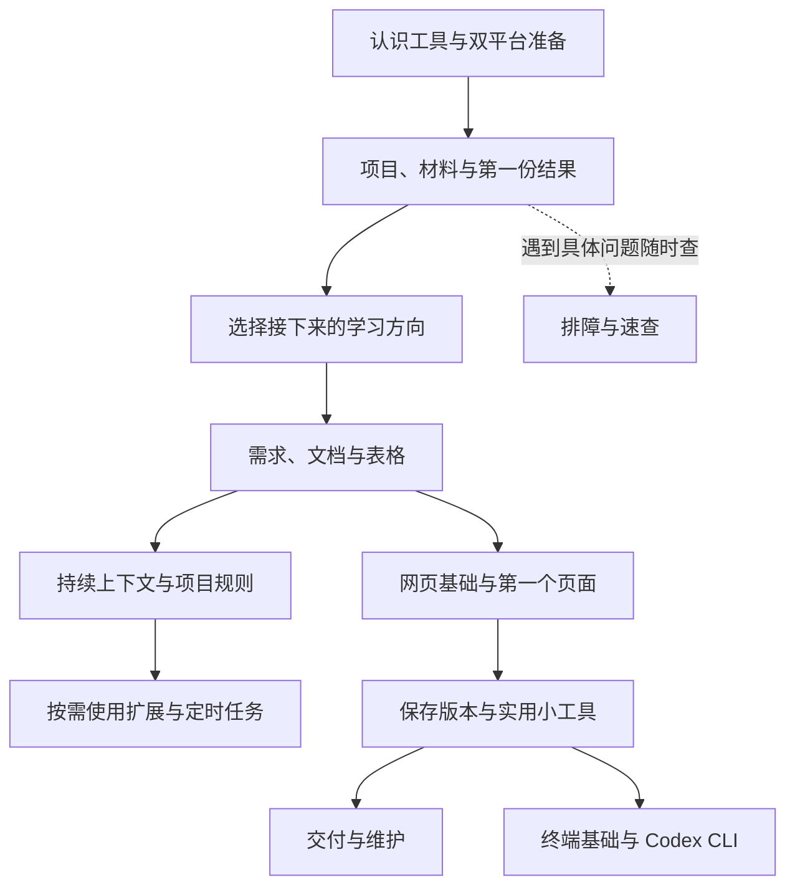

# 《Codex完全零基础入门》内容框架

目录草案 v0.4 · 2026-09-25。已完成研究后的推荐架构，尚未起草章节正文；操作路径和截图待 Mac、Windows 实测。

## 读者承诺

这本书写给会用办公软件和文件夹，却不懂终端、路径、Git，也没有编程基础的人。读者先学会让 Codex 帮自己完成日常工作，再逐步做出网页和小工具；随后了解 CLI 的必要用法。

我们希望读者最后能够：准备材料、说明想得到的成果、理解必要的操作授权、亲自核对结果、保存可继续修改的文件；制作小工具时，还能区分原型可用与可以正式交付的差别。不要求读者自行手写完整程序，也不承诺无需理解概念、短时间精通或自动获得商业成果。

Windows 与 Mac 并重。默认读者已拥有可用的付费账号，主线从登录和使用开始，不讨论付费与否、套餐选购或免费替代。实际入口、平台和组织限制仍按写作时的官方说明核对。地区和组织条件不足时明确说明限制，不让第三方接入教程替代主线。

## 推荐主线与阅读选择

前四章让读者认识工具并获得第一份可检查的结果。第五章是一次简短选择：读者可以继续日常工作，也可以随后进入网页、小工具；不以考试或练习作为继续条件。日常工作段与网页小工具段承担相近的内容分量。CLI 独立放在后段，桌面操作是主要学习入口。

所有篇章顺序、前置、深度、功能标签与事实关联以 [book.yaml](book.yaml) 为唯一配置。下面解释编排理由和写什么；这些是可修订的规划，不是已完成的教学效果承诺。

技能、插件和定时任务是日常工作的延伸，跳过它们仍可进入网页段。CLI 不作为前面任务的隐含前置。排障从每章第一次操作就出现，书末章节只是便于回查。

## 篇章安排

### 第 1 章　Codex 能帮你做什么，你还需要做什么

**读完能够：**能把自己的一个需求说成可交付的成果，并辨认 Codex 入口。

讲解展开：

1. 先看一份工作说明和一个小工具的前后变化。
2. 聊天、文件处理与工具调用有什么关系。
3. Codex、桌面应用、模型分别是什么。
4. AI 完成工作以后，哪些判断仍由你负责。

**案例安排：**展示本书将自行制作的活动说明、费用估算工具；这里只看结果，不先讲实现。

**卡住时讲什么：**入口名字或界面不同，先对照当前版本说明，不要求换模型或重装。

### 第 2 章　把桌面应用准备好：Windows 与 Mac

**读完能够：**能从官方入口安装、登录，并知道在哪里确认当前账号能使用什么。

讲解展开：

1. 先确认系统、账号和组织限制。
2. Mac 与 Windows 各走一遍安装和登录。
3. 只认这次会用到的界面区域，知道默认模型在哪里，不先要求调参。
4. 确认当前账号的可用入口，知道任务无法继续时在哪里查看状态。

**案例安排：**自己的空白演示账号环境和独立资料夹；不得把私人素材拍进截图。

**卡住时讲什么：**安装、浏览器登录返回、账号能力不可用分别定位；只列当前已核验的官方帮助。

### 第 3 章　让 Codex 找到材料：项目、任务和文件

**读完能够：**能指出原材料和结果保存在哪里，知道新建任务与新建项目的区别。

讲解展开：

1. 文件夹会用，路径为什么还要认识。
2. 把一份材料交给当前任务，并先确认材料可以交给 AI 服务处理。
3. 项目和任务分别管理什么。
4. 原文件、工作副本和成果文件分开放。

**案例安排：**自制社区活动资料夹：时间说明、场地条件、物品清单；先用系统文件界面认位置。

**卡住时讲什么：**选错文件夹先停止并核对位置；找不到输出先问文件名和完整路径。

### 第 4 章　得到第一份可以检查和保存的结果

**读完能够：**能找到新生成的一页工作说明，核对关键内容，提出一次具体修改。

讲解展开：

1. 先让 Codex 看懂材料，结合眼前动作解释文件访问和授权。
2. 生成一份新文件。
3. 自己核对数字、日期和遗漏。
4. 改一处，保存后重新打开。

**案例安排：**把三份原创短材料整理成活动筹备说明；首次输出采用普通文字，复杂格式稍后再讲。

**卡住时讲什么：**若内容与材料冲突，指出来源位置再改；若输出不是文件，要求保存并提供路径。

### 第 5 章　到这里已经能用：接下来走多远

**读完能够：**知道日常工作、网页小工具、CLI 三段分别增加什么要求，也可以在任一成果处停下。

讲解展开：

1. 日常工作能做到哪一步。
2. 制作小工具多出的判断和维护责任。
3. 需要补课、求助或暂停的信号。

**案例安排：**用本书三类成果说明投入差异，不承诺几小时精通或马上变现。

**卡住时讲什么：**电脑环境、账号或组织权限不满足时，先解决条件，不通过高权限设置硬闯。

### 第 6 章　把事情讲清楚，并带着它一步步改

**读完能够：**能交代材料、交付、限制与检查方法，区分小修改和需要先讨论的大任务。

讲解展开：

1. 从一句模糊要求找出缺失信息。
2. 哪些材料需要主动提供。
3. 小事直接改，大事先看方案。
4. 在同一结果上持续修改。

**案例安排：**修改活动时间时，同时找出受影响的安排；所用提示词由本书材料独立推导。

**卡住时讲什么：**需求发生冲突时保留原文，先列待确定项，不让 AI 自行编出决定。

### 第 7 章　把零散资料整理成真正能交付的文档

**读完能够：**能把多份资料做成可打开的工作文件，并区分材料事实和 AI 的补充建议。

讲解展开：

1. 说明、纪要、报告分别给谁看。
2. 查资料时保留可追溯来源。
3. 从内容草稿到办公文件。
4. 交付前核对事实、格式和遗漏。

**案例安排：**延续活动资料，生成内部安排与对外说明两种不同交付；演示如何发现材料间的时间矛盾。

**卡住时讲什么：**格式失败先保留内容草稿；插件或办公格式不可用时说明替代路径和能力范围。

### 第 8 章　让表格和数据帮你判断事情

**读完能够：**能提出数据问题、看懂处理过程，并用原始行和简单算例检查结果。

讲解展开：

1. 原始数据、清理结果和分析结论分开。
2. 日期、单位、重复和缺失值。
3. 图表漂亮之前先核对数字。
4. 保存能继续使用的表格与说明。

**案例安排：**独立设计小型工作室的物资采购表：故意包含重复行、空数量和混用单位；与活动案例区分行业背景。

**卡住时讲什么：**不确定的数据单列待确认；清理不能悄悄覆盖原表，计算错误先核查单位与范围。

### 第 9 章　让一个任务做得下去，也接得起来

**读完能够：**能判断继续原任务还是另开任务，并把必须长期保留的要求写成简短项目说明。

讲解展开：

1. 它能看到什么，未必记得什么。
2. 继续、打断和重新交接。
3. 把已确认决定留在文件里。
4. 什么时候需要 AGENTS.md，什么时候不用。

**案例安排：**活动时间和表达口径变化后，用自制交接摘要避免把旧决定带到新任务。

**卡住时讲什么：**发现“失忆”先核对文件和当前任务，避免不断追加互相矛盾的长指令。

### 第 10 章　需要新能力时，再认识技能和插件

**读完能够：**能分清重复流程与外部连接两种需求，知道安装或授权后怎样判断是否有用。

讲解展开：

1. 技能解决重复做法，插件提供一组能力。
2. 先检查已有能力，再增加一个必要扩展。
3. 连接器和 MCP 用在什么地方。
4. 文件访问、联网搜索与浏览器操作的区别。

**案例安排：**把已经跑通的文档整理过程整理为一项原创技能；外部工具只作一个最小演示。

**卡住时讲什么：**扩展不可用时先确认账号、系统、连接和入口；不把安装更多插件当通用修复。

### 第 11 章　把已经做好的流程，变成定时工作

**读完能够：**知道定时任务在哪里运行、何时触发、在哪里查结果，以及怎样暂停。

讲解展开：

1. 先手动成功，再安排重复。
2. 本地文件任务与云端任务的差别。
3. 第一次运行仍要查看结果。
4. 失败、重复结果与暂停处理。

**案例安排：**定期汇总自制材料夹中新增加的工作记录，只生成待审稿。

**卡住时讲什么：**电脑休眠、应用关闭、输入不可达分开说明；不安排自动删除、外发或支付。

### 第 12 章　从一份文件，走到一个能打开的网页

**读完能够：**能区分网页文件、浏览器、网址与本地预览，知道关掉窗口和关掉服务不同。

讲解展开：

1. 网页本身也是文件。
2. HTML、CSS、JavaScript 各解决什么问题。
3. 双击文件与启动本地服务的区别。
4. 为什么 localhost 地址不能直接发给别人。

**案例安排：**活动说明从文字排版变成浏览器中的页面，先解释运行方式，再扩大制作任务。

**卡住时讲什么：**打不开时先确认入口文件、启动状态和访问位置，不让 AI 无边界重建项目。

### 第 13 章　做出自己的第一个网页

**读完能够：**能描述页面给谁看、放什么内容，看到本地结果并提出有根据的修改。

讲解展开：

1. 内容和读者优先于技术选型。
2. 让 Codex 制作最小可用页面。
3. 在桌面预览并检查不同窗口大小。
4. 把笼统审美意见变成具体修改。

**案例安排：**将前面核对过的活动材料整理成活动说明页；不用外部数据、登录或数据库。

**卡住时讲什么：**链接、布局和文字问题分别检查；平台预览受限时明确使用系统浏览器的步骤。

### 第 14 章　改网页之前，先学会保存版本

**读完能够：**理解本地提交、改动和恢复；不会把保存历史当作已上传或完整备份。

讲解展开：

1. 文件保存、备份与 Git 记录不是一回事。
2. 安装和确认 Git，再建立第一份本地记录。
3. 在桌面看清这次改了什么。
4. 保留成果、尝试方案和回到可用版本。

**案例安排：**为活动页面增加另一种展示方式，保留原版并演示一次恢复；不要求背 Git 命令。

**卡住时讲什么：**先查看是否有其他未保存改动；恢复只针对已核定范围，未记录的新文件另处理。

### 第 15 章　从展示信息，走向一个实用小工具

**读完能够：**能用输入、规则、输出定义小工具，区分看起来能用和计算确实正确。

讲解展开：

1. 只解决一个明确问题。
2. 把工作规则变成可检查的输入与输出。
3. 先完成最小版本，再补异常情况。
4. 亲自走一遍普通、空白、错误和边界输入。

**案例安排：**独立设计活动物资费用估算器：人数、可选物品、数量与单价；手算对照；默认不保存个人数据。

**卡住时讲什么：**结果不对先对照业务规则和手算值；不让 AI 用改预期结果掩盖实现错误。

### 第 16 章　把成果交出去，并能在以后继续维护

**读完能够：**能为自己使用或小范围分享准备交付，区分发文件、分享预览与公开部署，知道接收者怎样打开及以后由谁维护。

讲解展开：

1. 交付文件时连同使用说明一起给。
2. 从本地地址到公开网址多了哪些条件。
3. 选定分享范围，确认接收者怎样打开。
4. 更新、撤回、备份和维护记录。

**案例安排：**为估算器写自己的启动、输入与限制说明；发布路径在写作时选一条已验证的官方/可信托管方案。

**卡住时讲什么：**本轮不承诺具体托管商；分享之前核查材料公开范围和撤回办法，无法验证则保留本地交付。

### 第 17 章　终端并不神秘：先看懂位置和命令

**读完能够：**知道当前是在系统终端还是 Codex 输入区，能确认命令作用的目录。

讲解展开：

1. Windows PowerShell 与 Mac Terminal 从哪里打开。
2. 把文件界面中的位置对应到路径。
3. 命令名、参数、路径和引号。
4. 启动程序、结束程序与终端里的报错。

**案例安排：**打开已有小工具资料夹，仅先查看位置和文件，再解释启动程序；不新建另一套陌生项目。

**卡住时讲什么：**命令找不到、路径带空格、贴错输入区分别举例；不把提示符当命令一起复制。

### 第 18 章　用 Codex CLI 继续同一个项目

**读完能够：**能安装、登录、从正确目录启动 CLI，提出一项小修改，并退出后再次继续。

讲解展开：

1. 选择一条适合自己系统的官方安装路线。
2. 登录并认出终端里的 Codex 界面。
3. 启动参数与会话内命令分别在哪里用。
4. 检查输出、暂停、退出和恢复任务。

**案例安排：**让 CLI 为熟悉的小工具修订使用说明，再在桌面或系统浏览器检查；复用业务背景，不保证任意历史自动同步。

**卡住时讲什么：**分别处理安装、登录、目录、权限和输出问题；恢复对话不代表旧文件版本自动恢复。

### 第 19 章　遇到问题时，先找出卡在哪一层

**读完能够：**能保存错误信息、说明已做步骤，判断自己能否继续处理或需要求助。

讲解展开：

1. 安装与登录问题。
2. 文件位置与权限问题。
3. 任务中断、额度不足与上下文问题。
4. 网页运行失败、结果错误与求助材料。

**案例安排：**用本书实测时实际遇到的故障编写恢复示范；本轮只设计分类，不编造个人踩坑故事。

**卡住时讲什么：**不把重装、反复重试或开完全访问当统一答案；书末索引回指发生问题的章节。

### 附录　速查：概念、平台差异和继续学习

**读完能够：**能按需要查术语和概念，不必记住所有功能与命令。

讲解展开：

1. 术语按遇见顺序索引。
2. Mac / Windows 操作差异。
3. CLI 最少必要命令及核对方法。
4. GitHub、工作树、并行任务、云端与 SDK 的后续方向。

**案例安排：**只编入正文实际使用的词；进阶功能用一页去向图说明，不在附录偷偷开一门新课。

**卡住时讲什么：**入口或型号变化回到官方来源和更新说明。

## 概念怎样逐步出现

| 第一次需要它的场景 | 当时讲到什么程度 | 留到后面再讲 |
|---|---|---|
| 给 Codex 一份材料 | 文件名、文件类型、所在文件夹；路径是位置的文字表示 | 相对路径、引号和终端目录操作 |
| 创建任务 | 一个任务围绕一个交付；项目组织相关材料 | 复杂并行、工作树与冲突 |
| 第一次改文件 | 原件、副本、新结果；查看具体变化 | Git 的历史、提交和恢复 |
| 连续做一个项目 | 当前上下文与项目说明；新任务要交接什么 | 记忆内部机制、长配置文件 |
| 第一次做网页 | 文件、浏览器、页面、运行服务和网址 | 后端、数据库、部署架构 |
| 第一次做工具 | 输入、规则、输出、状态与错误情况 | API、数据库、用户体系和支付 |
| 第一次打开 CLI | 终端、命令、参数、当前位置、启动与退出 | Shell 脚本、CI、无人值守批处理 |

出现英文术语时，先讲它正在解决什么问题，再给中文解释和英文名；不要先列一大页词汇让读者记。必要命令保持准确，不为“原创”改动通用语法。

## 原创案例和材料设计

**材料线 A：社区活动筹备。** 本书自行创作几份短材料，先产出一页安排；再做对外说明和网页；最终制作物资费用估算器。每一次沿用已经核对的事实，新增的只是一层能力。案例不是课程作业，读者不必提交任何结果。

**材料线 B：小型工作室采购表。** 使用自行设计的小数据集，包含单位不一致、重复和缺失等普通工作问题。它帮助读者学会核对数字，也为后面的工具计算提供判断方法。数据规模以能够逐行检查为准。

材料制作的基本要求：数据、文本、提示词和实现都独立编写；明示虚构；不含真实私人资料；普通情形有可人工核对的答案；刻意设置的异常必须有独立说明。书稿中的错误示范要明确是教学设计，不能伪装成作者真实遭遇。

## 每章怎么写

采用连贯叙述：为什么做这件事 → 眼前需要哪些材料与概念 → 作者演示操作 → 看见什么结果 → 怎样判断与修正。每章只围绕一个主要成果，必要时回到前一成果继续加工。

提示词是展示沟通思路的例子，不是需要背诵的咒语。例子旁解释为什么提供这些信息；复杂指令由读者已理解的小要求逐步组成。不设置练习题、作业、测验，也不安排每章统一打卡。所谓“检查结果”指任务的工作环节，不是考读者。

成功演示旁要有实际可执行的恢复说明。步骤至少讲清：在哪个界面、对哪个对象做什么、正常会看见什么、异常时先核对什么。截图由自己的演示采集，界面图只标当前步骤需要的区域，不给读者看满屏实现细节。

## Windows 与 Mac 怎样兼顾

共同的需求、概念、判断用一段主文解释；安装、文件定位、系统授权、浏览器、快捷键与终端命令分别给系统分支。Windows 不能仅把 Cmd 替换成 Ctrl，Mac 也不默认读者已经安装 Homebrew。

需要双平台验证的最小路径：安装登录 → 选择资料夹 → 读取材料/写新文件 → 打开和修订成果 → 网页启动/停止 → Git 保存/恢复 → CLI 安装/启动/退出/继续。表格、文档、技能和定时任务另核对实际入口和插件可用性。系统版本、应用版本、账号条件、结果与截图分别记录；一边验证成功不代表另一边通过。

## 当前产品入口和版本处理

2026-09-24 读取的官方文档把桌面称为 **ChatGPT desktop app**，其中可以选择 ChatGPT 或 Codex；CLI 仍有独立的 Codex 文档。书名保持《Codex完全零基础入门》，第一章和安装章讲清这个对应关系。[官方桌面说明](https://learn.chatgpt.com/docs/app)、[CLI 说明](https://learn.chatgpt.com/docs/codex/cli)。

官方推荐 Work 处理一些工作成果、Codex 处理开发任务，这不能被写成双方绝对不能做其他工作。日常任务必须在本书所称的 Codex 入口实际验证；如果某能力只在 Work 中可用，明确写为扩展路径，不悄悄替换演示产品。[官方快速开始](https://learn.chatgpt.com/docs/quickstart)。

正文以写作时最新稳定版为主，预览和逐步开放功能另注。稳定的工作方法放主文；会变的模型、菜单位置、系统与账号可用条件放带日期的说明。正文按需要引用 [facts.yaml](facts.yaml)；文档确认不等于操作成功。首版不在目录中绑定某一模型名字，不设套餐与价格教学。

## 篇幅与明确的取舍

建议首稿规模为约 6–8 万中文字，按试读结果调整，不按固定章数灌水。日常工作与网页、小工具各约占核心案例篇幅的一半；准备、沟通、检查和排障是二者共享的基础。CLI 约占全书 10%–15%，优先讲清必要动作。

自动化可跳读。IDE、GitHub 团队协作、工作树、多代理、远程开发、MCP 手工配置、Hooks、SDK、CI/CD、数据库、支付和账号系统作为后续方向，不在本书主线逐项展开。交付章以自用或小范围分享为目标，仍说明交付与公开的区别；具体分享路线留到对应章研究和实测后确定，不把面向陌生用户的账号、数据库和运营纳入首版。

比较过“按功能介绍再做案例”的方案：它更适合查手册，却会让本书读者在理解需要之前遇到过多名词。推荐当前成果递进方案，并用速查附录解决按功能查找的需求。

## 两个代表样章的任务

**普及样章：第 4 章。** 验证读者能否分清原材料与新成果，理解授权范围，自己核对一次修改并重新找到文件。写作前先完成自制材料与双平台最小操作记录。成稿只解决一次小交付，不提前塞入 Git、技能或命令行。

**深入样章：第 15 章。** 验证从工作规则到输入输出的讲法是否够浅。材料必须包括自己的手算对照、正常/空白/错误/边界输入，以及保存和恢复说明。读者不需读懂完整代码，但必须知道怎样判断它有没有完成要求。

这是写作任务设计，尚未执行正文写作。框架确认后启动样章；之后用目标读者的实际阅读情况调整解释顺序，不能把本轮文献研究当作教学效果验证。

## 参考与维护

所有实际研读来源，包含仅用于比较、最终未采纳建议的来源，列在[参考来源与致谢](参考来源与致谢.md)。本书独立创作，不复制、翻译或逐段改写教程；致谢不表示原作者为本书背书。

本草案已经落实到独立书仓的结构配置。章节文件仍为明确标注的占位；尚未出版、未完成双平台实测、未安排真实读者试读。
